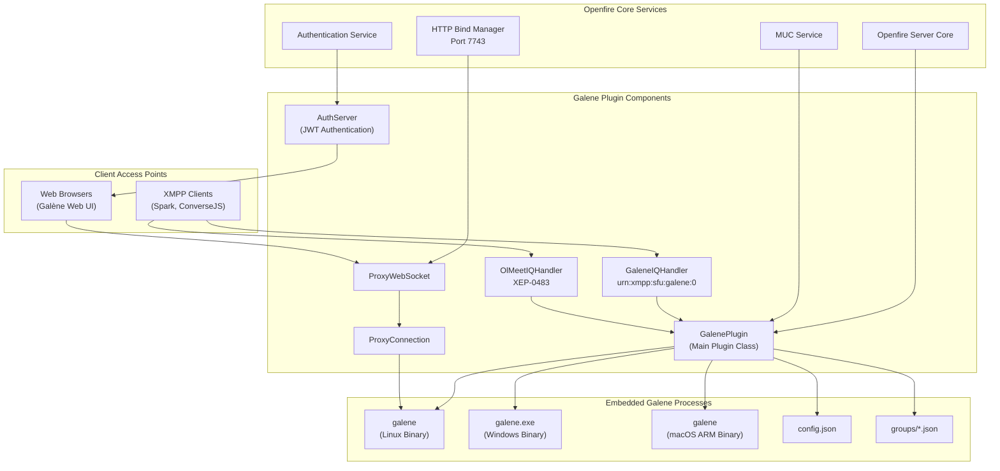
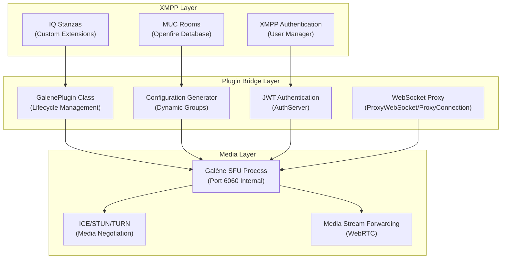

# Overview

> **Relevant source files**
> * [README.md](https://github.com/igniterealtime/openfire-galene-plugin/blob/5aa54ac8/README.md)
> * [changelog.html](https://github.com/igniterealtime/openfire-galene-plugin/blob/5aa54ac8/changelog.html)
> * [readme.html](https://github.com/igniterealtime/openfire-galene-plugin/blob/5aa54ac8/readme.html)

This document provides an overview of the Openfire Galene Plugin, which integrates Galène SFU (Selective Forwarding Unit) capabilities into the Openfire XMPP server to enable video conferencing functionality. The plugin embeds platform-specific Galène binaries and provides both web-based and XMPP-native interfaces for video conferencing.

For detailed installation procedures, see [Installation & Configuration](/igniterealtime/openfire-galene-plugin/2-installation-and-configuration). For information about the custom XMPP protocol extensions, see [XMPP Protocol Extensions](/igniterealtime/openfire-galene-plugin/5-xmpp-protocol-extensions). For comprehensive API documentation, see [API Reference](/igniterealtime/openfire-galene-plugin/8-api-reference).

## Purpose and Architecture

The Openfire Galene Plugin serves as a bridge between the XMPP ecosystem and WebRTC-based video conferencing. It embeds the Galène SFU server directly within Openfire, eliminating the need for separate video conferencing infrastructure while maintaining full integration with existing XMPP authentication, authorization, and Multi-User Chat (MUC) systems.

## Main System Architecture

The plugin operates through several key integration points with the Openfire server:

Sources: High-level system diagrams provided, [README.md L1-L78](https://github.com/igniterealtime/openfire-galene-plugin/blob/5aa54ac8/README.md#L1-L78)

 [changelog.html L1-L100](https://github.com/igniterealtime/openfire-galene-plugin/blob/5aa54ac8/changelog.html#L1-L100)

## Core Integration Components

The plugin implements a multi-layered integration approach connecting XMPP protocols with WebRTC media handling:

Sources: High-level system diagrams provided, [README.md L22-L65](https://github.com/igniterealtime/openfire-galene-plugin/blob/5aa54ac8/README.md#L22-L65)

## Multi-Platform Support

The plugin includes platform-specific binaries embedded within the JAR distribution, automatically selected based on the host operating system:

| Platform | Binary Path | Support Status |
| --- | --- | --- |
| Linux x64 | `classes/linux-64/galene` | Supported |
| Windows x64 | `classes/win-64/galene.exe` | Supported |
| macOS ARM64 | `classes/macos-64/galene` | Added in v0.9.3 |

The plugin automatically detects the runtime platform and extracts the appropriate binary during initialization.

Sources: [README.md L13](https://github.com/igniterealtime/openfire-galene-plugin/blob/5aa54ac8/README.md#L13-L13)

 [changelog.html L54](https://github.com/igniterealtime/openfire-galene-plugin/blob/5aa54ac8/changelog.html#L54-L54)

 [changelog.html L78](https://github.com/igniterealtime/openfire-galene-plugin/blob/5aa54ac8/changelog.html#L78-L78)

## XMPP Protocol Extensions

The plugin implements two primary XMPP extensions to enable SFU functionality:

1. **XEP-XXXX: In-Band SFU Sessions** (`urn:xmpp:sfu:galene:0`) - Custom extension for direct SFU communication via XMPP
2. **XEP-0483: HTTP Online Meetings** - Standard extension for web-based meeting integration

These extensions are handled by `GaleneIQHandler` and `OlMeetIQHandler` respectively, providing native XMPP client integration alongside web client access.

Sources: [README.md L68-L70](https://github.com/igniterealtime/openfire-galene-plugin/blob/5aa54ac8/README.md#L68-L70)

 [readme.html L76-L77](https://github.com/igniterealtime/openfire-galene-plugin/blob/5aa54ac8/readme.html#L76-L77)

## MUC Integration Modes

The plugin supports two operational modes for Multi-User Chat integration:

### Standalone Mode (MUC Disabled)

* Single parent group called `public`
* All participants have operator privileges
* Subgroups enabled for meeting organization
* Anonymous access follows Openfire settings

### MUC Integration Mode (MUC Enabled)

* Each Openfire MUC room becomes a Galène group
* Room permissions map to Galène group permissions
* Member-only rooms disable anonymous access
* Room passwords override user passwords for authentication

Sources: [README.md L25-L38](https://github.com/igniterealtime/openfire-galene-plugin/blob/5aa54ac8/README.md#L25-L38)

 [readme.html L48-L56](https://github.com/igniterealtime/openfire-galene-plugin/blob/5aa54ac8/readme.html#L48-L56)

## Development History

The plugin has undergone significant architectural changes since its initial release:

| Version | Release Date | Key Changes |
| --- | --- | --- |
| 0.0.3 | August 2023 | Initial release |
| 0.0.4 | September 2023 | Added XMPP chat integration |
| 0.8.1 | September 2024 | Updated to Galène 0.81, dropped 32-bit support |
| 0.9.0 | May 2025 | **Breaking change**: Removed custom web client, uses vanilla Galène |
| 0.9.3 | August 2025 | Added macOS ARM binary support |
| 0.9.4 | September 2025 | Removed Rayo integration, enhanced authentication |

The v0.9.0 release represents a major architectural shift from a custom web client to proxying the standard Galène web interface.

Sources: [changelog.html L46-L96](https://github.com/igniterealtime/openfire-galene-plugin/blob/5aa54ac8/changelog.html#L46-L96)

## Current Capabilities

The plugin currently provides:

* **Platform Support**: Linux x64, Windows x64, macOS ARM64
* **Client Access**: Web browsers via HTTP/WebSocket proxy, XMPP clients via custom IQ handlers
* **Authentication**: JWT-based with Openfire user integration
* **Network Configuration**: Configurable TURN server, port ranges, and binding addresses
* **Room Management**: Full MUC integration with permission mapping
* **Media Handling**: WebRTC with ICE/STUN/TURN support

For detailed configuration options, see [Advanced Configuration](/igniterealtime/openfire-galene-plugin/2.3-advanced-configuration). For client integration guides, see [XMPP Client Integration](/igniterealtime/openfire-galene-plugin/3.3-xmpp-client-integration) and [Web Client Interface](/igniterealtime/openfire-galene-plugin/3.2-web-client-interface).

Sources: [README.md L1-L78](https://github.com/igniterealtime/openfire-galene-plugin/blob/5aa54ac8/README.md#L1-L78)

 [changelog.html L46-L96](https://github.com/igniterealtime/openfire-galene-plugin/blob/5aa54ac8/changelog.html#L46-L96)