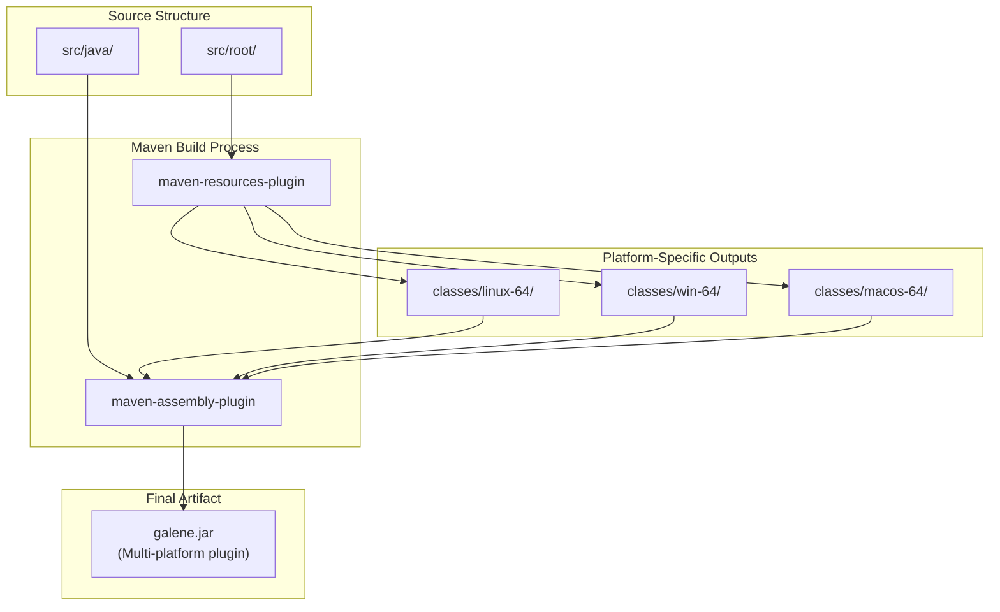
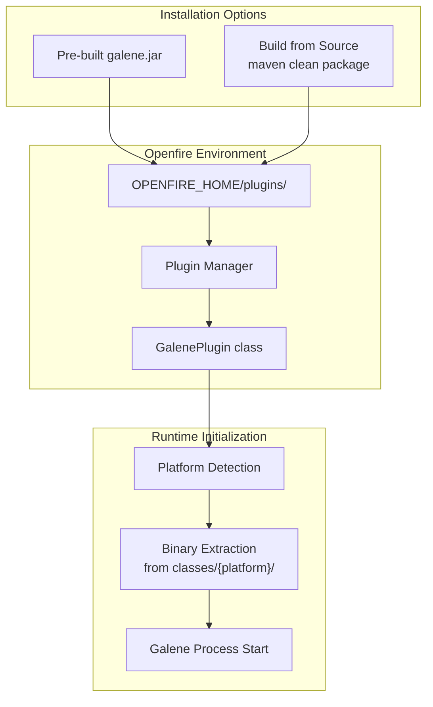
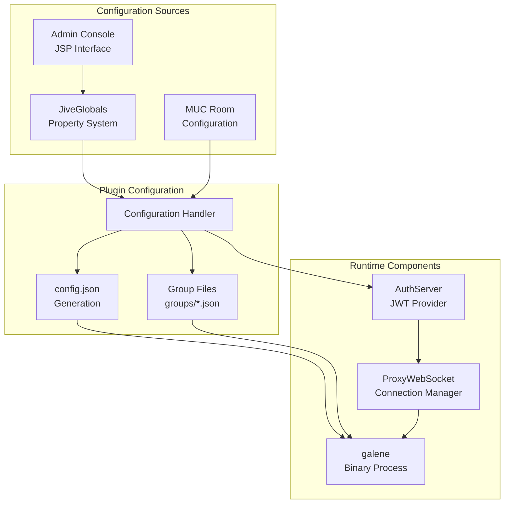
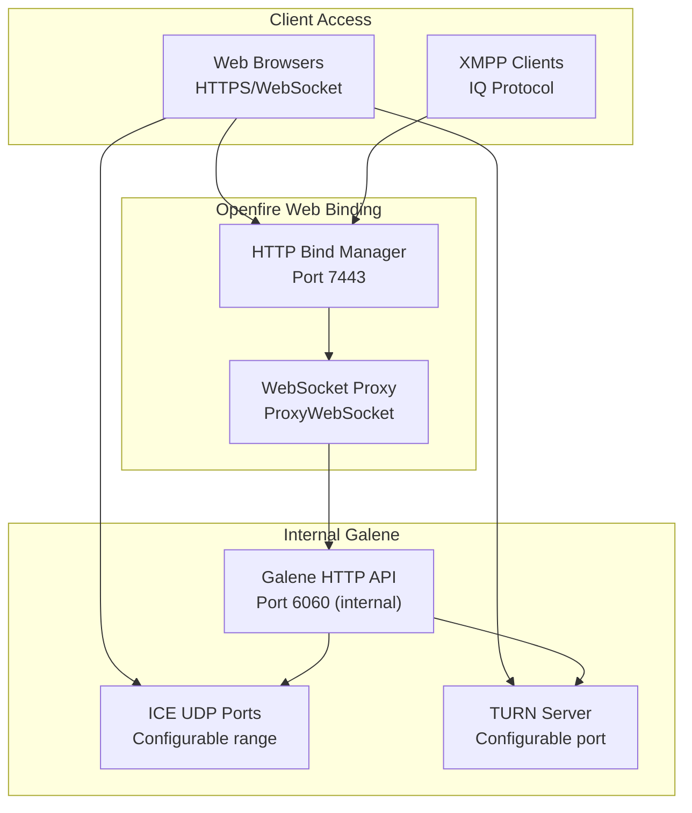

# Installation & Configuration

> **Relevant source files**
> * [README.md](https://github.com/igniterealtime/openfire-galene-plugin/blob/5aa54ac8/README.md)
> * [pom.xml](https://github.com/igniterealtime/openfire-galene-plugin/blob/5aa54ac8/pom.xml)
> * [readme.html](https://github.com/igniterealtime/openfire-galene-plugin/blob/5aa54ac8/readme.html)

This page covers the installation and configuration of the Openfire Galene Plugin, including system requirements, installation methods, and an overview of configuration options. For detailed build instructions, see [Building from Source](/igniterealtime/openfire-galene-plugin/2.1-building-from-source). For step-by-step installation guidance, see [Plugin Installation & Basic Setup](/igniterealtime/openfire-galene-plugin/2.2-plugin-installation-and-basic-setup). For comprehensive configuration details, see [Advanced Configuration](/igniterealtime/openfire-galene-plugin/2.3-advanced-configuration).

## Overview

The Openfire Galene Plugin installation process involves deploying a multi-platform plugin JAR that contains embedded Galene SFU binaries for different operating systems. The plugin integrates deeply with Openfire's architecture, requiring configuration of network settings, authentication, and MUC (Multi-User Chat) integration.

## System Requirements

The plugin supports the following platforms with embedded binaries:

| Platform | Architecture | Embedded Binary Location |
| --- | --- | --- |
| Linux | x64 | `classes/linux-64/` |
| Windows | x64 | `classes/win-64/` |
| macOS | ARM64 | `classes/macos-64/` |

**Multi-Platform Build Architecture**



Sources: [pom.xml L28-L76](https://github.com/igniterealtime/openfire-galene-plugin/blob/5aa54ac8/pom.xml#L28-L76)

## Installation Methods

### Pre-built Plugin Installation

The simplest installation method involves copying the pre-built `galene.jar` file to Openfire's plugins directory. This method is suitable for most production deployments.

### Building from Source

For development or customization purposes, the plugin can be built from source using Maven. This process creates platform-specific resource copies and assembles them into a single deployable JAR.

**Installation Process Flow**



Sources: [README.md L15-L17](https://github.com/igniterealtime/openfire-galene-plugin/blob/5aa54ac8/README.md#L15-L17)

 [pom.xml L22-L87](https://github.com/igniterealtime/openfire-galene-plugin/blob/5aa54ac8/pom.xml#L22-L87)

## Configuration Overview

The plugin configuration involves several key areas that integrate with both Openfire and Galene components:

### Core Configuration Areas

| Configuration Area | Purpose | Integration Point |
| --- | --- | --- |
| SFU Enable/Disable | Plugin activation control | `GalenePlugin` lifecycle |
| MUC Integration | Room-based group mapping | Openfire MUC service |
| Network Settings | IP/port binding configuration | Galene process startup |
| Authentication | User verification and JWT | `AuthServer` component |
| TURN Server | NAT traversal support | Galene ICE configuration |

### Configuration Data Flow



Sources: [README.md L19-L65](https://github.com/igniterealtime/openfire-galene-plugin/blob/5aa54ac8/README.md#L19-L65)

## Quick Start Configuration

### Essential Settings

1. **Enable SFU**: Activates the plugin functionality
2. **MUC Support**: Determines integration level with Openfire rooms
3. **Network Binding**: Internal IP address and port configuration
4. **External Access**: Public URL and TURN server settings

### Basic Configuration Parameters

```
galene.sfu.enabled = true
galene.muc.enabled = true
galene.ip.address = 127.0.0.1
galene.tcp.port = 6060
galene.external.url = https://your-server:7443
```

### Authentication Configuration

The plugin creates an administrative user account for Galene operations:

* **Default Username**: `sfu-user`
* **Password**: Auto-generated random string
* **Permissions**: Full Galene administrative access

### Network Port Configuration

| Port Type | Default | Purpose |
| --- | --- | --- |
| Internal TCP | 6060 | Galene HTTP API |
| External HTTP | 7443 | Openfire web binding |
| UDP Range | 49152-65535 | ICE candidates |
| TURN Port | Configurable | NAT traversal |

**Network Architecture**



Sources: [README.md L42-L64](https://github.com/igniterealtime/openfire-galene-plugin/blob/5aa54ac8/README.md#L42-L64)

## Dependencies and Requirements

The plugin requires specific Java dependencies managed through Maven:

### Core Dependencies

* **Jetty WebSocket**: For proxy connection handling
* **JSON Processing**: Configuration file generation
* **Commons Codec**: Authentication utilities
* **Hibernate Validator**: Configuration validation

### Openfire Integration

* **XMPP Server API**: Core Openfire integration
* **MUC Service**: Group chat room integration
* **Plugin Framework**: Openfire plugin lifecycle

Sources: [pom.xml L89-L160](https://github.com/igniterealtime/openfire-galene-plugin/blob/5aa54ac8/pom.xml#L89-L160)

This installation and configuration overview provides the foundation for deploying the Galene plugin. For detailed procedures, refer to the specific sub-sections covering building from source, installation steps, and advanced configuration options.