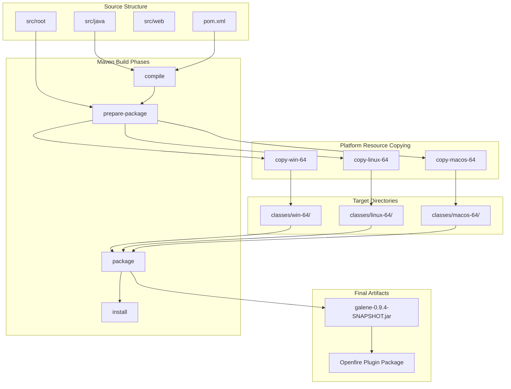
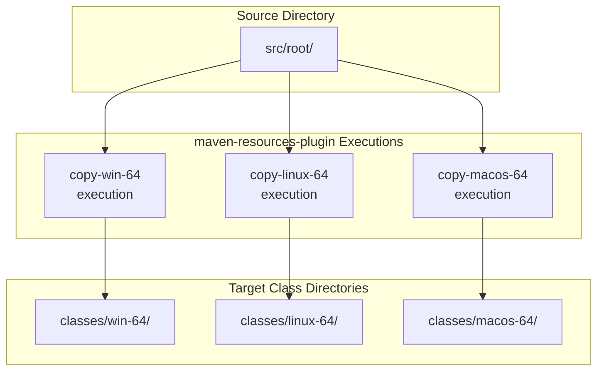
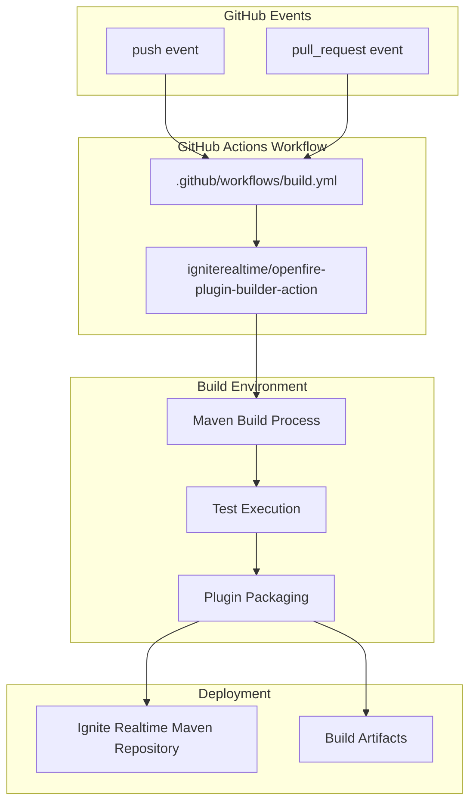

# Building from Source

> **Relevant source files**
> * [.github/FUNDING.yml](https://github.com/igniterealtime/openfire-galene-plugin/blob/5aa54ac8/.github/FUNDING.yml)
> * [.github/workflows/build.yml](https://github.com/igniterealtime/openfire-galene-plugin/blob/5aa54ac8/.github/workflows/build.yml)
> * [.gitignore](https://github.com/igniterealtime/openfire-galene-plugin/blob/5aa54ac8/.gitignore)
> * [LICENSE](https://github.com/igniterealtime/openfire-galene-plugin/blob/5aa54ac8/LICENSE)
> * [logo_large.gif](https://github.com/igniterealtime/openfire-galene-plugin/blob/5aa54ac8/logo_large.gif)
> * [pom.xml](https://github.com/igniterealtime/openfire-galene-plugin/blob/5aa54ac8/pom.xml)

This document provides detailed instructions for building the Openfire Galene Plugin from source code using Maven. It covers the build system configuration, platform-specific resource handling, and continuous integration setup.

For information about plugin installation after building, see [Plugin Installation & Basic Setup](./2.2-plugin-installation-and-basic-setup.md). For details about the plugin's internal architecture, see [Core Plugin Architecture](./4.1-core-plugin-architecture.md).

## Prerequisites

The build system requires the following components:

| Component | Version | Purpose |
| --- | --- | --- |
| Java JDK | 11+ | Compilation and runtime |
| Maven | 3.6+ | Build orchestration |
| Git | Any recent version | Source code management |

The plugin inherits build configuration from the parent Openfire plugins project specified in [pom.xml L7-L11](https://github.com/igniterealtime/openfire-galene-plugin/blob/5aa54ac8/pom.xml#L7-L11)

## Build Process Overview

The Galene plugin uses a multi-stage Maven build process that handles platform-specific binary distribution and resource copying. The build produces a single JAR file containing embedded Galene server binaries for Windows, Linux, and macOS platforms.

### Build Flow Diagram



Sources: [pom.xml L22-L87](https://github.com/igniterealtime/openfire-galene-plugin/blob/5aa54ac8/pom.xml#L22-L87)

 [.gitignore L5-L11](https://github.com/igniterealtime/openfire-galene-plugin/blob/5aa54ac8/.gitignore#L5-L11)

## Maven Configuration Analysis

The build configuration in `pom.xml` defines the core build behavior through several key sections:

### Project Coordinates

The plugin inherits from the Openfire plugins parent project and defines its own coordinates in [pom.xml L13-L15](https://github.com/igniterealtime/openfire-galene-plugin/blob/5aa54ac8/pom.xml#L13-L15)

:

```xml
<groupId>org.igniterealtime.openfire</groupId>
<artifactId>galene</artifactId>
<version>0.9.4-SNAPSHOT</version>
```

### Platform-Specific Resource Copying

The most complex part of the build process is the platform-specific resource copying handled by the `maven-resources-plugin`. This plugin executes three separate copy operations during the `prepare-package` phase:

### Resource Copy Configuration Diagram



Each execution copies the entire `src/root` directory contents to platform-specific class directories as configured in [pom.xml L28-L76](https://github.com/igniterealtime/openfire-galene-plugin/blob/5aa54ac8/pom.xml#L28-L76)

:

| Execution ID | Phase | Output Directory | Configuration Lines |
| --- | --- | --- | --- |
| `copy-win-64` | prepare-package | `classes/win-64` | [pom.xml L30-L43](https://github.com/igniterealtime/openfire-galene-plugin/blob/5aa54ac8/pom.xml#L30-L43) |
| `copy-linux-64` | prepare-package | `classes/linux-64` | [pom.xml L46-L59](https://github.com/igniterealtime/openfire-galene-plugin/blob/5aa54ac8/pom.xml#L46-L59) |
| `copy-macos-64` | prepare-package | `classes/macos-64` | [pom.xml L62-L75](https://github.com/igniterealtime/openfire-galene-plugin/blob/5aa54ac8/pom.xml#L62-L75) |

Sources: [pom.xml L25-L78](https://github.com/igniterealtime/openfire-galene-plugin/blob/5aa54ac8/pom.xml#L25-L78)

## Additional Build Plugins

Beyond resource copying, the build uses two additional Maven plugins:

### Assembly Plugin

The `maven-assembly-plugin` at [pom.xml L79-L81](https://github.com/igniterealtime/openfire-galene-plugin/blob/5aa54ac8/pom.xml#L79-L81)

 handles final packaging of the plugin JAR with all platform-specific resources included.

### JSP Compilation Plugin

The `jetty-ee8-jspc-maven-plugin` at [pom.xml L82-L85](https://github.com/igniterealtime/openfire-galene-plugin/blob/5aa54ac8/pom.xml#L82-L85)

 pre-compiles JSP files for the plugin's web administration interface.

Sources: [pom.xml L79-L86](https://github.com/igniterealtime/openfire-galene-plugin/blob/5aa54ac8/pom.xml#L79-L86)

## Dependencies

The plugin declares several key dependencies that enable its functionality:

| Dependency | Scope | Purpose |
| --- | --- | --- |
| `xmppserver` | provided | Core Openfire server APIs |
| `jetty-ee8-proxy` | compile | WebSocket proxy functionality |
| `json-lib` | compile | JSON processing |
| `joda-time` | compile | Date/time utilities |
| `hibernate-validator` | compile | Bean validation |
| `commons-codec` | compile | Encoding utilities |
| `jetty-ee8-websocket-jetty-client` | compile | WebSocket client support |

The Jetty dependencies with `provided` scope ([pom.xml L143-L157](https://github.com/igniterealtime/openfire-galene-plugin/blob/5aa54ac8/pom.xml#L143-L157)

) are supplied by the Openfire runtime environment.

Sources: [pom.xml L89-L160](https://github.com/igniterealtime/openfire-galene-plugin/blob/5aa54ac8/pom.xml#L89-L160)

## CI/CD Integration

The project uses GitHub Actions for continuous integration through a reusable workflow configuration:

### CI/CD Flow Diagram



The workflow configuration at [.github/workflows/build.yml L1-L11](https://github.com/igniterealtime/openfire-galene-plugin/blob/5aa54ac8/.github/workflows/build.yml#L1-L11)

 delegates to the centralized Openfire plugin builder action, which standardizes the build process across all Openfire plugins.

### Authentication

The CI system uses repository secrets for Maven repository access:

* `IGNITE_REALTIME_MAVEN_USERNAME`: Username for repository authentication
* `IGNITE_REALTIME_MAVEN_PASSWORD`: Password for repository authentication

These credentials enable automatic deployment to the Ignite Realtime Maven repository configured in [pom.xml L162-L169](https://github.com/igniterealtime/openfire-galene-plugin/blob/5aa54ac8/pom.xml#L162-L169)

Sources: [.github/workflows/build.yml L1-L11](https://github.com/igniterealtime/openfire-galene-plugin/blob/5aa54ac8/.github/workflows/build.yml#L1-L11)

 [pom.xml L162-L169](https://github.com/igniterealtime/openfire-galene-plugin/blob/5aa54ac8/pom.xml#L162-L169)

## Build Commands

Execute the following Maven commands to build the plugin:

### Development Build

```
mvn clean compile
```

### Full Build with Platform Resources

```
mvn clean package
```

### Install to Local Repository

```
mvn clean install
```

### Skip Tests (if needed)

```go
mvn clean package -DskipTests
```

The resulting plugin JAR will be created in the `target/` directory and can be deployed to an Openfire server.

## Build Output Structure

The build process generates platform-specific resource directories that are excluded from version control via [.gitignore L5-L11](https://github.com/igniterealtime/openfire-galene-plugin/blob/5aa54ac8/.gitignore#L5-L11)

:

```
classes/
├── linux-64/
│   ├── data/
│   ├── groups/
│   ├── recordings/
│   └── static/
├── win-64/
│   ├── data/
│   ├── groups/
│   ├── recordings/
│   └── static/
└── macos-64/
    └── [similar structure]
```

These directories contain the platform-specific Galene server binaries and configuration files that get embedded into the final plugin JAR.

Sources: [.gitignore L5-L11](https://github.com/igniterealtime/openfire-galene-plugin/blob/5aa54ac8/.gitignore#L5-L11)

 [pom.xml L37-L75](https://github.com/igniterealtime/openfire-galene-plugin/blob/5aa54ac8/pom.xml#L37-L75)