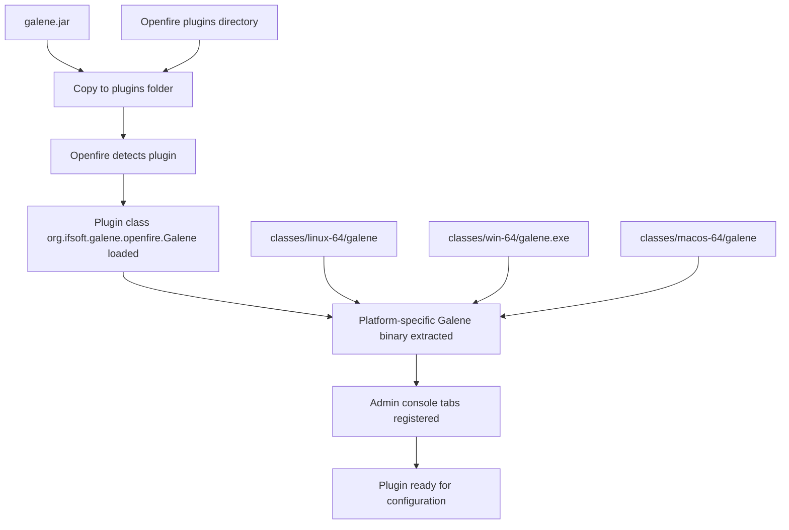
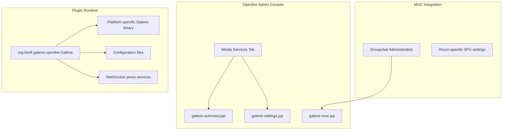
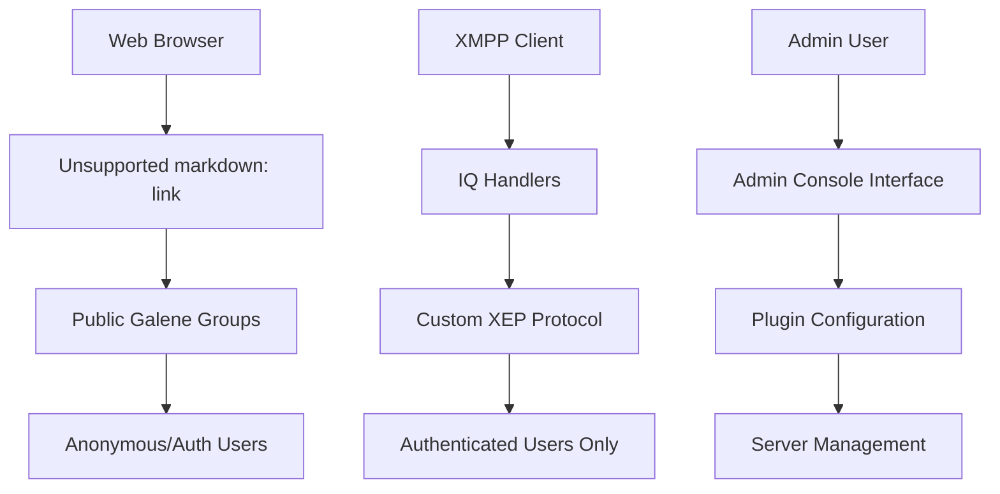

# Plugin Installation & Basic Setup

> **Relevant source files**
> * [README.md](https://github.com/igniterealtime/openfire-galene-plugin/blob/5aa54ac8/README.md)
> * [plugin.xml](https://github.com/igniterealtime/openfire-galene-plugin/blob/5aa54ac8/plugin.xml)
> * [readme.html](https://github.com/igniterealtime/openfire-galene-plugin/blob/5aa54ac8/readme.html)

This document covers the installation of the pre-built Openfire Galene plugin and initial configuration required to get the SFU (Selective Forwarding Unit) service operational. This guide assumes you have a pre-built `galene.jar` file and focuses on deployment and basic setup.

For information about building the plugin from source code, see [Building from Source](/igniterealtime/openfire-galene-plugin/2.1-building-from-source). For comprehensive configuration options and advanced settings, see [Advanced Configuration](/igniterealtime/openfire-galene-plugin/2.3-advanced-configuration).

## Prerequisites

Before installing the Galene plugin, ensure your environment meets the following requirements:

| Requirement | Specification | Notes |
| --- | --- | --- |
| Openfire Version | 5.0.0 or higher | Specified in [plugin.xml L10](https://github.com/igniterealtime/openfire-galene-plugin/blob/5aa54ac8/plugin.xml#L10-L10) |
| Operating System | Linux 64-bit, Windows 64-bit, or macOS ARM64 | Plugin includes platform-specific binaries |
| Java Runtime | Compatible with Openfire installation | Inherits from Openfire JVM |
| Network Ports | Default TCP 6060 (internal), UDP range for media | Configurable during setup |

Sources: [plugin.xml L10](https://github.com/igniterealtime/openfire-galene-plugin/blob/5aa54ac8/plugin.xml#L10-L10)

 [README.md L13](https://github.com/igniterealtime/openfire-galene-plugin/blob/5aa54ac8/README.md#L13-L13)

## Installation Process

The Galene plugin follows the standard Openfire plugin installation pattern. The installation involves deploying the plugin JAR file and allowing Openfire to initialize the embedded Galene SFU.

### Installation Flow



Sources: [README.md L17](https://github.com/igniterealtime/openfire-galene-plugin/blob/5aa54ac8/README.md#L17-L17)

 [plugin.xml L4](https://github.com/igniterealtime/openfire-galene-plugin/blob/5aa54ac8/plugin.xml#L4-L4)

### Step-by-Step Installation

1. **Stop Openfire Server** (if running) ```markdown # Stop Openfire service sudo systemctl stop openfire # OR /opt/openfire/bin/openfire stop ```
2. **Deploy Plugin JAR** ```markdown # Copy the plugin to Openfire plugins directory cp galene.jar /opt/openfire/plugins/ ```
3. **Start Openfire Server** ```markdown # Start Openfire service sudo systemctl start openfire # OR /opt/openfire/bin/openfire start ```
4. **Verify Plugin Loading** * Monitor Openfire logs for plugin initialization * Check admin console for new "Media Services" tab

Sources: [README.md L17](https://github.com/igniterealtime/openfire-galene-plugin/blob/5aa54ac8/README.md#L17-L17)

## Plugin Components After Installation

Once installed, the plugin creates the following structure within Openfire:



Sources: [plugin.xml L12-L26](https://github.com/igniterealtime/openfire-galene-plugin/blob/5aa54ac8/plugin.xml#L12-L26)

## Basic Configuration

After installation, configure the plugin through the Openfire Admin Console under the **Media Services** tab.

### Essential Settings

Navigate to **Server** → **Media Services** → **Galene Settings** to configure:

| Setting | Default | Description |
| --- | --- | --- |
| **Enable SFU** | Disabled | Master switch for the entire plugin |
| **Enable MUC Support** | Disabled | Integration with Openfire Multi-User Chat |
| **IP Address** | Auto-detected | Internal IP for Galene binding |
| **TCP Port** | 6060 | Internal port for Galene service |
| **Admin Username** | sfu-user | Galene administrator account |
| **Admin Password** | Generated | Random password for admin user |

Sources: [README.md L22-L49](https://github.com/igniterealtime/openfire-galene-plugin/blob/5aa54ac8/README.md#L22-L49)

### Minimal Working Configuration

For a basic working setup:

1. **Enable the Plugin** * Check "Enable SFU" checkbox * Leave MUC support disabled initially
2. **Network Configuration** * Accept default IP address (usually auto-detected) * Use default TCP port 6060 * Configure UDP port range or single mux port
3. **Administrator Account** * Note the generated admin username/password * Required for accessing Galene statistics and management
4. **Apply Settings** * Save configuration * Restart the plugin or Openfire server

Sources: [README.md L22-L52](https://github.com/igniterealtime/openfire-galene-plugin/blob/5aa54ac8/README.md#L22-L52)

## Verification Steps

After basic configuration, verify the installation is working:

### 1. Check Plugin Status

* Admin Console → **Server** → **Plugins** → Verify "Galene" plugin is loaded
* Look for green status indicator

### 2. Verify Galene Service

```markdown
# Check if Galene is listening on configured port
netstat -tlnp | grep 6060
# OR
curl http://localhost:6060/
```

### 3. Test Web Client Access

* Navigate to: `https://your-server:7443/group/public`
* Should display Galene web interface
* Login with admin credentials to verify functionality

### 4. Check Log Files

Monitor Openfire logs for successful initialization:

```yaml
INFO: Galene plugin started successfully
INFO: Galene server process started on port 6060
```

Sources: [README.md L52](https://github.com/igniterealtime/openfire-galene-plugin/blob/5aa54ac8/README.md#L52-L52)

 [README.md L30](https://github.com/igniterealtime/openfire-galene-plugin/blob/5aa54ac8/README.md#L30-L30)

## Initial Access Patterns

With basic configuration, the plugin supports these access patterns:



Sources: [README.md L30](https://github.com/igniterealtime/openfire-galene-plugin/blob/5aa54ac8/README.md#L30-L30)

 [README.md L36](https://github.com/igniterealtime/openfire-galene-plugin/blob/5aa54ac8/README.md#L36-L36)

## Next Steps

After completing basic installation and verification:

1. **Advanced Configuration**: See [Advanced Configuration](/igniterealtime/openfire-galene-plugin/2.3-advanced-configuration) for MUC integration, TURN server setup, and network optimization
2. **Admin Interface**: Explore the full admin console features covered in [Admin Console Interface](/igniterealtime/openfire-galene-plugin/3.1-admin-console-interface)
3. **Client Integration**: Set up XMPP clients using the protocols described in [XMPP Client Integration](/igniterealtime/openfire-galene-plugin/3.3-xmpp-client-integration)
4. **Web Client**: Customize the web interface as detailed in [Web Client Interface](/igniterealtime/openfire-galene-plugin/3.2-web-client-interface)

Sources: [README.md L68-L70](https://github.com/igniterealtime/openfire-galene-plugin/blob/5aa54ac8/README.md#L68-L70)