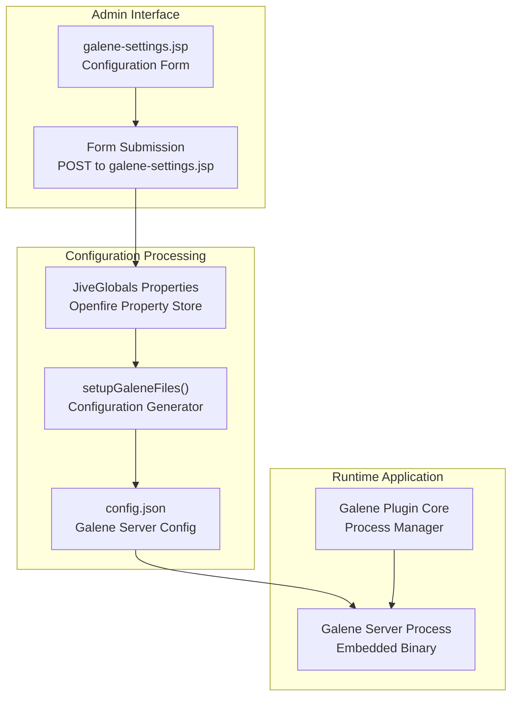
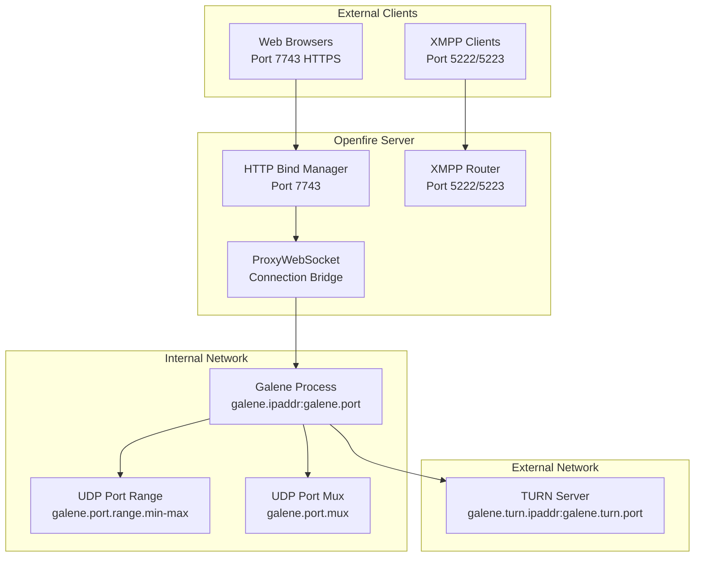
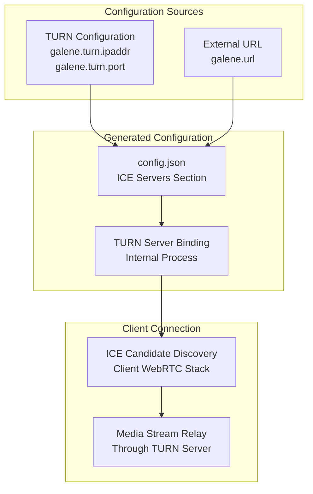
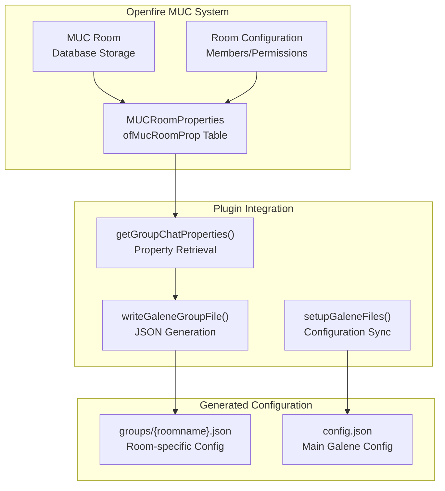
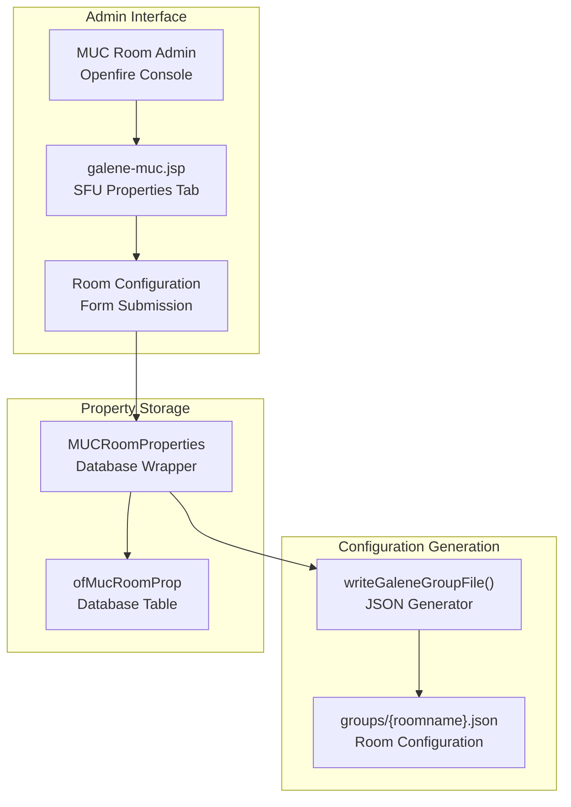

# Advanced Configuration

> **Relevant source files**
> * [README.md](https://github.com/igniterealtime/openfire-galene-plugin/blob/5aa54ac8/README.md)
> * [readme.html](https://github.com/igniterealtime/openfire-galene-plugin/blob/5aa54ac8/readme.html)
> * [src/i18n/galene_i18n.properties](https://github.com/igniterealtime/openfire-galene-plugin/blob/5aa54ac8/src/i18n/galene_i18n.properties)
> * [src/java/org/ifsoft/galene/openfire/MUCRoomProperties.java](https://github.com/igniterealtime/openfire-galene-plugin/blob/5aa54ac8/src/java/org/ifsoft/galene/openfire/MUCRoomProperties.java)
> * [src/root/groups/public.json](https://github.com/igniterealtime/openfire-galene-plugin/blob/5aa54ac8/src/root/groups/public.json)
> * [src/web/galene-muc.jsp](https://github.com/igniterealtime/openfire-galene-plugin/blob/5aa54ac8/src/web/galene-muc.jsp)
> * [src/web/galene-settings.jsp](https://github.com/igniterealtime/openfire-galene-plugin/blob/5aa54ac8/src/web/galene-settings.jsp)
> * [src/web/galene-summary.jsp](https://github.com/igniterealtime/openfire-galene-plugin/blob/5aa54ac8/src/web/galene-summary.jsp)

This document provides comprehensive configuration guidance for the Openfire Galene Plugin beyond basic installation. It covers network settings, TURN server configuration, MUC integration options, and per-room customization. For basic installation and setup, see [Plugin Installation & Basic Setup](/igniterealtime/openfire-galene-plugin/2.2-plugin-installation-and-basic-setup). For developer information about the configuration system architecture, see [Core Plugin Architecture](/igniterealtime/openfire-galene-plugin/4.1-core-plugin-architecture).

## Global Plugin Configuration

The plugin's primary configuration is managed through the Openfire admin console via the settings page. All configuration changes require a plugin restart to take effect.

### Core Plugin Settings

The main plugin configuration is controlled through JiveGlobals properties that can be set via the admin interface:

| Setting | Property Key | Default | Description |
| --- | --- | --- | --- |
| Enable SFU | `galene.enabled` | `true` | Master switch for plugin functionality |
| Enable MUC Support | `galene.muc.enabled` | `false` | Integrates with Openfire MUC rooms |
| Enable TURN Server | `galene.turn.enabled` | `false` | Activates internal TURN server |
| Use Port Muxing | `galene.mux.enabled` | `false` | Single UDP port vs port range |

**Configuration Flow Diagram**



Sources: [src/web/galene-settings.jsp L16-L61](https://github.com/igniterealtime/openfire-galene-plugin/blob/5aa54ac8/src/web/galene-settings.jsp#L16-L61)

 [src/i18n/galene_i18n.properties L17-L20](https://github.com/igniterealtime/openfire-galene-plugin/blob/5aa54ac8/src/i18n/galene_i18n.properties#L17-L20)

### Authentication Configuration

The plugin creates an administrative user account for Galene operations:

* **Username**: Configurable via `galene.username` (default: `sfu-admin`)
* **Password**: Configurable via `galene.password` (default: auto-generated)

This account provides Galene admin permissions to view stream statistics and join any meeting. If using LDAP or read-only user management, the account must be created manually in Openfire before configuring these credentials.

Sources: [README.md L48-L49](https://github.com/igniterealtime/openfire-galene-plugin/blob/5aa54ac8/README.md#L48-L49)

 [src/web/galene-settings.jsp L117-L127](https://github.com/igniterealtime/openfire-galene-plugin/blob/5aa54ac8/src/web/galene-settings.jsp#L117-L127)

## Network Configuration

The plugin requires careful network configuration to handle both internal communication and external client access.

### Internal Network Settings

| Setting | Property Key | Default | Description |
| --- | --- | --- | --- |
| IP Address | `galene.ipaddr` | Auto-detected | Internal network interface binding |
| TCP Port | `galene.port` | `6060` | Internal Galene server port |
| External URL | `galene.url` | Auto-generated | Public base URL for client access |

The Galene server binds internally and is accessed externally through Openfire's web binding service on port 7743.

### UDP Port Configuration

The plugin supports two UDP port allocation strategies:

**Port Range Mode** (default):

* **Min Port**: `galene.port.range.min`
* **Max Port**: `galene.port.range.max`
* Allocates ephemeral ports from the specified range for ICE connections

**Port Muxing Mode** (when `galene.mux.enabled` = `true`):

* **Mux Port**: `galene.port.mux`
* Uses a single UDP port for all ICE connections

**Network Architecture Diagram**



Sources: [README.md L51-L58](https://github.com/igniterealtime/openfire-galene-plugin/blob/5aa54ac8/README.md#L51-L58)

 [src/web/galene-settings.jsp L129-L167](https://github.com/igniterealtime/openfire-galene-plugin/blob/5aa54ac8/src/web/galene-settings.jsp#L129-L167)

## TURN Server Configuration

The embedded TURN server facilitates WebRTC connections through NAT and firewalls.

### TURN Server Settings

| Setting | Property Key | Description |
| --- | --- | --- |
| TURN IP Address | `galene.turn.ipaddr` | Public IP or FQDN for TURN server |
| TURN Port | `galene.turn.port` | Public port for TURN server (TCP/UDP) |

### TURN Server Requirements

* **Public IP**: Must be accessible from client networks
* **Port Access**: Specified port must be open for both TCP and UDP
* **NAT Considerations**: If behind NAT without hairpinning support, external TURN server required
* **DNS Resolution**: External URL hostname must resolve to TURN IP address

**TURN Configuration Flow**



Sources: [README.md L60-L64](https://github.com/igniterealtime/openfire-galene-plugin/blob/5aa54ac8/README.md#L60-L64)

 [src/web/galene-settings.jsp L169-L191](https://github.com/igniterealtime/openfire-galene-plugin/blob/5aa54ac8/src/web/galene-settings.jsp#L169-L191)

## MUC Integration Settings

When MUC support is enabled (`galene.muc.enabled` = `true`), the plugin integrates with Openfire's Multi-User Chat system.

### MUC Integration Modes

**Disabled Mode** (`galene.muc.enabled` = `false`):

* Single `public` group with subgroup support
* All participants have operator privileges
* Anonymous access follows Openfire anonymous settings
* URL format: `/group/public/subgroup-name`

**Enabled Mode** (`galene.muc.enabled` = `true`):

* MUC rooms become Galene groups
* Authentication required for room access
* Room permissions inherited by Galene groups
* URL format: `/group/room-name`

### MUC Permission Mapping

The plugin maps Openfire MUC permissions to Galene group settings:

| MUC Setting | Galene Configuration | Effect |
| --- | --- | --- |
| Members Only | `allow-anonymous: false` | Authenticated users only |
| Password Protected | Password authentication | Room password required |
| Allow Invitations | Token-based access | Invitation URLs supported |

**MUC Integration Architecture**



Sources: [README.md L25-L40](https://github.com/igniterealtime/openfire-galene-plugin/blob/5aa54ac8/README.md#L25-L40)

 [src/java/org/ifsoft/galene/openfire/MUCRoomProperties.java L25-L305](https://github.com/igniterealtime/openfire-galene-plugin/blob/5aa54ac8/src/java/org/ifsoft/galene/openfire/MUCRoomProperties.java#L25-L305)

## Per-Room Configuration

Individual MUC rooms can have specific Galene configuration through the admin console room management interface.

### Room-Specific Settings

Each MUC room supports the following Galene-specific properties:

* **Enable SFU**: `galene.enabled` - Enable/disable Galene for this room
* **Enable Federation**: `galene.federation.enabled` - Allow federated access

### Room Configuration Interface

The `galene-muc.jsp` interface provides per-room configuration accessible from the Openfire admin console under MUC room management.

**Per-Room Configuration Flow**



Sources: [src/web/galene-muc.jsp L23-L31](https://github.com/igniterealtime/openfire-galene-plugin/blob/5aa54ac8/src/web/galene-muc.jsp#L23-L31)

 [src/java/org/ifsoft/galene/openfire/MUCRoomProperties.java L172-L196](https://github.com/igniterealtime/openfire-galene-plugin/blob/5aa54ac8/src/java/org/ifsoft/galene/openfire/MUCRoomProperties.java#L172-L196)

## Configuration File Structure

The plugin generates several configuration files that control Galene server behavior.

### Main Configuration

The primary `config.json` is generated dynamically based on plugin settings and contains:

* HTTP server configuration
* ICE server settings (TURN configuration)
* Authentication settings
* Group directory paths

### Group Configuration Files

Individual group files in the `groups/` directory define room-specific settings:

**Default Public Group** - [src/root/groups/public.json](https://github.com/igniterealtime/openfire-galene-plugin/blob/5aa54ac8/src/root/groups/public.json)

:

```json
{
  "public": true,
  "description": "A public place to hangout",
  "allow-recording": true,
  "allow-anonymous": true,
  "allow-subgroups": true,
  "op": [{}],
  "presenter": [{}],
  "other": [{}],  
  "codecs": ["vp9", "opus", "av1", "h264"],   
  "max-clients": 100
}
```

**MUC Room Groups** are generated based on room properties and permissions, with authentication and authorization settings reflecting the corresponding MUC room configuration.

Sources: [src/root/groups/public.json L1-L12](https://github.com/igniterealtime/openfire-galene-plugin/blob/5aa54ac8/src/root/groups/public.json#L1-L12)