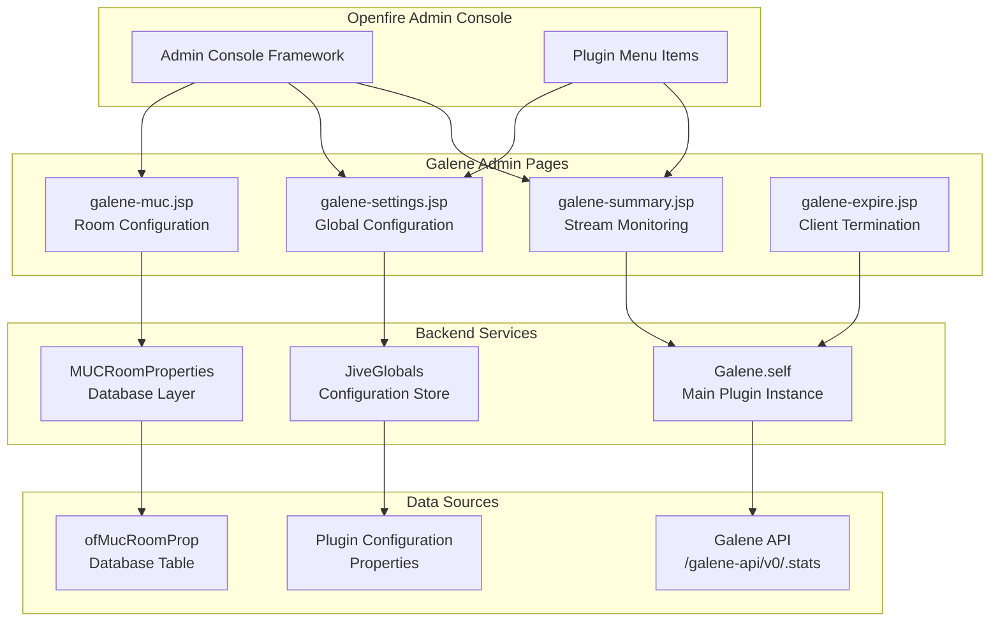
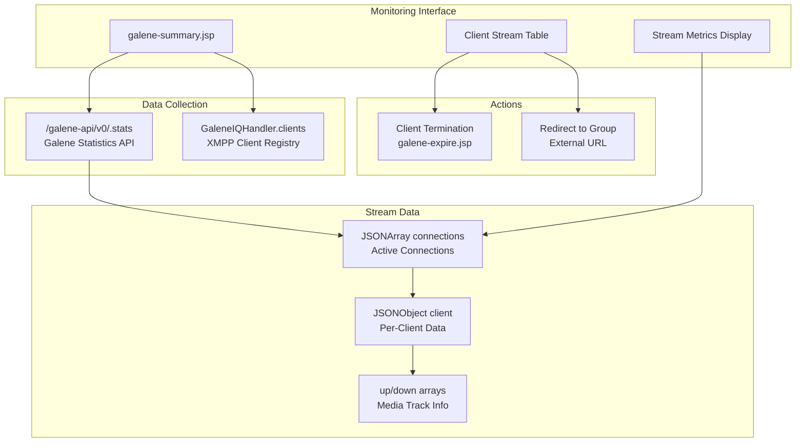
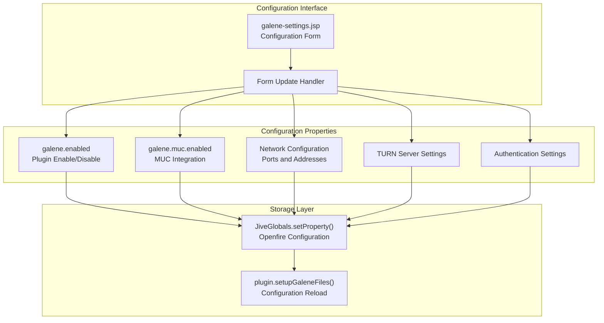
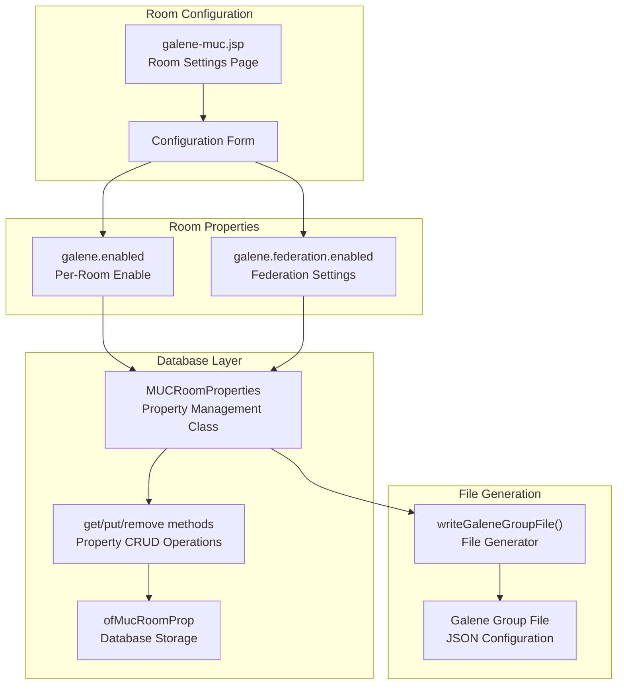
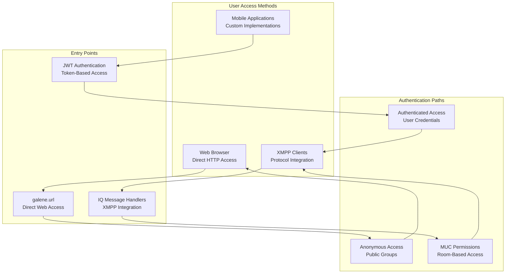
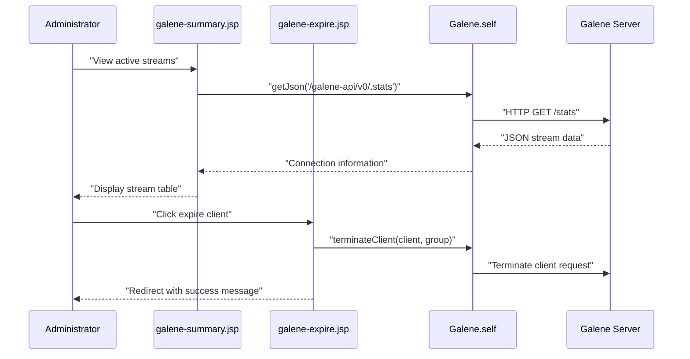

# Administration & Usage

> **Relevant source files**
> * [docs/galene-summary.png](https://github.com/igniterealtime/openfire-galene-plugin/blob/5aa54ac8/docs/galene-summary.png)
> * [src/i18n/galene_i18n.properties](https://github.com/igniterealtime/openfire-galene-plugin/blob/5aa54ac8/src/i18n/galene_i18n.properties)
> * [src/java/org/ifsoft/galene/openfire/MUCRoomProperties.java](https://github.com/igniterealtime/openfire-galene-plugin/blob/5aa54ac8/src/java/org/ifsoft/galene/openfire/MUCRoomProperties.java)
> * [src/web/galene-expire.jsp](https://github.com/igniterealtime/openfire-galene-plugin/blob/5aa54ac8/src/web/galene-expire.jsp)
> * [src/web/galene-muc.jsp](https://github.com/igniterealtime/openfire-galene-plugin/blob/5aa54ac8/src/web/galene-muc.jsp)
> * [src/web/galene-settings.jsp](https://github.com/igniterealtime/openfire-galene-plugin/blob/5aa54ac8/src/web/galene-settings.jsp)
> * [src/web/galene-summary.jsp](https://github.com/igniterealtime/openfire-galene-plugin/blob/5aa54ac8/src/web/galene-summary.jsp)

This page covers how administrators and users interact with the Galene plugin through its various interfaces, including monitoring active streams, configuring settings, and managing video conferences. For technical details about the underlying plugin architecture, see [System Architecture](/igniterealtime/openfire-galene-plugin/4-system-architecture). For specific client integration patterns, see [XMPP Client Integration](/igniterealtime/openfire-galene-plugin/3.3-xmpp-client-integration).

## Administrative Interface Architecture

The plugin provides web-based administrative interfaces integrated into Openfire's admin console, along with programmatic management capabilities.

### Admin Console Integration

**Sources:** [src/web/galene-summary.jsp L1-L214](https://github.com/igniterealtime/openfire-galene-plugin/blob/5aa54ac8/src/web/galene-summary.jsp#L1-L214)

 [src/web/galene-settings.jsp L1-L214](https://github.com/igniterealtime/openfire-galene-plugin/blob/5aa54ac8/src/web/galene-settings.jsp#L1-L214)

 [src/web/galene-muc.jsp L1-L76](https://github.com/igniterealtime/openfire-galene-plugin/blob/5aa54ac8/src/web/galene-muc.jsp#L1-L76)

 [src/web/galene-expire.jsp L1-L21](https://github.com/igniterealtime/openfire-galene-plugin/blob/5aa54ac8/src/web/galene-expire.jsp#L1-L21)

## Stream Monitoring and Management

Administrators can monitor active video streams and manage client connections through the summary interface.

### Real-time Stream Monitoring

The `galene-summary.jsp` page provides comprehensive monitoring of active connections:

**Sources:** [src/web/galene-summary.jsp L19-L26](https://github.com/igniterealtime/openfire-galene-plugin/blob/5aa54ac8/src/web/galene-summary.jsp#L19-L26)

 [src/web/galene-summary.jsp L54-L212](https://github.com/igniterealtime/openfire-galene-plugin/blob/5aa54ac8/src/web/galene-summary.jsp#L54-L212)

 [src/web/galene-expire.jsp L13-L16](https://github.com/igniterealtime/openfire-galene-plugin/blob/5aa54ac8/src/web/galene-expire.jsp#L13-L16)

### Stream Metrics and Information

The monitoring interface displays detailed information about each active stream:

| Metric | Description | Source |
| --- | --- | --- |
| Client ID | XMPP JID or connection identifier | `GaleneIQHandler.clients` registry |
| Stream ID | Galene internal stream identifier | `/galene-api/v0/.stats` |
| Stream Type | `up` (sending) or `down` (receiving) | Track data arrays |
| Track Type | `audio` or `video` | Track metadata |
| Bitrate | Current bitrate in bits/sec | Track statistics |
| Max Bitrate | Maximum configured bitrate | Track configuration |
| Packet Loss | Network packet loss percentage | RTC statistics |
| Jitter | Network jitter measurements | RTC statistics |

**Sources:** [src/web/galene-summary.jsp L64-L75](https://github.com/igniterealtime/openfire-galene-plugin/blob/5aa54ac8/src/web/galene-summary.jsp#L64-L75)

 [src/web/galene-summary.jsp L168-L189](https://github.com/igniterealtime/openfire-galene-plugin/blob/5aa54ac8/src/web/galene-summary.jsp#L168-L189)

 [src/i18n/galene_i18n.properties L34-L42](https://github.com/igniterealtime/openfire-galene-plugin/blob/5aa54ac8/src/i18n/galene_i18n.properties#L34-L42)

## Configuration Management

The plugin provides multiple levels of configuration: global settings, per-room configuration, and runtime parameters.

### Global Plugin Configuration

**Sources:** [src/web/galene-settings.jsp L16-L61](https://github.com/igniterealtime/openfire-galene-plugin/blob/5aa54ac8/src/web/galene-settings.jsp#L16-L61)

 [src/web/galene-settings.jsp L91-L192](https://github.com/igniterealtime/openfire-galene-plugin/blob/5aa54ac8/src/web/galene-settings.jsp#L91-L192)

### Configuration Properties Reference

| Property | Default | Purpose |
| --- | --- | --- |
| `galene.enabled` | `true` | Enable/disable the plugin |
| `galene.muc.enabled` | `false` | Enable MUC room integration |
| `galene.mux.enabled` | `false` | Use single UDP port vs range |
| `galene.turn.enabled` | `false` | Enable embedded TURN server |
| `galene.username` | `sfu-admin` | Admin username for Galene |
| `galene.password` | `sfu-admin` | Admin password for Galene |
| `galene.port` | Auto-detected | TCP port for Galene |
| `galene.port.range.min` | Auto-detected | Minimum UDP port |
| `galene.port.range.max` | Auto-detected | Maximum UDP port |
| `galene.ipaddr` | Auto-detected | Server IP address |
| `galene.url` | Auto-detected | External access URL |

**Sources:** [src/web/galene-settings.jsp L18-L60](https://github.com/igniterealtime/openfire-galene-plugin/blob/5aa54ac8/src/web/galene-settings.jsp#L18-L60)

 [src/i18n/galene_i18n.properties L7-L24](https://github.com/igniterealtime/openfire-galene-plugin/blob/5aa54ac8/src/i18n/galene_i18n.properties#L7-L24)

### Per-Room Configuration

Individual MUC rooms can have specific SFU settings managed through the room configuration interface:

**Sources:** [src/web/galene-muc.jsp L23-L31](https://github.com/igniterealtime/openfire-galene-plugin/blob/5aa54ac8/src/web/galene-muc.jsp#L23-L31)

 [src/java/org/ifsoft/galene/openfire/MUCRoomProperties.java L172-L196](https://github.com/igniterealtime/openfire-galene-plugin/blob/5aa54ac8/src/java/org/ifsoft/galene/openfire/MUCRoomProperties.java#L172-L196)

 [src/java/org/ifsoft/galene/openfire/MUCRoomProperties.java L227-L244](https://github.com/igniterealtime/openfire-galene-plugin/blob/5aa54ac8/src/java/org/ifsoft/galene/openfire/MUCRoomProperties.java#L227-L244)

## User Access Patterns

Users can access video conferences through multiple pathways depending on their client capabilities and preferences.

### Access Method Overview

**Sources:** [src/web/galene-muc.jsp L34-L35](https://github.com/igniterealtime/openfire-galene-plugin/blob/5aa54ac8/src/web/galene-muc.jsp#L34-L35)

 [src/web/galene-summary.jsp L57-L58](https://github.com/igniterealtime/openfire-galene-plugin/blob/5aa54ac8/src/web/galene-summary.jsp#L57-L58)

 [src/i18n/galene_i18n.properties L43-L44](https://github.com/igniterealtime/openfire-galene-plugin/blob/5aa54ac8/src/i18n/galene_i18n.properties#L43-L44)

### Administrative Actions

Administrators can perform various management tasks through the web interface:

| Action | Interface | Purpose |
| --- | --- | --- |
| View Active Streams | `galene-summary.jsp` | Monitor real-time connections |
| Terminate Client | `galene-expire.jsp` | Force disconnect problematic clients |
| Configure Global Settings | `galene-settings.jsp` | Adjust plugin-wide parameters |
| Configure Room Settings | `galene-muc.jsp` | Set per-room SFU options |
| Access Group Lobby | External URL links | Direct web interface access |

The termination workflow demonstrates the administrative control flow:

**Sources:** [src/web/galene-summary.jsp L195-L197](https://github.com/igniterealtime/openfire-galene-plugin/blob/5aa54ac8/src/web/galene-summary.jsp#L195-L197)

 [src/web/galene-expire.jsp L16-L20](https://github.com/igniterealtime/openfire-galene-plugin/blob/5aa54ac8/src/web/galene-expire.jsp#L16-L20)