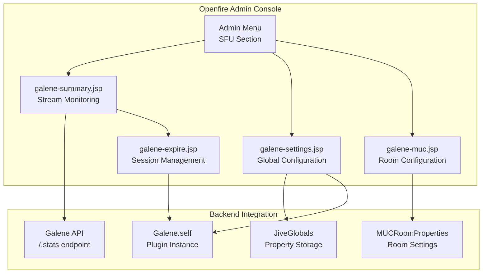
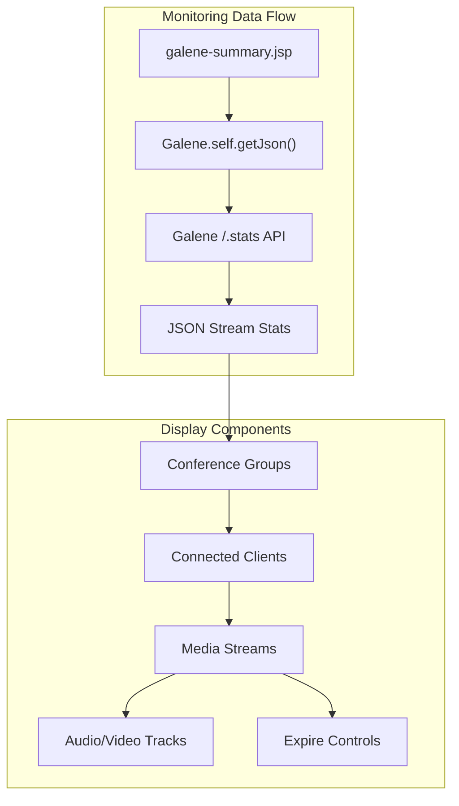
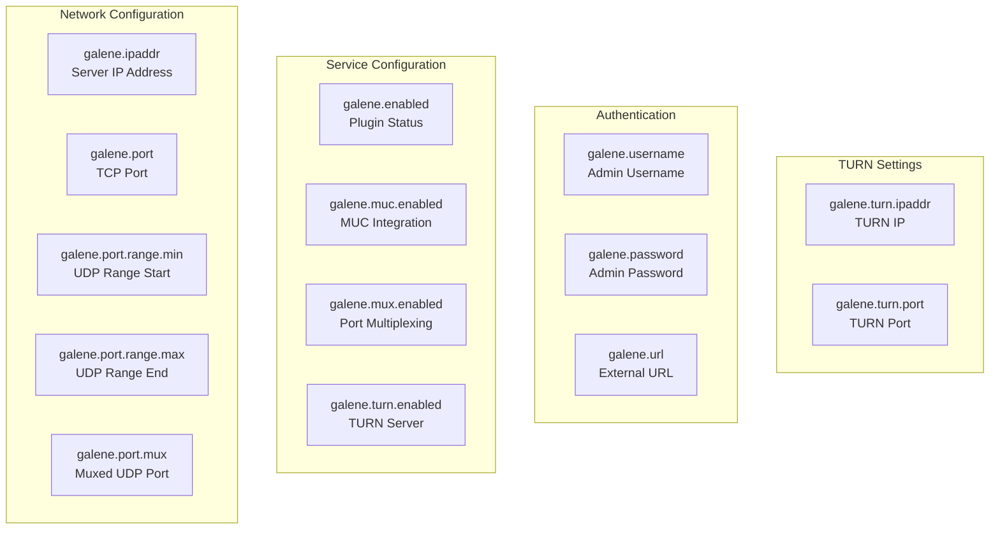
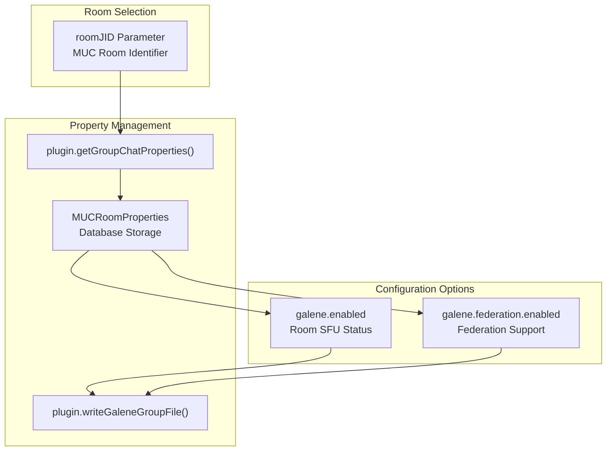
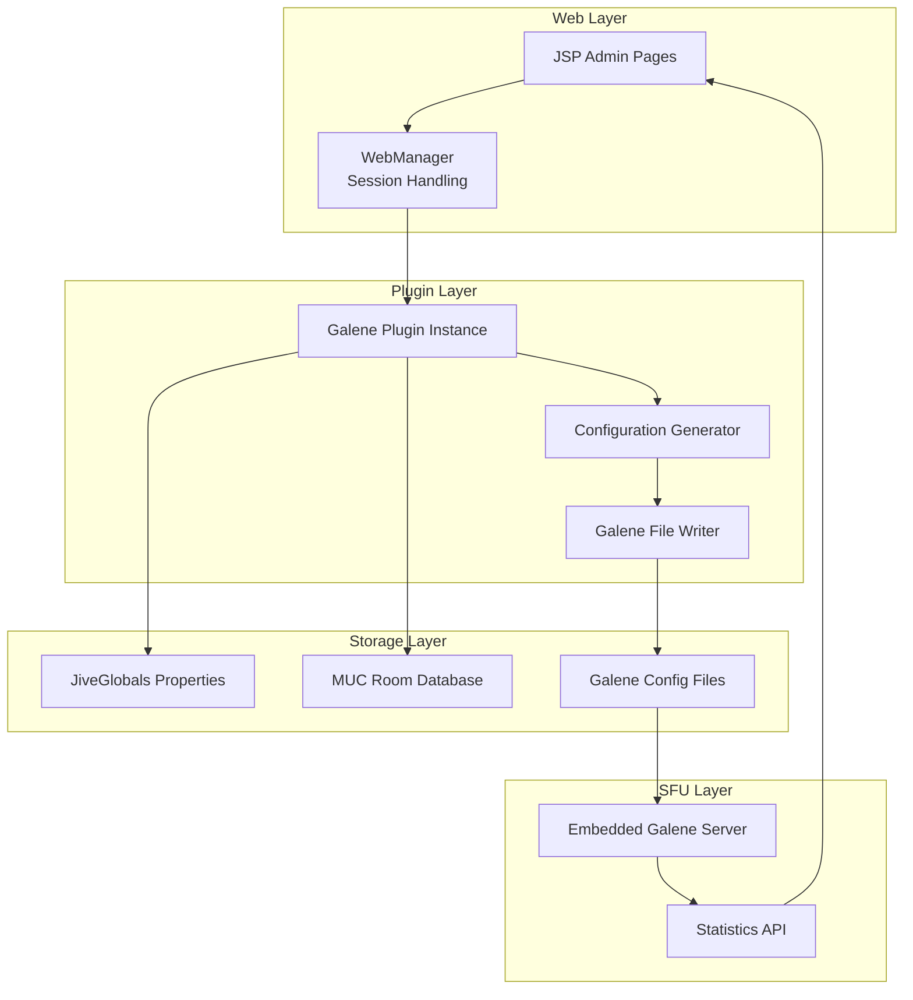

# Admin Console Interface

> **Relevant source files**
> * [docs/galene-summary.png](https://github.com/igniterealtime/openfire-galene-plugin/blob/5aa54ac8/docs/galene-summary.png)
> * [src/i18n/galene_i18n.properties](https://github.com/igniterealtime/openfire-galene-plugin/blob/5aa54ac8/src/i18n/galene_i18n.properties)
> * [src/java/org/ifsoft/galene/openfire/MUCRoomProperties.java](https://github.com/igniterealtime/openfire-galene-plugin/blob/5aa54ac8/src/java/org/ifsoft/galene/openfire/MUCRoomProperties.java)
> * [src/web/galene-expire.jsp](https://github.com/igniterealtime/openfire-galene-plugin/blob/5aa54ac8/src/web/galene-expire.jsp)
> * [src/web/galene-muc.jsp](https://github.com/igniterealtime/openfire-galene-plugin/blob/5aa54ac8/src/web/galene-muc.jsp)
> * [src/web/galene-settings.jsp](https://github.com/igniterealtime/openfire-galene-plugin/blob/5aa54ac8/src/web/galene-settings.jsp)
> * [src/web/galene-summary.jsp](https://github.com/igniterealtime/openfire-galene-plugin/blob/5aa54ac8/src/web/galene-summary.jsp)

This document covers the web-based administrative interface for the Openfire Galene Plugin, accessible through the Openfire admin console. The interface provides configuration management, real-time monitoring of streaming sessions, and administrative controls for the embedded Galene SFU server.

For information about the underlying plugin architecture, see [Core Plugin Architecture](./4.1-core-plugin-architecture.md). For details about client-side interfaces, see [Web Client Interface](./3.2-web-client-interface.md).

## Overview

The admin console interface consists of four main JSP pages integrated into Openfire's web administration panel. These pages provide comprehensive management capabilities for the Galene SFU functionality, from global configuration to real-time session monitoring.

## Admin Console Structure

Sources: [src/web/galene-summary.jsp L1-L214](https://github.com/igniterealtime/openfire-galene-plugin/blob/5aa54ac8/src/web/galene-summary.jsp#L1-L214)

 [src/web/galene-settings.jsp L1-L213](https://github.com/igniterealtime/openfire-galene-plugin/blob/5aa54ac8/src/web/galene-settings.jsp#L1-L213)

 [src/web/galene-muc.jsp L1-L76](https://github.com/igniterealtime/openfire-galene-plugin/blob/5aa54ac8/src/web/galene-muc.jsp#L1-L76)

 [src/web/galene-expire.jsp L1-L21](https://github.com/igniterealtime/openfire-galene-plugin/blob/5aa54ac8/src/web/galene-expire.jsp#L1-L21)

## Stream Monitoring Page

The primary monitoring interface is implemented in `galene-summary.jsp`, providing real-time visibility into active streaming sessions across all Galene conference groups.

### Core Monitoring Features

The monitoring page fetches statistics by calling `Galene.self.getJson("/galene-api/v0/.stats")` and displays:

* **Client Information**: XMPP JID resolution via `GaleneIQHandler.clients.get(id).getFullId()`
* **Stream Details**: Upstream and downstream media flows
* **Performance Metrics**: Bitrate, packet loss, jitter measurements
* **Session Controls**: Individual client termination capabilities

### Data Structure Processing

The page processes nested JSON arrays containing connection statistics:

| Data Level | Description | Code Reference |
| --- | --- | --- |
| `connections` | Conference groups | [src/web/galene-summary.jsp L19-L26](https://github.com/igniterealtime/openfire-galene-plugin/blob/5aa54ac8/src/web/galene-summary.jsp#L19-L26) |
| `clients` | Individual participants | [src/web/galene-summary.jsp L96-L123](https://github.com/igniterealtime/openfire-galene-plugin/blob/5aa54ac8/src/web/galene-summary.jsp#L96-L123) |
| `up`/`down` | Media stream directions | [src/web/galene-summary.jsp L122-L137](https://github.com/igniterealtime/openfire-galene-plugin/blob/5aa54ac8/src/web/galene-summary.jsp#L122-L137) |
| `tracks` | Audio/video track data | [src/web/galene-summary.jsp L160-L189](https://github.com/igniterealtime/openfire-galene-plugin/blob/5aa54ac8/src/web/galene-summary.jsp#L160-L189) |

Sources: [src/web/galene-summary.jsp L19-L212](https://github.com/igniterealtime/openfire-galene-plugin/blob/5aa54ac8/src/web/galene-summary.jsp#L19-L212)

 [src/i18n/galene_i18n.properties L30-L44](https://github.com/igniterealtime/openfire-galene-plugin/blob/5aa54ac8/src/i18n/galene_i18n.properties#L30-L44)

## Global Configuration Page

The `galene-settings.jsp` page manages system-wide Galene SFU configuration through Openfire's `JiveGlobals` property system.

### Configuration Categories

### Property Management

Configuration changes trigger `plugin.setupGaleneFiles()` to regenerate Galene configuration files and restart the embedded server process. The form handles both boolean checkbox properties and text input values:

* **Boolean Properties**: Converted to "true"/"false" strings via checkbox state detection
* **Text Properties**: Validated and stored directly in `JiveGlobals`
* **Default Values**: Retrieved from plugin methods like `plugin.getIpAddress()`

Sources: [src/web/galene-settings.jsp L16-L61](https://github.com/igniterealtime/openfire-galene-plugin/blob/5aa54ac8/src/web/galene-settings.jsp#L16-L61)

 [src/i18n/galene_i18n.properties L7-L24](https://github.com/igniterealtime/openfire-galene-plugin/blob/5aa54ac8/src/i18n/galene_i18n.properties#L7-L24)

## Room-Specific Configuration

The `galene-muc.jsp` page provides per-room SFU configuration for Multi-User Chat rooms, integrating with Openfire's MUC service.

### Room Configuration Flow

The page uses `MUCRoomProperties` to store room-specific settings in Openfire's database, then generates corresponding Galene group configuration files.

Sources: [src/web/galene-muc.jsp L11-L31](https://github.com/igniterealtime/openfire-galene-plugin/blob/5aa54ac8/src/web/galene-muc.jsp#L11-L31)

 [src/java/org/ifsoft/galene/openfire/MUCRoomProperties.java L1-L305](https://github.com/igniterealtime/openfire-galene-plugin/blob/5aa54ac8/src/java/org/ifsoft/galene/openfire/MUCRoomProperties.java#L1-L305)

## Session Management

The `galene-expire.jsp` utility page provides administrative control over active client sessions through the `terminateClient()` method.

### Termination Process

The page accepts `client` and `group` parameters, calls `Galene.self.terminateClient(client, group)`, and redirects back to the summary page with a success message. This provides administrators with immediate control over problematic or unauthorized sessions.

Sources: [src/web/galene-expire.jsp L13-L20](https://github.com/igniterealtime/openfire-galene-plugin/blob/5aa54ac8/src/web/galene-expire.jsp#L13-L20)

## Integration Architecture

The admin interface bridges Openfire's web management system with the Galene SFU through the plugin's configuration and monitoring APIs. Changes made through the web interface trigger configuration file regeneration and server restarts to ensure consistent operation.

Sources: [src/web/galene-summary.jsp L12-L17](https://github.com/igniterealtime/openfire-galene-plugin/blob/5aa54ac8/src/web/galene-summary.jsp#L12-L17)

 [src/web/galene-settings.jsp L14-L60](https://github.com/igniterealtime/openfire-galene-plugin/blob/5aa54ac8/src/web/galene-settings.jsp#L14-L60)

 [src/java/org/ifsoft/galene/openfire/MUCRoomProperties.java L25-L48](https://github.com/igniterealtime/openfire-galene-plugin/blob/5aa54ac8/src/java/org/ifsoft/galene/openfire/MUCRoomProperties.java#L25-L48)