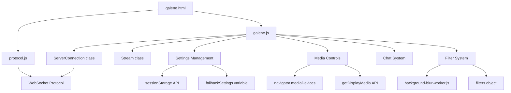
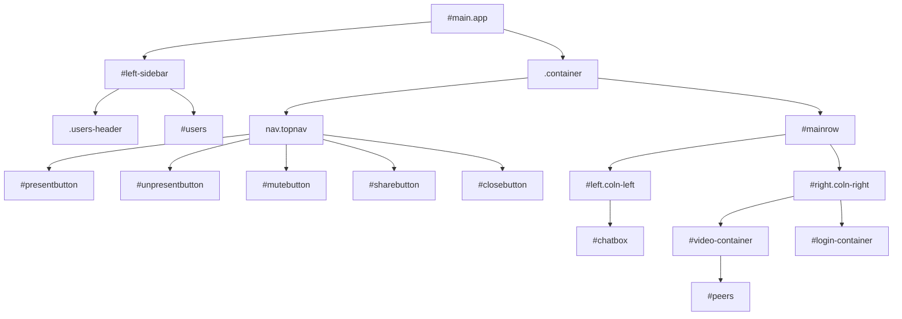
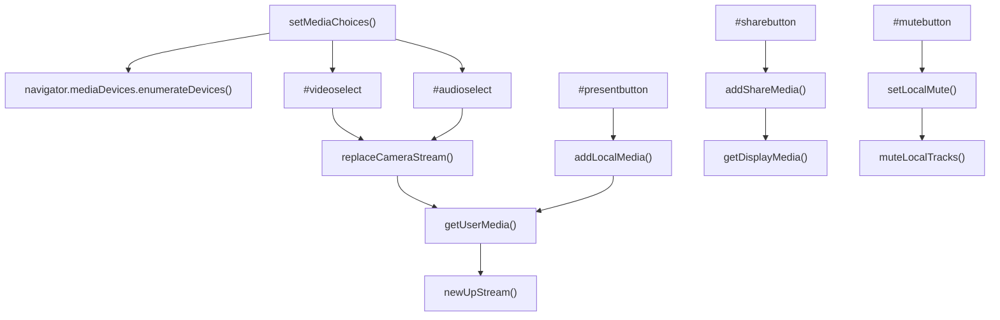
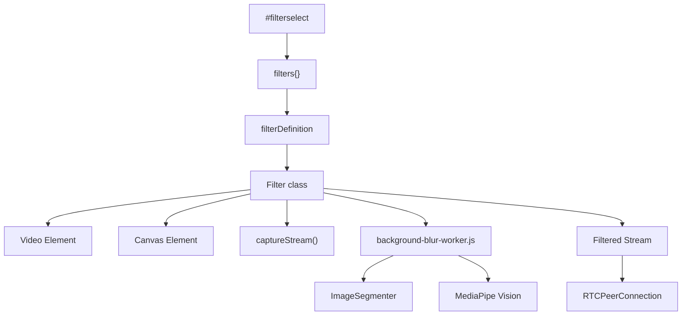

# Web Client Interface

> **Relevant source files**
> * [classes/macos-64/galene](https://github.com/igniterealtime/openfire-galene-plugin/blob/5aa54ac8/classes/macos-64/galene)
> * [classes/macos-64/static/background-blur-worker.js](https://github.com/igniterealtime/openfire-galene-plugin/blob/5aa54ac8/classes/macos-64/static/background-blur-worker.js)
> * [classes/macos-64/static/galene.js](https://github.com/igniterealtime/openfire-galene-plugin/blob/5aa54ac8/classes/macos-64/static/galene.js)
> * [classes/macos-64/static/index.html](https://github.com/igniterealtime/openfire-galene-plugin/blob/5aa54ac8/classes/macos-64/static/index.html)
> * [src/root/static/galene.css](https://github.com/igniterealtime/openfire-galene-plugin/blob/5aa54ac8/src/root/static/galene.css)
> * [src/root/static/galene.html](https://github.com/igniterealtime/openfire-galene-plugin/blob/5aa54ac8/src/root/static/galene.html)
> * [src/root/static/galene.js](https://github.com/igniterealtime/openfire-galene-plugin/blob/5aa54ac8/src/root/static/galene.js)
> * [src/root/static/index.html](https://github.com/igniterealtime/openfire-galene-plugin/blob/5aa54ac8/src/root/static/index.html)
> * [src/root/static/protocol.js](https://github.com/igniterealtime/openfire-galene-plugin/blob/5aa54ac8/src/root/static/protocol.js)

This document covers the web-based client interface for the Galène video conferencing system. The web client provides users with a browser-based interface for joining groups, participating in video conferences, and managing their media settings. For information about the server-side admin interface, see [Admin Console Interface](/igniterealtime/openfire-galene-plugin/3.1-admin-console-interface). For details about XMPP client integration, see [XMPP Client Integration](/igniterealtime/openfire-galene-plugin/3.3-xmpp-client-integration).

## Group Selection Interface

The web client begins with a landing page that allows users to discover and join available groups. This interface is implemented in [src/root/static/index.html L1-L40](https://github.com/igniterealtime/openfire-galene-plugin/blob/5aa54ac8/src/root/static/index.html#L1-L40)

 and provides a simple form for group selection.

The landing page presents:

* A group name input field with autofocus
* A join button that submits the form
* A section displaying publicly available groups
* Error message display area

When users submit the group form, they are redirected to the main conferencing interface at `/group/{groupname}`, which loads the full Galène client application.

**Sources:** [src/root/static/index.html L1-L40](https://github.com/igniterealtime/openfire-galene-plugin/blob/5aa54ac8/src/root/static/index.html#L1-L40)

## Main Conferencing Interface Architecture

The primary web client interface is built around several key JavaScript modules that work together to provide the complete video conferencing experience.

### Core Client Architecture

The main interface is structured around the `ServerConnection` class which handles all communication with the Galène server, and the main `galene.js` module which orchestrates the user interface and media handling.

**Sources:** [src/root/static/galene.html L1-L318](https://github.com/igniterealtime/openfire-galene-plugin/blob/5aa54ac8/src/root/static/galene.html#L1-L318)

 [src/root/static/galene.js L1-L100](https://github.com/igniterealtime/openfire-galene-plugin/blob/5aa54ac8/src/root/static/galene.js#L1-L100)

 [src/root/static/protocol.js L77-L246](https://github.com/igniterealtime/openfire-galene-plugin/blob/5aa54ac8/src/root/static/protocol.js#L77-L246)

### Interface Layout Components

**Sources:** [src/root/static/galene.html L19-L151](https://github.com/igniterealtime/openfire-galene-plugin/blob/5aa54ac8/src/root/static/galene.html#L19-L151)

## Client-Side Settings System

The web client implements a persistent settings system that stores user preferences across sessions. The settings are managed through several key functions in [src/root/static/galene.js L94-L164](https://github.com/igniterealtime/openfire-galene-plugin/blob/5aa54ac8/src/root/static/galene.js#L94-L164)

### Settings Storage Mechanism

The client uses a hybrid storage approach:

* Primary: `sessionStorage` for temporary session-based settings
* Fallback: `fallbackSettings` global variable when sessionStorage is unavailable

Key settings management functions:

* `storeSettings(settings)` - Persists settings to storage
* `getSettings()` - Retrieves current settings with fallback handling
* `updateSettings(settings)` - Merges new settings with existing ones
* `updateSetting(key, value)` - Updates a single setting
* `delSetting(key)` - Removes a setting

### Settings Categories

The settings system manages several categories of user preferences:

| Setting Category | Properties | Purpose |
| --- | --- | --- |
| Media Settings | `video`, `audio`, `mirrorView`, `blackboardMode` | Device selection and video display |
| Quality Settings | `send`, `simulcast`, `request`, `hqaudio` | Bandwidth and quality control |
| Audio Processing | `preprocessing`, `localMute` | Audio enhancement and mute state |
| UI Behavior | `activityDetection`, `displayAll` | Interface behavior preferences |
| Advanced | `filter`, `forceRelay`, `resolution` | Filters and network preferences |

The `reflectSettings()` function at [src/root/static/galene.js L205-L302](https://github.com/igniterealtime/openfire-galene-plugin/blob/5aa54ac8/src/root/static/galene.js#L205-L302)

 ensures the UI reflects the stored settings when the client loads.

**Sources:** [src/root/static/galene.js L94-L164](https://github.com/igniterealtime/openfire-galene-plugin/blob/5aa54ac8/src/root/static/galene.js#L94-L164)

 [src/root/static/galene.js L205-L302](https://github.com/igniterealtime/openfire-galene-plugin/blob/5aa54ac8/src/root/static/galene.js#L205-L302)

## Media Controls and Configuration

### Media Device Management

The client provides comprehensive media device management through several key systems:

The media system is built around these core functions:

* `setMediaChoices()` at [src/root/static/galene.js L993-L1026](https://github.com/igniterealtime/openfire-galene-plugin/blob/5aa54ac8/src/root/static/galene.js#L993-L1026)  populates device selection menus
* `addLocalMedia()` initiates camera/microphone capture
* `addShareMedia()` starts screen sharing
* `setLocalMute()` at [src/root/static/galene.js L622-L637](https://github.com/igniterealtime/openfire-galene-plugin/blob/5aa54ac8/src/root/static/galene.js#L622-L637)  handles audio muting

### Media Stream Configuration

Media streams are configured through several parameters:

* Video throughput controlled by `getMaxVideoThroughput()` at [src/root/static/galene.js L724-L739](https://github.com/igniterealtime/openfire-galene-plugin/blob/5aa54ac8/src/root/static/galene.js#L724-L739)
* Simulcast settings managed through the simulcast dropdown
* Audio quality controlled by the `hqaudio` setting
* Video processing options like mirror view and blackboard mode

**Sources:** [src/root/static/galene.js L993-L1026](https://github.com/igniterealtime/openfire-galene-plugin/blob/5aa54ac8/src/root/static/galene.js#L993-L1026)

 [src/root/static/galene.js L622-L637](https://github.com/igniterealtime/openfire-galene-plugin/blob/5aa54ac8/src/root/static/galene.js#L622-L637)

 [src/root/static/galene.js L724-L739](https://github.com/igniterealtime/openfire-galene-plugin/blob/5aa54ac8/src/root/static/galene.js#L724-L739)

## Chat System

The web client includes an integrated chat system that supports both public group chat and private messaging. The chat interface consists of:

* Chat container at `#chatbox` with message display area `#box`
* Input form `#inputform` with textarea `#input` and send button `#inputbutton`
* Toggle buttons for showing/hiding chat: `#show-chat` and `#close-chat`

The chat system handles:

* Real-time message display
* Chat history when joining a group
* Private messaging capabilities
* Privileged message indicators
* Timestamp display

Chat functionality integrates with the WebSocket protocol through the `onchat` callback in the `ServerConnection` class, which processes incoming chat messages and displays them in the interface.

**Sources:** [src/root/static/galene.html L77-L90](https://github.com/igniterealtime/openfire-galene-plugin/blob/5aa54ac8/src/root/static/galene.html#L77-L90)

 [src/root/static/protocol.js L496-L504](https://github.com/igniterealtime/openfire-galene-plugin/blob/5aa54ac8/src/root/static/protocol.js#L496-L504)

## WebSocket Protocol Integration

The web client communicates with the Galène server through a WebSocket-based protocol implemented in [src/root/static/protocol.js L1-L627](https://github.com/igniterealtime/openfire-galene-plugin/blob/5aa54ac8/src/root/static/protocol.js#L1-L627)

### Protocol Architecture

```mermaid
flowchart TD

ServerConnection["ServerConnection class"]
WebSocket["WebSocket API"]
MessageHandlers["Message Handlers"]
HandshakeHandler["handshake"]
JoinedHandler["joined"]
UserHandler["user"]
ChatHandler["chat/chathistory"]
OfferHandler["offer/answer"]
IceHandler["ice"]
CloseHandler["close/abort"]
StreamManagement["Stream Management"]
UpStreams["this.up{}"]
DownStreams["this.down{}"]
UserManagement["User Management"]
UsersObject["this.users{}"]
Callbacks["Client Callbacks"]
OnConnected["onconnected"]
OnJoined["onjoined"]
OnUser["onuser"]
OnChat["onchat"]
OnDownstream["ondownstream"]

ServerConnection --> WebSocket
ServerConnection --> MessageHandlers
MessageHandlers --> HandshakeHandler
MessageHandlers --> JoinedHandler
MessageHandlers --> UserHandler
MessageHandlers --> ChatHandler
MessageHandlers --> OfferHandler
MessageHandlers --> IceHandler
MessageHandlers --> CloseHandler
ServerConnection --> StreamManagement
StreamManagement --> UpStreams
StreamManagement --> DownStreams
ServerConnection --> UserManagement
UserManagement --> UsersObject
ServerConnection --> Callbacks
Callbacks --> OnConnected
Callbacks --> OnJoined
Callbacks --> OnUser
Callbacks --> OnChat
Callbacks --> OnDownstream
```

### Connection Lifecycle

The connection lifecycle follows this pattern:

1. `connect(url)` establishes WebSocket connection
2. Handshake exchange negotiates protocol version
3. `join(group, username, credentials)` joins a conference group
4. Ongoing message exchange for media signaling and chat
5. Connection cleanup on close/error

Key protocol features:

* Automatic ping/pong heartbeat mechanism
* RTCPeerConnection management for WebRTC streams
* ICE candidate exchange for NAT traversal
* User presence and permission management

**Sources:** [src/root/static/protocol.js L77-L246](https://github.com/igniterealtime/openfire-galene-plugin/blob/5aa54ac8/src/root/static/protocol.js#L77-L246)

 [src/root/static/protocol.js L316-L527](https://github.com/igniterealtime/openfire-galene-plugin/blob/5aa54ac8/src/root/static/protocol.js#L316-L527)

## Advanced Features

### Video Filter System

The client supports advanced video filtering capabilities including background blur and other effects. The filter system is implemented through:

* Filter definitions stored in a global `filters` object
* `Filter` class at [src/root/static/galene.js L1126-L1160](https://github.com/igniterealtime/openfire-galene-plugin/blob/5aa54ac8/src/root/static/galene.js#L1126-L1160)  for managing filter instances
* Web Workers for computationally intensive filters

### Background Blur Implementation

The background blur feature uses MediaPipe's image segmentation running in a Web Worker:

Key components:

* `loadImageSegmenter()` at [classes/macos-64/static/background-blur-worker.js L25-L39](https://github.com/igniterealtime/openfire-galene-plugin/blob/5aa54ac8/classes/macos-64/static/background-blur-worker.js#L25-L39)  loads the ML model
* `foregroundMask()` at [classes/macos-64/static/background-blur-worker.js L41-L70](https://github.com/igniterealtime/openfire-galene-plugin/blob/5aa54ac8/classes/macos-64/static/background-blur-worker.js#L41-L70)  generates person mask
* Message passing between main thread and worker for video frame processing

The filter system allows for:

* Real-time video processing at 30 FPS
* Canvas-based rendering pipeline
* Automatic frame rate adaptation
* Filter chaining and cleanup

**Sources:** [src/root/static/galene.js L1126-L1160](https://github.com/igniterealtime/openfire-galene-plugin/blob/5aa54ac8/src/root/static/galene.js#L1126-L1160)

 [classes/macos-64/static/background-blur-worker.js L25-L70](https://github.com/igniterealtime/openfire-galene-plugin/blob/5aa54ac8/classes/macos-64/static/background-blur-worker.js#L25-L70)

### Responsive Design and Mobile Support

The client includes responsive design features for mobile devices:

* `isMobileLayout()` function at [src/root/static/galene.js L308-L310](https://github.com/igniterealtime/openfire-galene-plugin/blob/5aa54ac8/src/root/static/galene.js#L308-L310)  detects mobile screens
* Viewport height management with CSS custom properties
* Touch-friendly interface elements
* Adaptive video layout based on screen size

The interface automatically adjusts button visibility and layout based on screen size and device capabilities, ensuring a consistent experience across desktop and mobile platforms.

**Sources:** [src/root/static/galene.js L308-L310](https://github.com/igniterealtime/openfire-galene-plugin/blob/5aa54ac8/src/root/static/galene.js#L308-L310)

 [src/root/static/galene.js L533-L540](https://github.com/igniterealtime/openfire-galene-plugin/blob/5aa54ac8/src/root/static/galene.js#L533-L540)