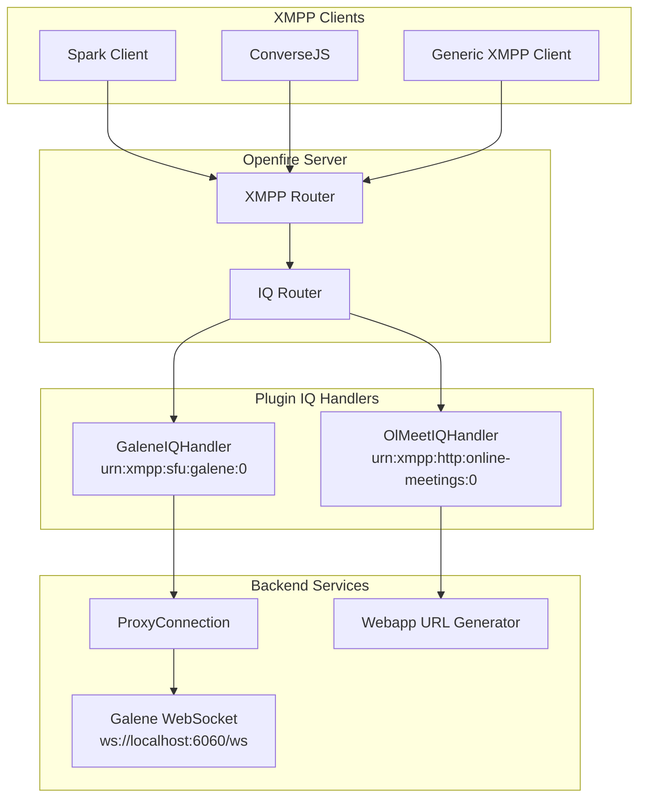
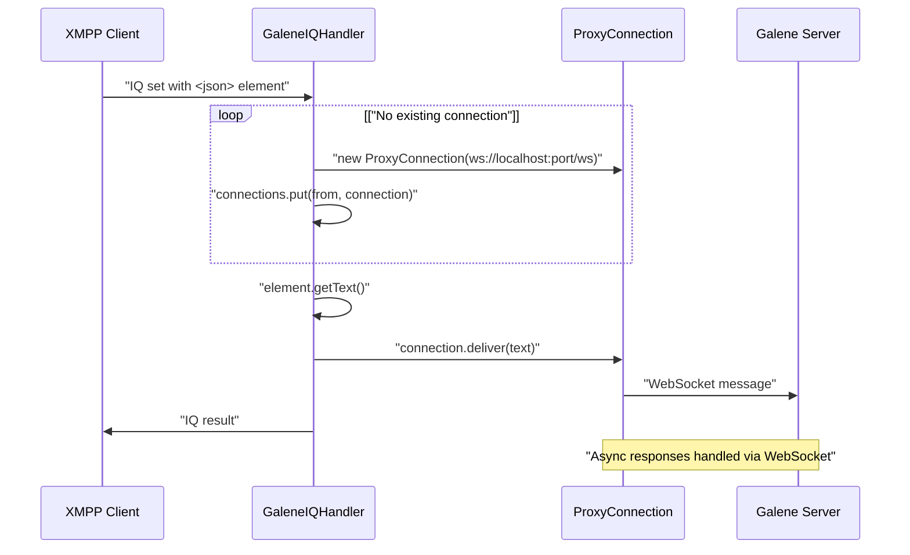
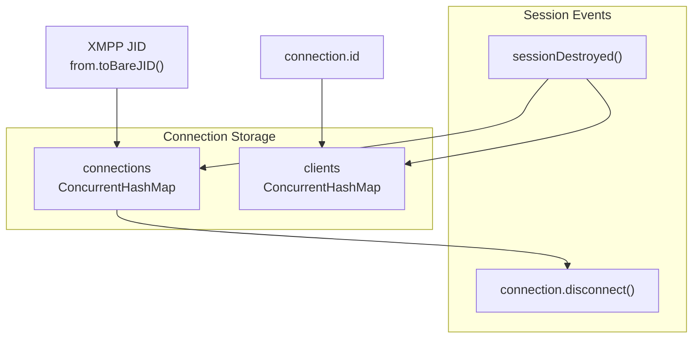
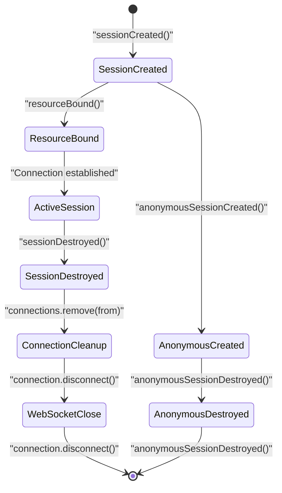

# XMPP Client Integration

> **Relevant source files**
> * [src/java/org/ifsoft/galene/openfire/GaleneIQHandler.java](https://github.com/igniterealtime/openfire-galene-plugin/blob/5aa54ac8/src/java/org/ifsoft/galene/openfire/GaleneIQHandler.java)
> * [src/java/org/ifsoft/galene/openfire/OlMeetIQHandler.java](https://github.com/igniterealtime/openfire-galene-plugin/blob/5aa54ac8/src/java/org/ifsoft/galene/openfire/OlMeetIQHandler.java)
> * [src/root/data/ice-servers.json](https://github.com/igniterealtime/openfire-galene-plugin/blob/5aa54ac8/src/root/data/ice-servers.json)

This document covers how XMPP clients interact with the Openfire Galene Plugin through custom IQ handlers and XMPP protocol extensions. It explains the available integration patterns, message flows, and client-side implementation requirements for accessing Galene SFU functionality through XMPP.

For detailed protocol specifications, see [XEP-XXXX: In-Band SFU Sessions](/igniterealtime/openfire-galene-plugin/5.1-xep-xxxx:-in-band-sfu-sessions). For configuration of client-facing features, see [Advanced Configuration](/igniterealtime/openfire-galene-plugin/2.3-advanced-configuration).

## Protocol Overview

The plugin provides two primary XMPP integration points for client applications:

| Handler | Namespace | Purpose | Element |
| --- | --- | --- | --- |
| `GaleneIQHandler` | `urn:xmpp:sfu:galene:0` | Real-time SFU communication | `c2s` |
| `OlMeetIQHandler` | `urn:xmpp:http:online-meetings:0` | Meeting URL generation | `query` |

### Protocol Architecture



Sources: [src/java/org/ifsoft/galene/openfire/GaleneIQHandler.java L34-L164](https://github.com/igniterealtime/openfire-galene-plugin/blob/5aa54ac8/src/java/org/ifsoft/galene/openfire/GaleneIQHandler.java#L34-L164)

 [src/java/org/ifsoft/galene/openfire/OlMeetIQHandler.java L28-L92](https://github.com/igniterealtime/openfire-galene-plugin/blob/5aa54ac8/src/java/org/ifsoft/galene/openfire/OlMeetIQHandler.java#L28-L92)

## GaleneIQHandler Integration

The `GaleneIQHandler` provides the primary interface for real-time SFU communication between XMPP clients and the embedded Galene server. It implements a WebSocket proxy pattern that bridges XMPP IQ stanzas to WebSocket messages.

### Handler Configuration

The handler registers with these properties:

* **Namespace**: `urn:xmpp:sfu:galene:0`
* **Element Name**: `c2s`
* **Handler Name**: "Galene IQ Handler"

### Message Flow



Sources: [src/java/org/ifsoft/galene/openfire/GaleneIQHandler.java L56-L100](https://github.com/igniterealtime/openfire-galene-plugin/blob/5aa54ac8/src/java/org/ifsoft/galene/openfire/GaleneIQHandler.java#L56-L100)

### Connection Management

The handler maintains two concurrent hashmaps for connection tracking:



Sources: [src/java/org/ifsoft/galene/openfire/GaleneIQHandler.java L37-L38](https://github.com/igniterealtime/openfire-galene-plugin/blob/5aa54ac8/src/java/org/ifsoft/galene/openfire/GaleneIQHandler.java#L37-L38)

 [src/java/org/ifsoft/galene/openfire/GaleneIQHandler.java L152-L163](https://github.com/igniterealtime/openfire-galene-plugin/blob/5aa54ac8/src/java/org/ifsoft/galene/openfire/GaleneIQHandler.java#L152-L163)

### Client Implementation Pattern

XMPP clients interact with `GaleneIQHandler` using this IQ structure:

```xml
<iq type="set" to="server.domain" from="user@domain/resource">
  <c2s xmlns="urn:xmpp:sfu:galene:0">
    <json>{"type":"join","kind":"join","group":"roomname"}</json>
  </c2s>
</iq>
```

The handler extracts JSON from the `<json>` element and forwards it to the Galene WebSocket connection. Empty IQ stanzas (without `<json>`) trigger connection cleanup.

Sources: [src/java/org/ifsoft/galene/openfire/GaleneIQHandler.java L63-L90](https://github.com/igniterealtime/openfire-galene-plugin/blob/5aa54ac8/src/java/org/ifsoft/galene/openfire/GaleneIQHandler.java#L63-L90)

## OlMeetIQHandler Integration

The `OlMeetIQHandler` implements support for XEP-0483 HTTP Online Meetings, providing XMPP clients with web URLs to join Galene conferences.

### Handler Configuration

* **Namespace**: `urn:xmpp:http:online-meetings:0`
* **Element Name**: `query`
* **Supported Features**: * `urn:xmpp:http:online-meetings:initiate:0` * `urn:xmpp:http:online-meetings#galene`

### URL Generation Flow

```mermaid
flowchart TD

QueryIQ["IQ with"]
OptionalID["Optional id attribute"]
TypeCheck["Check type == 'galene'"]
URLGeneration["Generate webapp URL"]
ResponseBuilder["Build IQ response"]
InitiateElement[""]
URLElement["webapp_url"]
InviteElement[""]

QueryIQ --> TypeCheck
OptionalID --> URLGeneration
ResponseBuilder --> InitiateElement
ResponseBuilder --> URLElement
ResponseBuilder --> InviteElement

subgraph subGraph2 ["Response Elements"]
    InitiateElement
    URLElement
    InviteElement
end

subgraph subGraph1 ["Handler Processing"]
    TypeCheck
    URLGeneration
    ResponseBuilder
    TypeCheck --> URLGeneration
    URLGeneration --> ResponseBuilder
end

subgraph subGraph0 ["Client Request"]
    QueryIQ
    OptionalID
end
```

Sources: [src/java/org/ifsoft/galene/openfire/OlMeetIQHandler.java L46-L68](https://github.com/igniterealtime/openfire-galene-plugin/blob/5aa54ac8/src/java/org/ifsoft/galene/openfire/OlMeetIQHandler.java#L46-L68)

### Client Implementation Example

```xml
<!-- Request -->
<iq type="get" to="server.domain">
  <query xmlns="urn:xmpp:http:online-meetings:0" type="galene" id="roomname"/>
</iq>

<!-- Response -->
<iq type="result">
  <query xmlns="urn:xmpp:http:online-meetings:0">
    <initiate type="galene">
      <url>https://server.domain:7443/galene/roomname</url>
    </initiate>
    <invite xmlns="urn:xmpp:call-invites:0">
      <external uri="https://server.domain:7443/galene/roomname"/>
    </invite>
  </query>
</iq>
```

Sources: [src/java/org/ifsoft/galene/openfire/OlMeetIQHandler.java L49-L64](https://github.com/igniterealtime/openfire-galene-plugin/blob/5aa54ac8/src/java/org/ifsoft/galene/openfire/OlMeetIQHandler.java#L49-L64)

## Session Lifecycle Management

The `GaleneIQHandler` implements `SessionEventListener` to properly manage WebSocket connections throughout the XMPP session lifecycle.

### Session Event Handling



### Connection Cleanup Process

When an XMPP session ends, the handler performs these cleanup steps:

1. Extract bare JID: `session.getAddress().toBareJID()`
2. Remove from connections map: `connections.remove(from)`
3. Remove from clients map: `clients.remove(connection.id)`
4. Disconnect WebSocket: `connection.disconnect()`

Sources: [src/java/org/ifsoft/galene/openfire/GaleneIQHandler.java L152-L163](https://github.com/igniterealtime/openfire-galene-plugin/blob/5aa54ac8/src/java/org/ifsoft/galene/openfire/GaleneIQHandler.java#L152-L163)

 [src/java/org/ifsoft/galene/openfire/GaleneIQHandler.java L42-L48](https://github.com/igniterealtime/openfire-galene-plugin/blob/5aa54ac8/src/java/org/ifsoft/galene/openfire/GaleneIQHandler.java#L42-L48)

## Server Features Discovery

Both IQ handlers implement `ServerFeaturesProvider` to advertise their capabilities through service discovery.

### Advertised Features

| Handler | Features |
| --- | --- |
| `GaleneIQHandler` | `urn:xmpp:sfu:galene:0` |
| `OlMeetIQHandler` | `urn:xmpp:http:online-meetings:initiate:0``urn:xmpp:http:online-meetings#galene` |

XMPP clients can discover these features using standard service discovery (`disco#info`) queries to determine plugin availability and supported protocols.

Sources: [src/java/org/ifsoft/galene/openfire/GaleneIQHandler.java L109-L115](https://github.com/igniterealtime/openfire-galene-plugin/blob/5aa54ac8/src/java/org/ifsoft/galene/openfire/GaleneIQHandler.java#L109-L115)

 [src/java/org/ifsoft/galene/openfire/OlMeetIQHandler.java L84-L91](https://github.com/igniterealtime/openfire-galene-plugin/blob/5aa54ac8/src/java/org/ifsoft/galene/openfire/OlMeetIQHandler.java#L84-L91)

## Integration Patterns

### Pattern 1: Real-time SFU Communication

For clients requiring real-time media signaling and control:

1. Send IQ stanzas to `urn:xmpp:sfu:galene:0`
2. Include JSON payloads in `<json>` elements
3. Maintain persistent connection throughout session
4. Handle asynchronous responses via established WebSocket proxy

### Pattern 2: HTTP Meeting Integration

For clients providing meeting URLs or web-based integration:

1. Query `urn:xmpp:http:online-meetings:0` with `type="galene"`
2. Optionally specify room ID via `id` attribute
3. Extract web URLs from response for user access
4. Support XEP-0483 call invitations

These patterns allow XMPP clients to choose between deep SFU integration and simpler web-based meeting access depending on their capabilities and requirements.

Sources: [src/java/org/ifsoft/galene/openfire/GaleneIQHandler.java L56-L100](https://github.com/igniterealtime/openfire-galene-plugin/blob/5aa54ac8/src/java/org/ifsoft/galene/openfire/GaleneIQHandler.java#L56-L100)

 [src/java/org/ifsoft/galene/openfire/OlMeetIQHandler.java L38-L76](https://github.com/igniterealtime/openfire-galene-plugin/blob/5aa54ac8/src/java/org/ifsoft/galene/openfire/OlMeetIQHandler.java#L38-L76)