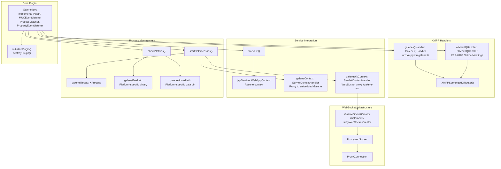
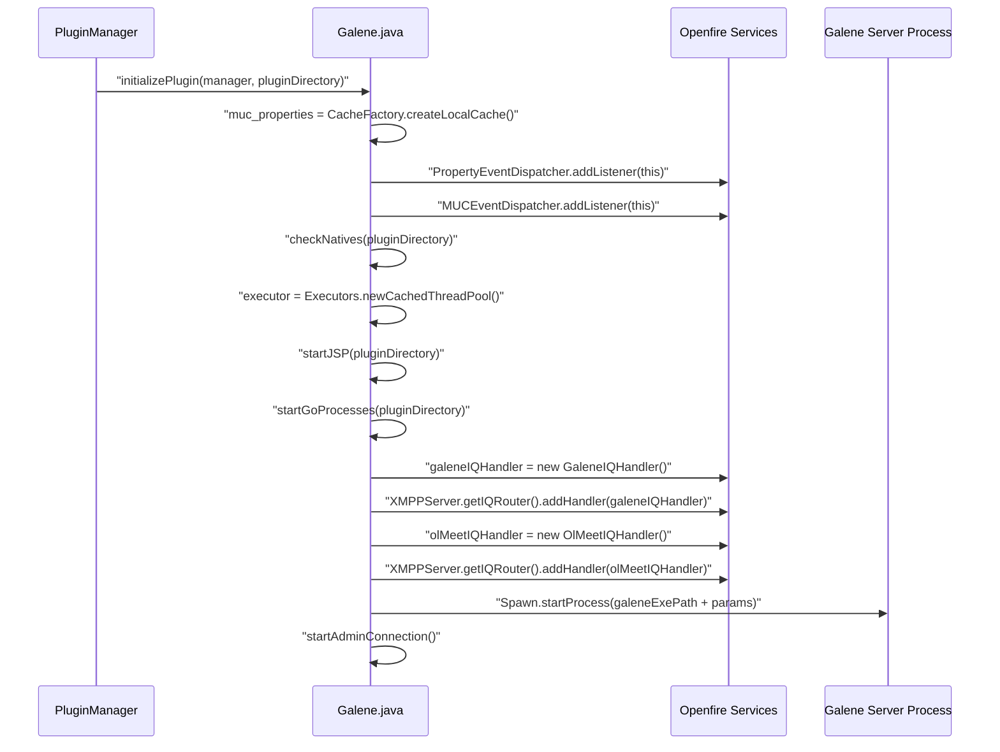
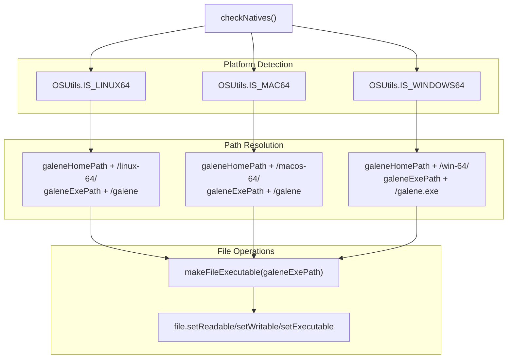
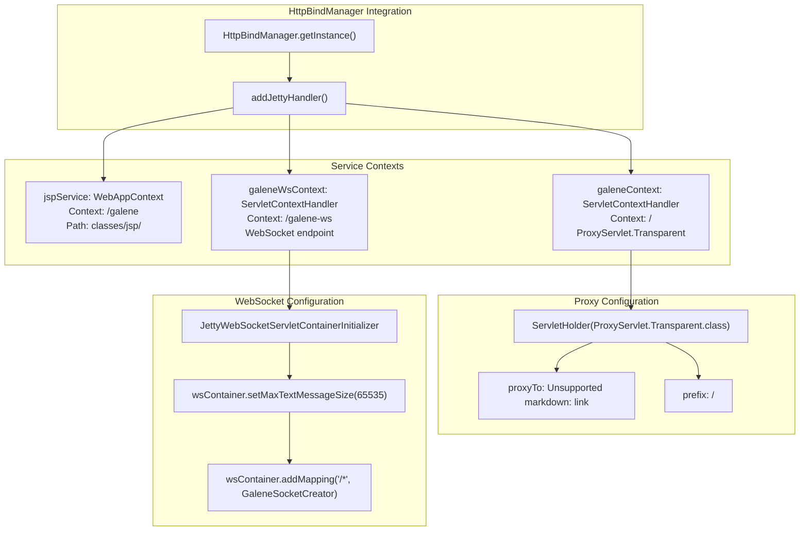
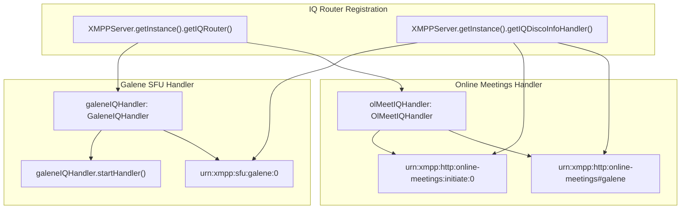
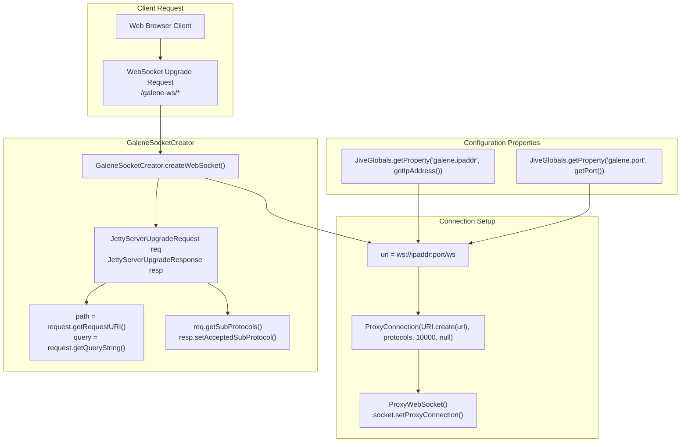
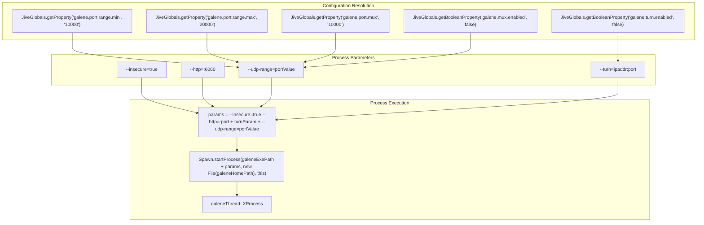
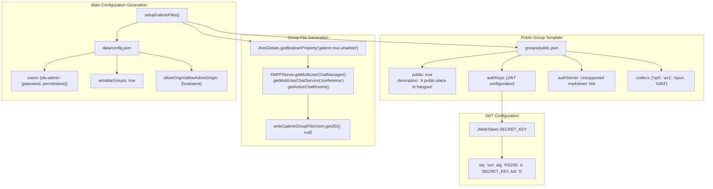
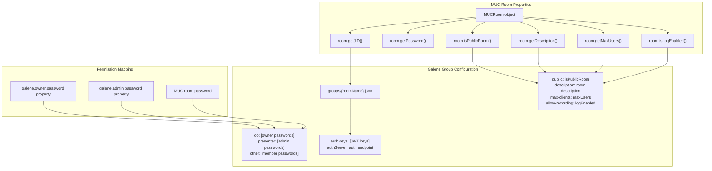

# System Architecture

> **Relevant source files**
> * [plugin.xml](https://github.com/igniterealtime/openfire-galene-plugin/blob/5aa54ac8/plugin.xml)
> * [src/java/org/ifsoft/galene/openfire/Galene.java](https://github.com/igniterealtime/openfire-galene-plugin/blob/5aa54ac8/src/java/org/ifsoft/galene/openfire/Galene.java)

This document provides a comprehensive overview of the internal architecture of the Openfire Galene Plugin, focusing on how the various components interact to provide SFU (Selective Forwarding Unit) video conferencing capabilities within the XMPP ecosystem. For installation and configuration details, see [Installation & Configuration](./2-installation-and-configuration.md). For protocol specifications, see [XMPP Protocol Extensions](./5-xmpp-protocol-extensions.md). For API details, see [API Reference](./8-api-reference.md).

## System Overview

The Openfire Galene Plugin implements a hybrid architecture that combines XMPP signaling with WebRTC media delivery by embedding the Galene SFU server within Openfire. The system bridges multiple client types (XMPP clients and web browsers) through a sophisticated proxy and handler system while maintaining deep integration with Openfire's Multi-User Chat (MUC) functionality.

### High-Level Component Architecture

**Sources:** [src/java/org/ifsoft/galene/openfire/Galene.java L60-L133](https://github.com/igniterealtime/openfire-galene-plugin/blob/5aa54ac8/src/java/org/ifsoft/galene/openfire/Galene.java#L60-L133)

 [plugin.xml L1-L27](https://github.com/igniterealtime/openfire-galene-plugin/blob/5aa54ac8/plugin.xml#L1-L27)

## Core Plugin Lifecycle

The `Galene` class serves as the main orchestrator, implementing multiple Openfire interfaces to integrate with different subsystems. The plugin follows a structured initialization and cleanup pattern.

### Plugin Initialization Sequence

**Sources:** [src/java/org/ifsoft/galene/openfire/Galene.java L110-L133](https://github.com/igniterealtime/openfire-galene-plugin/blob/5aa54ac8/src/java/org/ifsoft/galene/openfire/Galene.java#L110-L133)

### Platform Detection and Binary Management

The system supports multiple platforms by detecting the operating system and selecting appropriate binaries:

| Platform | Detection Method | Binary Path | Executable |
| --- | --- | --- | --- |
| Linux 64-bit | `OSUtils.IS_LINUX64` | `classes/linux-64/` | `galene` |
| macOS ARM64 | `OSUtils.IS_MAC64` | `classes/macos-64/` | `galene` |
| Windows 64-bit | `OSUtils.IS_WINDOWS64` | `classes/win-64/` | `galene.exe` |

**Sources:** [src/java/org/ifsoft/galene/openfire/Galene.java L326-L380](https://github.com/igniterealtime/openfire-galene-plugin/blob/5aa54ac8/src/java/org/ifsoft/galene/openfire/Galene.java#L326-L380)

## Service Integration Points

The plugin integrates with Openfire through multiple service attachment points, each serving different client types and protocols.

### HTTP Service Integration

**Sources:** [src/java/org/ifsoft/galene/openfire/Galene.java L227-L235](https://github.com/igniterealtime/openfire-galene-plugin/blob/5aa54ac8/src/java/org/ifsoft/galene/openfire/Galene.java#L227-L235)

 [src/java/org/ifsoft/galene/openfire/Galene.java L245-L274](https://github.com/igniterealtime/openfire-galene-plugin/blob/5aa54ac8/src/java/org/ifsoft/galene/openfire/Galene.java#L245-L274)

### IQ Handler Registration

The plugin registers two IQ handlers for different XMPP protocol extensions:

**Sources:** [src/java/org/ifsoft/galene/openfire/Galene.java L122-L131](https://github.com/igniterealtime/openfire-galene-plugin/blob/5aa54ac8/src/java/org/ifsoft/galene/openfire/Galene.java#L122-L131)

## WebSocket Proxy Architecture

The WebSocket proxy system bridges web clients to the embedded Galene server through a sophisticated connection management system.

### WebSocket Creation Flow

**Sources:** [src/java/org/ifsoft/galene/openfire/Galene.java L293-L324](https://github.com/igniterealtime/openfire-galene-plugin/blob/5aa54ac8/src/java/org/ifsoft/galene/openfire/Galene.java#L293-L324)

## Process Management

The plugin manages the embedded Galene server process with comprehensive parameter configuration and lifecycle management.

### Galene Process Configuration

**Sources:** [src/java/org/ifsoft/galene/openfire/Galene.java L256-L286](https://github.com/igniterealtime/openfire-galene-plugin/blob/5aa54ac8/src/java/org/ifsoft/galene/openfire/Galene.java#L256-L286)

## Configuration File Management

The system dynamically generates configuration files for the Galene server, including the main configuration and per-group files based on MUC room settings.

### Configuration Generation System

**Sources:** [src/java/org/ifsoft/galene/openfire/Galene.java L382-L475](https://github.com/igniterealtime/openfire-galene-plugin/blob/5aa54ac8/src/java/org/ifsoft/galene/openfire/Galene.java#L382-L475)

### MUC Integration and Group File Generation

The system creates Galene group files that correspond to MUC rooms, inheriting permissions and settings:

**Sources:** [src/java/org/ifsoft/galene/openfire/Galene.java L612-L710](https://github.com/igniterealtime/openfire-galene-plugin/blob/5aa54ac8/src/java/org/ifsoft/galene/openfire/Galene.java#L612-L710)

## Admin Console Integration

The plugin provides administrative interfaces through JSP pages integrated into Openfire's admin console structure.

### Admin Console Structure

| Page ID | JSP File | Purpose | Tab Location |
| --- | --- | --- | --- |
| `galene-summary` | `galene-summary.jsp` | Overview and status | Media Services |
| `galene-settings` | `galene-settings.jsp` | Global configuration | Media Services |
| `galene-muc` | `galene-muc.jsp` | MUC-specific SFU settings | Group Chat → Room Options |

**Sources:** [plugin.xml L12-L26](https://github.com/igniterealtime/openfire-galene-plugin/blob/5aa54ac8/plugin.xml#L12-L26)

This architecture provides a robust foundation for integrating Galene SFU capabilities into Openfire while maintaining compatibility with existing XMPP infrastructure and providing multiple client access methods through both native XMPP protocols and web-based interfaces.