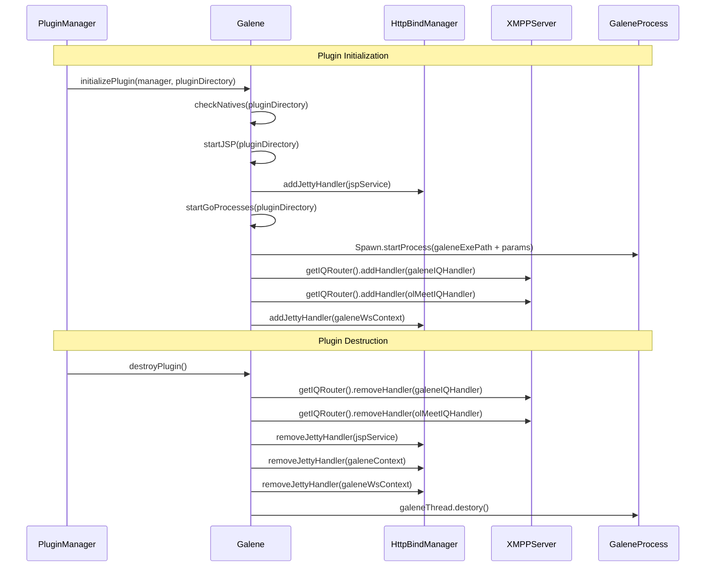
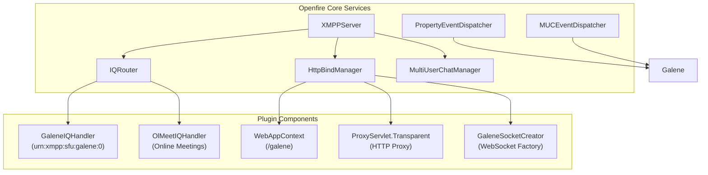
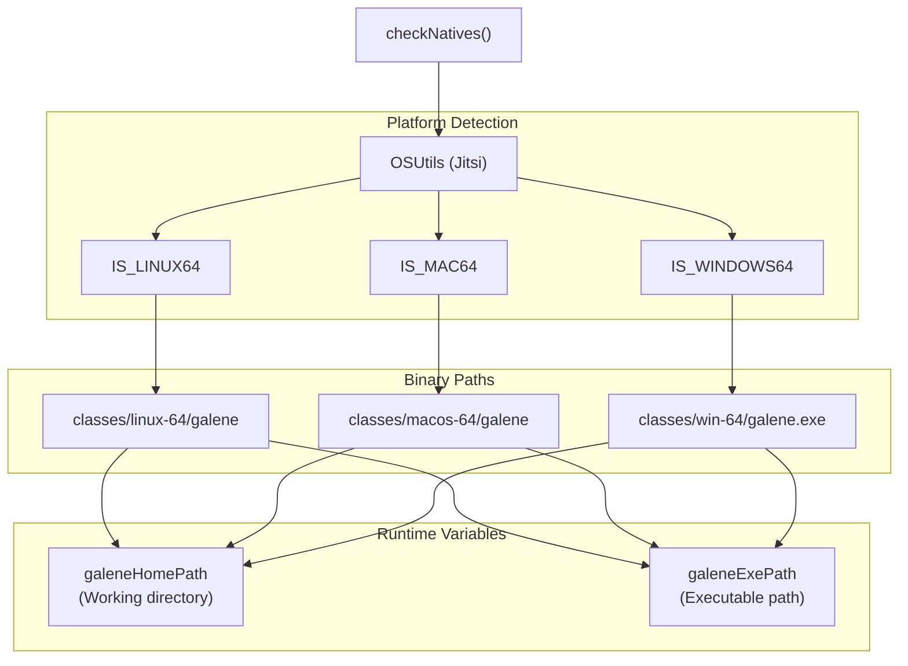
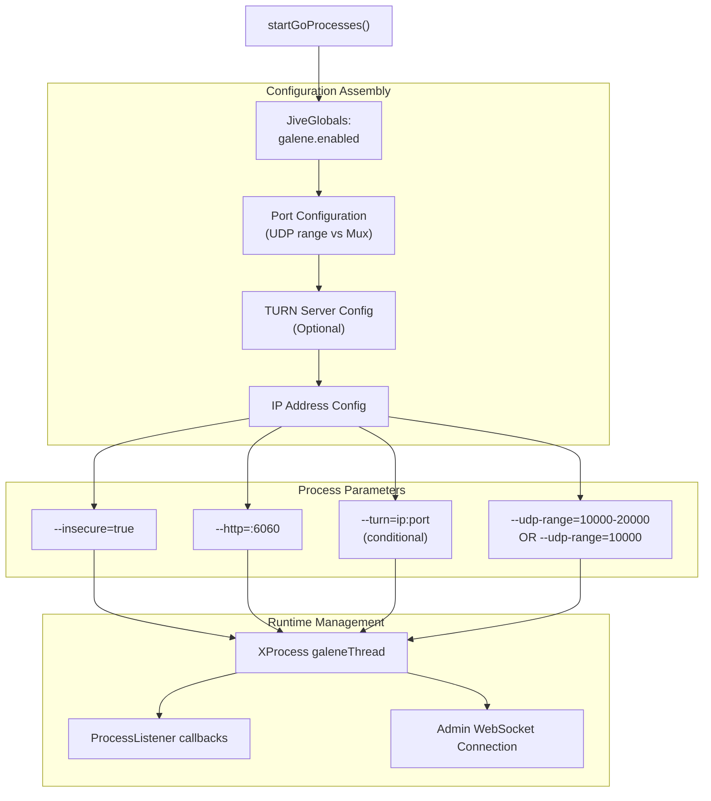

# Core Plugin Architecture

> **Relevant source files**
> * [plugin.xml](https://github.com/igniterealtime/openfire-galene-plugin/blob/5aa54ac8/plugin.xml)
> * [src/java/org/ifsoft/galene/openfire/Galene.java](https://github.com/igniterealtime/openfire-galene-plugin/blob/5aa54ac8/src/java/org/ifsoft/galene/openfire/Galene.java)

This document covers the core architecture of the Openfire Galene Plugin, focusing on the main plugin class, its lifecycle management, and integration with Openfire services. For details about the WebSocket proxy system, see [WebSocket Proxy System](./4.2-websocket-proxy-system.md). For multi-platform support specifics, see [Multi-Platform Support](./4.3-multi-platform-support.md).

## Overview

The Openfire Galene Plugin is built around a central `Galene` class that orchestrates the integration between Openfire XMPP server and the embedded Galene SFU (Selective Forwarding Unit). The architecture follows Openfire's plugin framework while managing an embedded native process, WebSocket proxying, and extensive MUC (Multi-User Chat) integration.

## Core Plugin Class Structure

The `Galene` class serves as the main orchestrator and implements multiple interfaces to integrate with different Openfire subsystems:

```mermaid
flowchart TD

Galene["Galene Class<br>(Main Plugin)"]
Plugin["Plugin Interface<br>(Openfire Core)"]
PropertyEventListener["PropertyEventListener<br>(Configuration Changes)"]
ProcessListener["ProcessListener<br>(Native Process Events)"]
MUCEventListener["MUCEventListener<br>(Chat Room Events)"]
galeneThread["XProcess galeneThread<br>(Native Binary Process)"]
galeneIQHandler["GaleneIQHandler<br>(XMPP IQ Processing)"]
olMeetIQHandler["OlMeetIQHandler<br>(Online Meetings)"]
adminConnection["ProxyConnection<br>(Admin WebSocket)"]
jspService["WebAppContext jspService<br>(JSP Pages)"]
galeneContext["ServletContextHandler<br>(HTTP Proxy)"]
galeneWsContext["ServletContextHandler<br>(WebSocket Proxy)"]

Galene --> Plugin
Galene --> PropertyEventListener
Galene --> ProcessListener
Galene --> MUCEventListener
Galene --> galeneThread
Galene --> galeneIQHandler
Galene --> olMeetIQHandler
Galene --> adminConnection
Galene --> jspService
Galene --> galeneContext
Galene --> galeneWsContext

subgraph subGraph1 ["Web Services"]
    jspService
    galeneContext
    galeneWsContext
end

subgraph subGraph0 ["Core Components"]
    galeneThread
    galeneIQHandler
    olMeetIQHandler
    adminConnection
end
```

Sources: [src/java/org/ifsoft/galene/openfire/Galene.java L60-L77](https://github.com/igniterealtime/openfire-galene-plugin/blob/5aa54ac8/src/java/org/ifsoft/galene/openfire/Galene.java#L60-L77)

## Plugin Lifecycle Management

The plugin follows Openfire's standard lifecycle pattern with initialization and destruction phases that manage all integrated services:

| Lifecycle Phase | Key Operations | Methods |
| --- | --- | --- |
| **Initialization** | Native binary detection, JSP setup, process spawning, IQ handler registration | `initializePlugin()`, `checkNatives()`, `startJSP()`, `startGoProcesses()` |
| **Runtime** | Event handling, configuration updates, MUC integration | `propertySet()`, `roomCreated()`, `messageReceived()` |
| **Destruction** | Resource cleanup, process termination, handler removal | `destroyPlugin()` |

Sources: [src/java/org/ifsoft/galene/openfire/Galene.java L110-L133](https://github.com/igniterealtime/openfire-galene-plugin/blob/5aa54ac8/src/java/org/ifsoft/galene/openfire/Galene.java#L110-L133)

 [src/java/org/ifsoft/galene/openfire/Galene.java L79-L108](https://github.com/igniterealtime/openfire-galene-plugin/blob/5aa54ac8/src/java/org/ifsoft/galene/openfire/Galene.java#L79-L108)

## Service Integration Architecture

The plugin integrates with multiple Openfire services through a centralized registration pattern:

### IQ Handler Registration

The plugin registers two specialized IQ handlers for different protocol extensions:

| Handler | Namespace | Purpose |
| --- | --- | --- |
| `GaleneIQHandler` | `urn:xmpp:sfu:galene:0` | Core SFU session management |
| `OlMeetIQHandler` | `urn:xmpp:http:online-meetings:initiate:0` | HTTP-based meeting initiation |

Sources: [src/java/org/ifsoft/galene/openfire/Galene.java L122-L130](https://github.com/igniterealtime/openfire-galene-plugin/blob/5aa54ac8/src/java/org/ifsoft/galene/openfire/Galene.java#L122-L130)

### HTTP Service Integration

The plugin creates multiple HTTP service endpoints through Openfire's `HttpBindManager`:

| Context | Path | Purpose | Implementation |
| --- | --- | --- | --- |
| `jspService` | `/galene` | Admin interface JSP pages | `WebAppContext` |
| `galeneContext` | `/` | HTTP proxy to embedded Galene | `ProxyServlet.Transparent` |
| `galeneWsContext` | `/galene-ws` | WebSocket proxy endpoint | `GaleneSocketCreator` |

Sources: [src/java/org/ifsoft/galene/openfire/Galene.java L227-L235](https://github.com/igniterealtime/openfire-galene-plugin/blob/5aa54ac8/src/java/org/ifsoft/galene/openfire/Galene.java#L227-L235)

 [src/java/org/ifsoft/galene/openfire/Galene.java L245-L254](https://github.com/igniterealtime/openfire-galene-plugin/blob/5aa54ac8/src/java/org/ifsoft/galene/openfire/Galene.java#L245-L254)

 [src/java/org/ifsoft/galene/openfire/Galene.java L267-L274](https://github.com/igniterealtime/openfire-galene-plugin/blob/5aa54ac8/src/java/org/ifsoft/galene/openfire/Galene.java#L267-L274)

## Platform-Specific Binary Management

The plugin manages native Galene binaries for multiple platforms through runtime detection and path resolution:

The platform detection logic sets executable permissions and determines the correct working directory for the embedded Galene process:

| Platform | Executable Path | Working Directory |
| --- | --- | --- |
| Linux x64 | `classes/linux-64/galene` | `classes/linux-64` |
| macOS ARM64 | `classes/macos-64/galene` | `classes/macos-64` |
| Windows x64 | `classes/win-64/galene.exe` | `classes/win-64` |

Sources: [src/java/org/ifsoft/galene/openfire/Galene.java L326-L380](https://github.com/igniterealtime/openfire-galene-plugin/blob/5aa54ac8/src/java/org/ifsoft/galene/openfire/Galene.java#L326-L380)

## Process Spawning and Management

The plugin spawns the embedded Galene server process with dynamic configuration based on JiveGlobals properties:

The process spawning includes automatic creation of configuration files and establishment of an administrative WebSocket connection for process monitoring.

Sources: [src/java/org/ifsoft/galene/openfire/Galene.java L237-L291](https://github.com/igniterealtime/openfire-galene-plugin/blob/5aa54ac8/src/java/org/ifsoft/galene/openfire/Galene.java#L237-L291)

## Configuration Management System

The plugin dynamically generates Galene configuration files based on Openfire's MUC room properties and global settings:

| Configuration File | Purpose | Source Data |
| --- | --- | --- |
| `data/config.json` | Global Galene server config | JiveGlobals properties |
| `groups/public.json` | Default public group | Static template with auth keys |
| `groups/{room}.json` | Per-MUC room configuration | MUC room properties and permissions |

### MUC Integration Pattern

The plugin implements deep MUC integration through the `MUCEventListener` interface:

| MUC Event | Plugin Response |
| --- | --- |
| `roomCreated()` | Generate corresponding Galene group file |
| `messageReceived()` | Bridge chat messages to Galene clients |
| Room property changes | Regenerate group configuration |

Sources: [src/java/org/ifsoft/galene/openfire/Galene.java L382-L475](https://github.com/igniterealtime/openfire-galene-plugin/blob/5aa54ac8/src/java/org/ifsoft/galene/openfire/Galene.java#L382-L475)

 [src/java/org/ifsoft/galene/openfire/Galene.java L505-L562](https://github.com/igniterealtime/openfire-galene-plugin/blob/5aa54ac8/src/java/org/ifsoft/galene/openfire/Galene.java#L505-L562)

 [src/java/org/ifsoft/galene/openfire/Galene.java L612-L710](https://github.com/igniterealtime/openfire-galene-plugin/blob/5aa54ac8/src/java/org/ifsoft/galene/openfire/Galene.java#L612-L710)