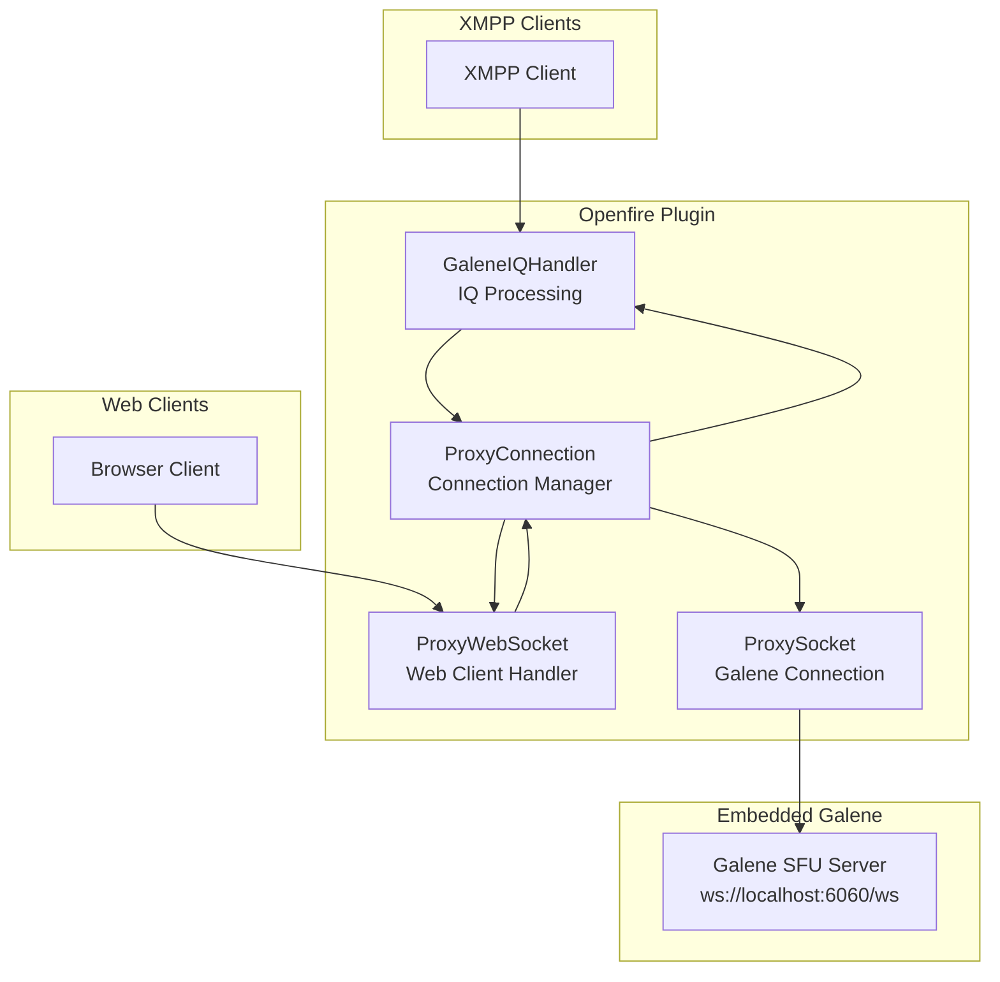
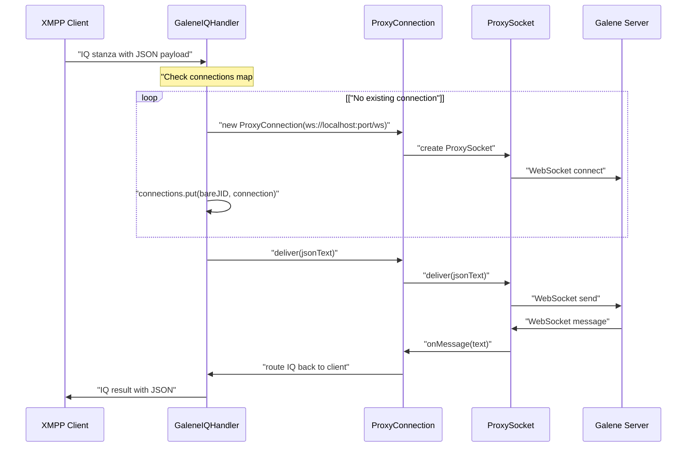
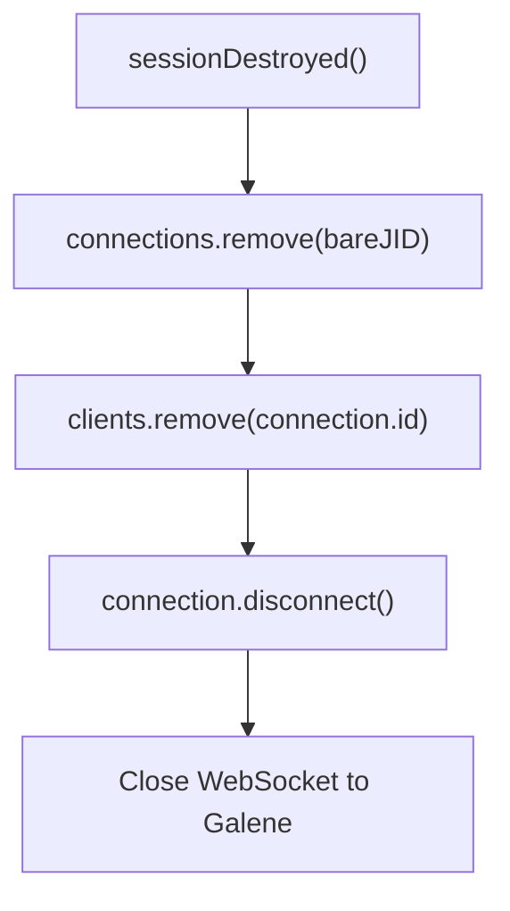
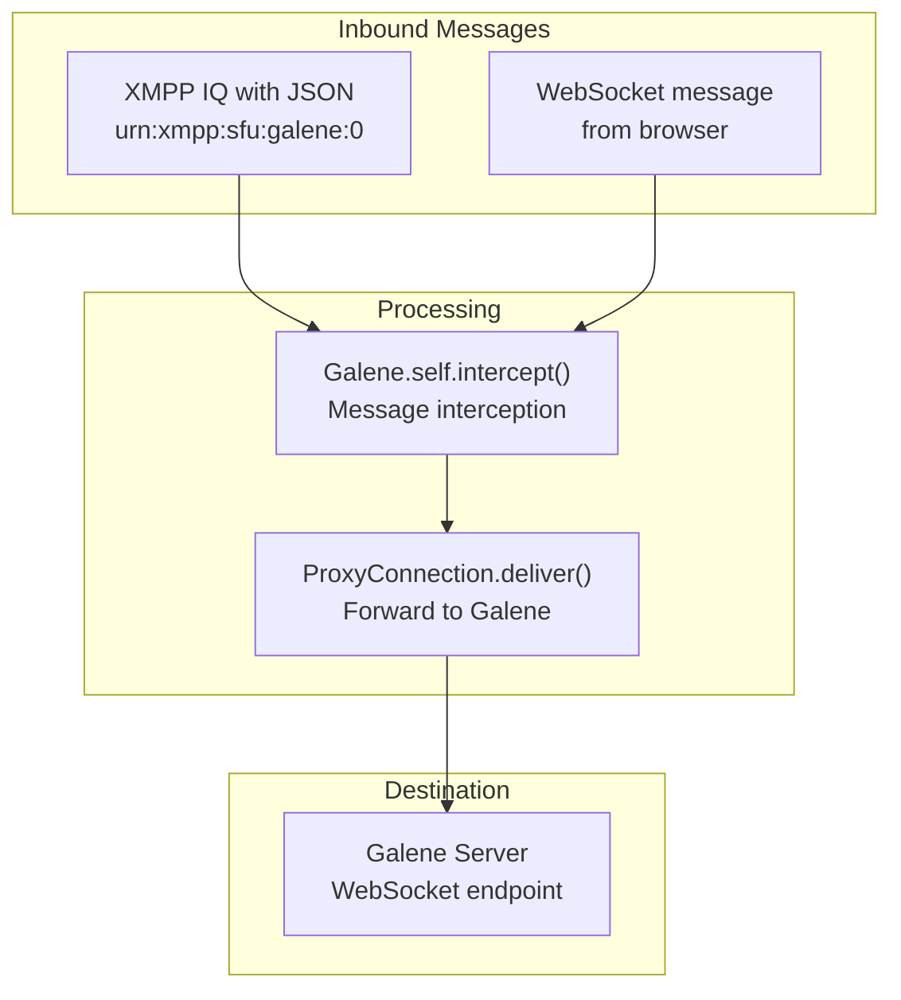
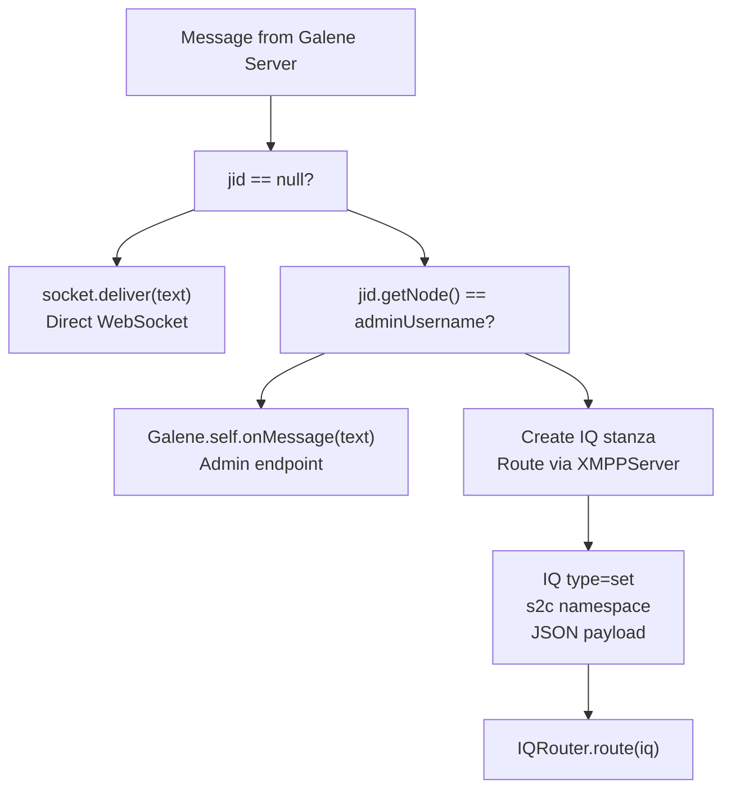
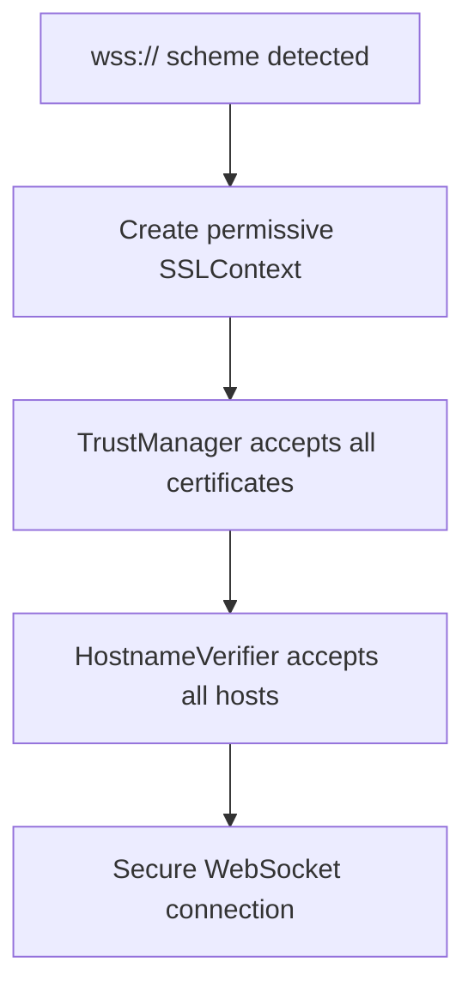

# WebSocket Proxy System

> **Relevant source files**
> * [src/java/org/ifsoft/galene/openfire/GaleneIQHandler.java](https://github.com/igniterealtime/openfire-galene-plugin/blob/5aa54ac8/src/java/org/ifsoft/galene/openfire/GaleneIQHandler.java)
> * [src/java/org/ifsoft/websockets/ProxyConnection.java](https://github.com/igniterealtime/openfire-galene-plugin/blob/5aa54ac8/src/java/org/ifsoft/websockets/ProxyConnection.java)
> * [src/java/org/ifsoft/websockets/ProxyWebSocket.java](https://github.com/igniterealtime/openfire-galene-plugin/blob/5aa54ac8/src/java/org/ifsoft/websockets/ProxyWebSocket.java)
> * [src/root/data/ice-servers.json](https://github.com/igniterealtime/openfire-galene-plugin/blob/5aa54ac8/src/root/data/ice-servers.json)

This document describes the WebSocket proxy system that enables bidirectional communication between various client types and the embedded Galene SFU server. The proxy system acts as a bridge, allowing both XMPP clients (via IQ stanzas) and web browser clients (via direct WebSocket connections) to interact with the same Galene server instance.

For information about the core plugin architecture and lifecycle management, see [Core Plugin Architecture](/igniterealtime/openfire-galene-plugin/4.1-core-plugin-architecture). For details about authentication mechanisms used by the proxy system, see [Authentication & Security](/igniterealtime/openfire-galene-plugin/4.4-authentication-and-security).

## System Overview

The WebSocket proxy system consists of three primary components that work together to route messages between clients and the embedded Galene SFU server:

* **`GaleneIQHandler`** - Manages XMPP client connections and creates proxy connections
* **`ProxyConnection`** - Establishes and maintains WebSocket connections to the Galene server
* **`ProxyWebSocket`** - Handles direct WebSocket connections from web browser clients

## Proxy Architecture



**Sources:** [src/java/org/ifsoft/galene/openfire/GaleneIQHandler.java L34-L100](https://github.com/igniterealtime/openfire-galene-plugin/blob/5aa54ac8/src/java/org/ifsoft/galene/openfire/GaleneIQHandler.java#L34-L100)

 [src/java/org/ifsoft/websockets/ProxyWebSocket.java L29-L101](https://github.com/igniterealtime/openfire-galene-plugin/blob/5aa54ac8/src/java/org/ifsoft/websockets/ProxyWebSocket.java#L29-L101)

 [src/java/org/ifsoft/websockets/ProxyConnection.java L39-L284](https://github.com/igniterealtime/openfire-galene-plugin/blob/5aa54ac8/src/java/org/ifsoft/websockets/ProxyConnection.java#L39-L284)

## Connection Management

The proxy system maintains connection state through two static concurrent hash maps in `GaleneIQHandler`:

| Map | Purpose | Key | Value |
| --- | --- | --- | --- |
| `connections` | Active XMPP client connections | Bare JID string | `ProxyConnection` instance |
| `clients` | Web client connections | Connection ID | `ProxyConnection` instance |

### Connection Lifecycle for XMPP Clients



**Sources:** [src/java/org/ifsoft/galene/openfire/GaleneIQHandler.java L56-L100](https://github.com/igniterealtime/openfire-galene-plugin/blob/5aa54ac8/src/java/org/ifsoft/galene/openfire/GaleneIQHandler.java#L56-L100)

 [src/java/org/ifsoft/websockets/ProxyConnection.java L56-L96](https://github.com/igniterealtime/openfire-galene-plugin/blob/5aa54ac8/src/java/org/ifsoft/websockets/ProxyConnection.java#L56-L96)

### Connection Cleanup

When XMPP sessions are destroyed, the system performs automatic cleanup:



**Sources:** [src/java/org/ifsoft/galene/openfire/GaleneIQHandler.java L152-L163](https://github.com/igniterealtime/openfire-galene-plugin/blob/5aa54ac8/src/java/org/ifsoft/galene/openfire/GaleneIQHandler.java#L152-L163)

## Message Routing

The proxy system handles bidirectional message routing between clients and the Galene server using different pathways depending on the client type.

### Client-to-Server Message Flow



**Sources:** [src/java/org/ifsoft/galene/openfire/GaleneIQHandler.java L81-L84](https://github.com/igniterealtime/openfire-galene-plugin/blob/5aa54ac8/src/java/org/ifsoft/galene/openfire/GaleneIQHandler.java#L81-L84)

 [src/java/org/ifsoft/websockets/ProxyWebSocket.java L69-L82](https://github.com/igniterealtime/openfire-galene-plugin/blob/5aa54ac8/src/java/org/ifsoft/websockets/ProxyWebSocket.java#L69-L82)

### Server-to-Client Message Flow

The `ProxyConnection.onMessage()` method routes messages from Galene back to the appropriate client type:



**Sources:** [src/java/org/ifsoft/websockets/ProxyConnection.java L148-L176](https://github.com/igniterealtime/openfire-galene-plugin/blob/5aa54ac8/src/java/org/ifsoft/websockets/ProxyConnection.java#L148-L176)

## WebSocket Connection Details

### ProxyConnection Architecture

The `ProxyConnection` class uses Jetty's WebSocket client to establish connections to the embedded Galene server:

| Component | Purpose | Configuration |
| --- | --- | --- |
| `HttpClient` | Underlying HTTP client | 10 second connect timeout |
| `WebSocketClient` | WebSocket client wrapper | 5 minute idle timeout |
| `ProxySocket` | Inner WebSocket handler | 64KB max text message size |

**Sources:** [src/java/org/ifsoft/websockets/ProxyConnection.java L70-L89](https://github.com/igniterealtime/openfire-galene-plugin/blob/5aa54ac8/src/java/org/ifsoft/websockets/ProxyConnection.java#L70-L89)

### SSL/TLS Handling

For secure WebSocket connections (`wss://`), the system implements a trust-all SSL context:



**Sources:** [src/java/org/ifsoft/websockets/ProxyConnection.java L186-L226](https://github.com/igniterealtime/openfire-galene-plugin/blob/5aa54ac8/src/java/org/ifsoft/websockets/ProxyConnection.java#L186-L226)

### Message Size Limits

The `ProxySocket` inner class sets a maximum text message size of 64KB to handle typical Galene protocol messages:

```python
@WebSocket(maxTextMessageSize = 64 * 1024) public class ProxySocket
```

**Sources:** [src/java/org/ifsoft/websockets/ProxyConnection.java L228](https://github.com/igniterealtime/openfire-galene-plugin/blob/5aa54ac8/src/java/org/ifsoft/websockets/ProxyConnection.java#L228-L228)

## Error Handling and Recovery

The proxy system implements several error handling mechanisms:

### Connection Failure Recovery

When a `ProxyConnection` fails to establish, the system marks it as disconnected and logs the error. XMPP clients will trigger creation of a new connection on the next IQ request.

### WebSocket Error Handling

Both `ProxyWebSocket` and `ProxySocket` implement `@OnWebSocketError` handlers that log errors and attempt graceful cleanup.

### Session Cleanup

The `GaleneIQHandler` implements `SessionEventListener` to automatically clean up proxy connections when XMPP sessions are destroyed, preventing resource leaks.

**Sources:** [src/java/org/ifsoft/galene/openfire/GaleneIQHandler.java L132-L163](https://github.com/igniterealtime/openfire-galene-plugin/blob/5aa54ac8/src/java/org/ifsoft/galene/openfire/GaleneIQHandler.java#L132-L163)

 [src/java/org/ifsoft/websockets/ProxyWebSocket.java L64-L67](https://github.com/igniterealtime/openfire-galene-plugin/blob/5aa54ac8/src/java/org/ifsoft/websockets/ProxyWebSocket.java#L64-L67)

 [src/java/org/ifsoft/websockets/ProxyConnection.java L238-L241](https://github.com/igniterealtime/openfire-galene-plugin/blob/5aa54ac8/src/java/org/ifsoft/websockets/ProxyConnection.java#L238-L241)

## Configuration Integration

The proxy system integrates with the plugin's configuration system through `JiveGlobals` properties:

* `galene.port` - Port number for the embedded Galene server (default from `Galene.self.getPort()`)
* `galene.username` - Admin username for special message routing (default: "sfu-admin")

The WebSocket URL is constructed as: `ws://localhost:[galene.port]/ws`

**Sources:** [src/java/org/ifsoft/galene/openfire/GaleneIQHandler.java L70-L71](https://github.com/igniterealtime/openfire-galene-plugin/blob/5aa54ac8/src/java/org/ifsoft/galene/openfire/GaleneIQHandler.java#L70-L71)

 [src/java/org/ifsoft/websockets/ProxyConnection.java L60](https://github.com/igniterealtime/openfire-galene-plugin/blob/5aa54ac8/src/java/org/ifsoft/websockets/ProxyConnection.java#L60-L60)