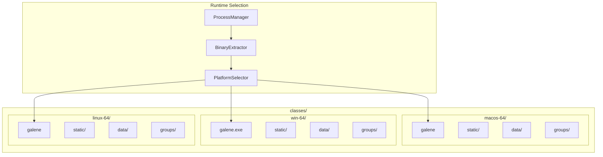
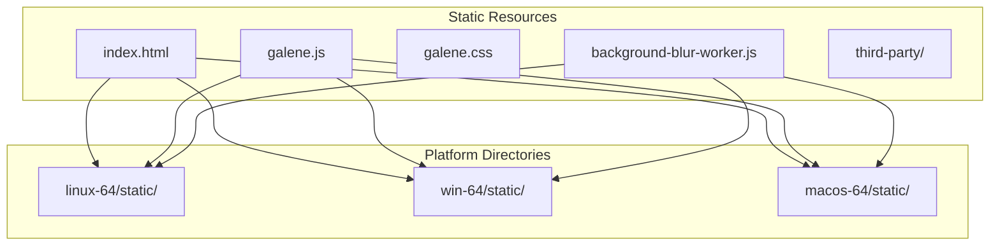
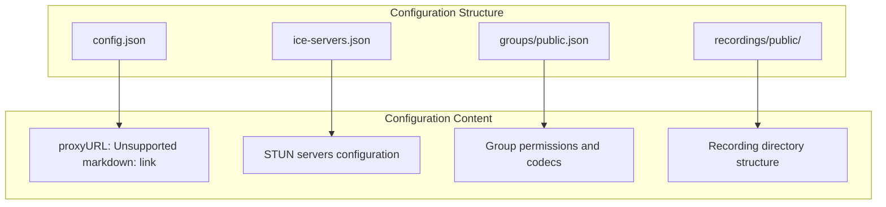
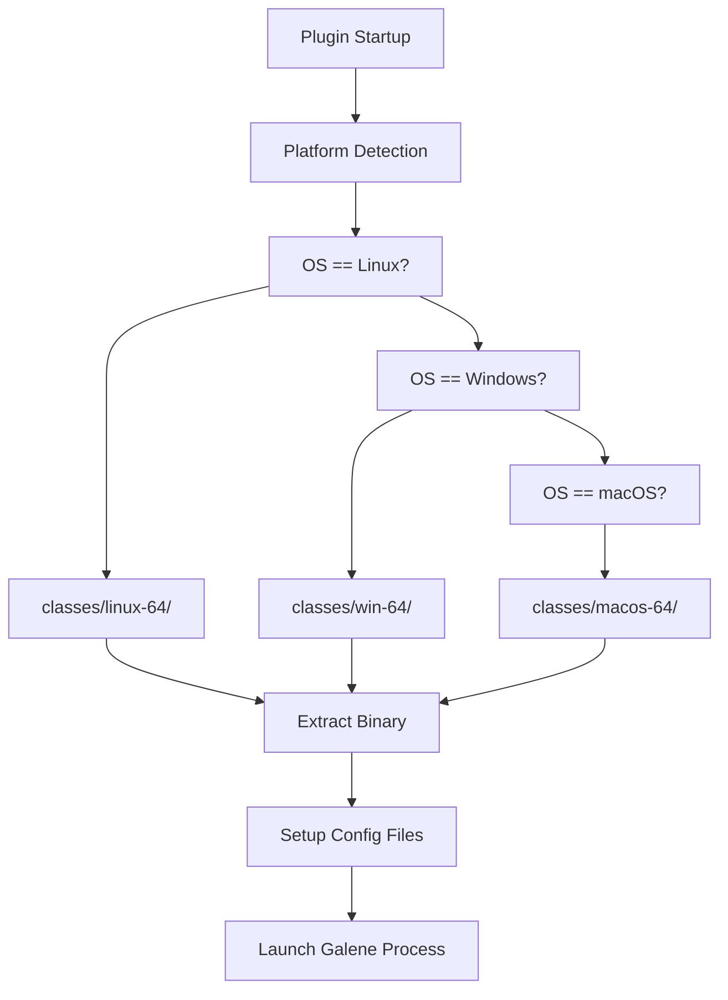
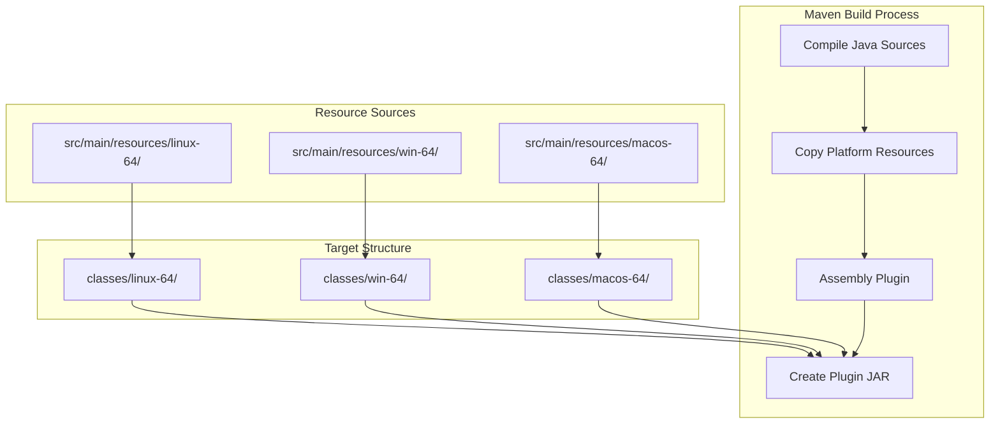

# Multi-Platform Support

> **Relevant source files**
> * [classes/linux-64/galene](https://github.com/igniterealtime/openfire-galene-plugin/blob/5aa54ac8/classes/linux-64/galene)
> * [classes/macos-64/data/config.json](https://github.com/igniterealtime/openfire-galene-plugin/blob/5aa54ac8/classes/macos-64/data/config.json)
> * [classes/macos-64/data/ice-servers.json](https://github.com/igniterealtime/openfire-galene-plugin/blob/5aa54ac8/classes/macos-64/data/ice-servers.json)
> * [classes/macos-64/galene](https://github.com/igniterealtime/openfire-galene-plugin/blob/5aa54ac8/classes/macos-64/galene)
> * [classes/macos-64/groups/public.json](https://github.com/igniterealtime/openfire-galene-plugin/blob/5aa54ac8/classes/macos-64/groups/public.json)
> * [classes/macos-64/recordings/public/dummy.txt](https://github.com/igniterealtime/openfire-galene-plugin/blob/5aa54ac8/classes/macos-64/recordings/public/dummy.txt)
> * [classes/macos-64/static/404.css](https://github.com/igniterealtime/openfire-galene-plugin/blob/5aa54ac8/classes/macos-64/static/404.css)
> * [classes/macos-64/static/404.html](https://github.com/igniterealtime/openfire-galene-plugin/blob/5aa54ac8/classes/macos-64/static/404.html)
> * [classes/macos-64/static/background-blur-worker.js](https://github.com/igniterealtime/openfire-galene-plugin/blob/5aa54ac8/classes/macos-64/static/background-blur-worker.js)
> * [classes/macos-64/static/change-password.css](https://github.com/igniterealtime/openfire-galene-plugin/blob/5aa54ac8/classes/macos-64/static/change-password.css)
> * [classes/macos-64/static/galene.js](https://github.com/igniterealtime/openfire-galene-plugin/blob/5aa54ac8/classes/macos-64/static/galene.js)
> * [classes/macos-64/static/index.html](https://github.com/igniterealtime/openfire-galene-plugin/blob/5aa54ac8/classes/macos-64/static/index.html)
> * [classes/win-64/galene.exe](https://github.com/igniterealtime/openfire-galene-plugin/blob/5aa54ac8/classes/win-64/galene.exe)

This page describes how the Openfire Galene Plugin manages platform-specific Galene server binaries and configuration files across Linux, Windows, and macOS environments. The plugin embeds native Galene executables for each supported platform and automatically selects the appropriate binary at runtime.

For information about the overall plugin architecture, see [Core Plugin Architecture](./4.1-core-plugin-architecture.md). For details about the build system that packages these binaries, see [Building from Source](./2.1-building-from-source.md).

## Platform Binary Architecture

The plugin maintains separate directory structures for each supported platform, containing both the Galene server executable and associated static resources.

Sources: [classes/linux-64/galene](https://github.com/igniterealtime/openfire-galene-plugin/blob/5aa54ac8/classes/linux-64/galene)

 [classes/win-64/galene.exe](https://github.com/igniterealtime/openfire-galene-plugin/blob/5aa54ac8/classes/win-64/galene.exe)

 [classes/macos-64/galene](https://github.com/igniterealtime/openfire-galene-plugin/blob/5aa54ac8/classes/macos-64/galene)

## Binary Format Detection

Each platform binary uses its native executable format, which the plugin identifies through OS detection rather than binary inspection.

| Platform | Architecture | Binary Format | Executable Name |
| --- | --- | --- | --- |
| Linux | x86_64 | ELF | `galene` |
| Windows | x86_64 | PE | `galene.exe` |
| macOS | ARM64 | Mach-O | `galene` |

The Linux binary begins with the ELF magic number `7f454c46`, the Windows binary with the PE signature `4d5a` (MZ), and the macOS binary with the Mach-O magic `feedfacf`.

Sources: [classes/linux-64/galene L1-L10](https://github.com/igniterealtime/openfire-galene-plugin/blob/5aa54ac8/classes/linux-64/galene#L1-L10)

 [classes/win-64/galene.exe L1-L10](https://github.com/igniterealtime/openfire-galene-plugin/blob/5aa54ac8/classes/win-64/galene.exe#L1-L10)

 [classes/macos-64/galene L1-L10](https://github.com/igniterealtime/openfire-galene-plugin/blob/5aa54ac8/classes/macos-64/galene#L1-L10)

## Static Resource Management

Each platform directory contains identical static web resources that serve the Galene web client interface.

The main client application is contained in `galene.js`, which provides WebRTC functionality, background blur processing via `background-blur-worker.js`, and the complete web conferencing interface.

Sources: [classes/macos-64/static/index.html](https://github.com/igniterealtime/openfire-galene-plugin/blob/5aa54ac8/classes/macos-64/static/index.html)

 [classes/macos-64/static/galene.js L1-L50](https://github.com/igniterealtime/openfire-galene-plugin/blob/5aa54ac8/classes/macos-64/static/galene.js#L1-L50)

 [classes/macos-64/static/background-blur-worker.js L1-L30](https://github.com/igniterealtime/openfire-galene-plugin/blob/5aa54ac8/classes/macos-64/static/background-blur-worker.js#L1-L30)

## Configuration File Deployment

The plugin deploys platform-specific configuration files that define Galene server behavior and group permissions.

The base configuration in `config.json` sets the proxy URL to integrate with Openfire's HTTP binding system.

Sources: [classes/macos-64/data/config.json](https://github.com/igniterealtime/openfire-galene-plugin/blob/5aa54ac8/classes/macos-64/data/config.json)

 [classes/macos-64/data/ice-servers.json](https://github.com/igniterealtime/openfire-galene-plugin/blob/5aa54ac8/classes/macos-64/data/ice-servers.json)

 [classes/macos-64/groups/public.json](https://github.com/igniterealtime/openfire-galene-plugin/blob/5aa54ac8/classes/macos-64/groups/public.json)

## Runtime Platform Detection

The plugin implements platform detection logic to select the appropriate binary and configuration directory at startup.

The platform detection occurs during plugin initialization and determines which embedded binary directory to use for the current runtime environment.

Sources: Based on the directory structure in [classes/linux-64/](https://github.com/igniterealtime/openfire-galene-plugin/blob/5aa54ac8/classes/linux-64/)

 [classes/win-64/](https://github.com/igniterealtime/openfire-galene-plugin/blob/5aa54ac8/classes/win-64/)

 [classes/macos-64/](https://github.com/igniterealtime/openfire-galene-plugin/blob/5aa54ac8/classes/macos-64/)

## Build Integration

The Maven build system coordinates the packaging of platform-specific resources through resource copying and assembly phases.

The build process ensures all platform-specific binaries and resources are correctly embedded in the final plugin JAR file for distribution.

Sources: Directory structure from [classes/linux-64/galene](https://github.com/igniterealtime/openfire-galene-plugin/blob/5aa54ac8/classes/linux-64/galene)

 [classes/win-64/galene.exe](https://github.com/igniterealtime/openfire-galene-plugin/blob/5aa54ac8/classes/win-64/galene.exe)

 [classes/macos-64/galene](https://github.com/igniterealtime/openfire-galene-plugin/blob/5aa54ac8/classes/macos-64/galene)