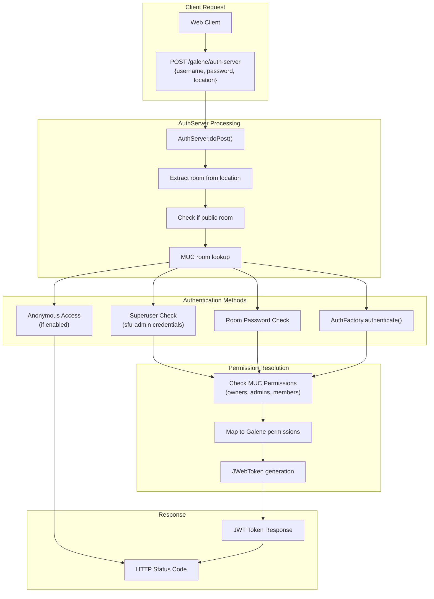
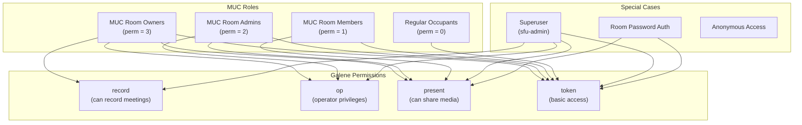
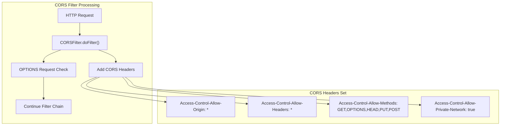
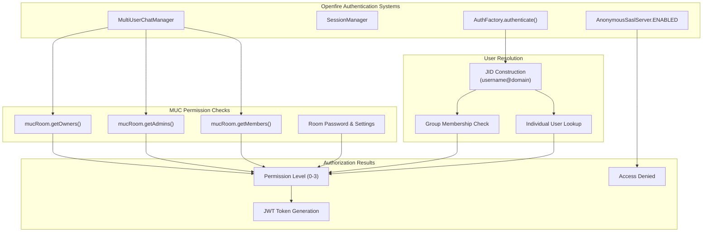

# Authentication & Security

> **Relevant source files**
> * [classes/jsp/WEB-INF/web.xml](https://github.com/igniterealtime/openfire-galene-plugin/blob/5aa54ac8/classes/jsp/WEB-INF/web.xml)
> * [src/java/org/ifsoft/galene/openfire/AuthServer.java](https://github.com/igniterealtime/openfire-galene-plugin/blob/5aa54ac8/src/java/org/ifsoft/galene/openfire/AuthServer.java)
> * [src/java/org/ifsoft/galene/openfire/CORSFilter.java](https://github.com/igniterealtime/openfire-galene-plugin/blob/5aa54ac8/src/java/org/ifsoft/galene/openfire/CORSFilter.java)
> * [src/java/org/ifsoft/galene/openfire/JWebToken.java](https://github.com/igniterealtime/openfire-galene-plugin/blob/5aa54ac8/src/java/org/ifsoft/galene/openfire/JWebToken.java)
> * [src/root/data/config.json](https://github.com/igniterealtime/openfire-galene-plugin/blob/5aa54ac8/src/root/data/config.json)

This document covers the authentication and security mechanisms implemented by the Openfire Galene plugin. It explains how users are authenticated, how permissions are granted, and how secure communication is established between clients and the embedded Galene SFU server.

For information about XMPP protocol authentication, see [XMPP Protocol Extensions](./5-xmpp-protocol-extensions.md). For client-side security implementation details, see [Client-Side Development](./6.3-client-side-development.md).

## Authentication Flow Overview

The plugin implements a HTTP-based authentication server that generates JWT tokens for client access to Galene conference rooms. The authentication flow integrates deeply with Openfire's existing user management and MUC (Multi-User Chat) permission systems.



Sources: [src/java/org/ifsoft/galene/openfire/AuthServer.java L59-L235](https://github.com/igniterealtime/openfire-galene-plugin/blob/5aa54ac8/src/java/org/ifsoft/galene/openfire/AuthServer.java#L59-L235)

## JWT Token System

The plugin uses JSON Web Tokens (JWT) to securely transmit authentication credentials and permissions to the Galene SFU. The `JWebToken` class implements HMAC SHA-256 signing for token integrity.

### JWT Token Structure

```

```

The JWT payload is constructed in the `sendAcceptedResponse` method:

| Field | Description | Example |
| --- | --- | --- |
| `sub` | Subject (username) | `admin@example.com` |
| `aud` | Audience (room location) | `/galene/groups/meeting123/` |
| `permissions` | Array of Galene permissions | `["record", "op", "present", "token"]` |
| `iat` | Issued at (Unix timestamp) | `1640995200` |
| `exp` | Expiration (Unix timestamp) | `1641167999` |
| `iss` | Issuer (auth server URL) | `https://server:7443/galene/auth-server` |

Sources: [src/java/org/ifsoft/galene/openfire/AuthServer.java L33-L56](https://github.com/igniterealtime/openfire-galene-plugin/blob/5aa54ac8/src/java/org/ifsoft/galene/openfire/AuthServer.java#L33-L56)

 [src/java/org/ifsoft/galene/openfire/JWebToken.java L23-L76](https://github.com/igniterealtime/openfire-galene-plugin/blob/5aa54ac8/src/java/org/ifsoft/galene/openfire/JWebToken.java#L23-L76)

## Permission Model

The plugin maps Openfire MUC roles to Galene SFU permissions through a hierarchical permission system. Each user's role in the MUC room determines their capabilities within the video conference.



### Permission Resolution Logic

The authentication server implements a cascade of permission checks:

1. **Superuser Check**: Special `sfu-admin` credentials grant full permissions
2. **MUC Owner Check**: Room owners get `record`, `op`, `present`, `token`
3. **MUC Admin Check**: Room admins get `op`, `present`, `token`
4. **MUC Member Check**: Room members get `present`, `token`
5. **Room Password Check**: Correct room password grants `present`, `token`
6. **Openfire Authentication**: Valid user credentials grant permissions based on MUC role
7. **Occupant Invitation**: If room allows, grants `token` permission only

Sources: [src/java/org/ifsoft/galene/openfire/AuthServer.java L125-L219](https://github.com/igniterealtime/openfire-galene-plugin/blob/5aa54ac8/src/java/org/ifsoft/galene/openfire/AuthServer.java#L125-L219)

## Security Mechanisms

### CORS Security

The plugin implements Cross-Origin Resource Sharing (CORS) through the `CORSFilter` class to enable secure web client access while controlling cross-origin requests.



Sources: [src/java/org/ifsoft/galene/openfire/CORSFilter.java L28-L45](https://github.com/igniterealtime/openfire-galene-plugin/blob/5aa54ac8/src/java/org/ifsoft/galene/openfire/CORSFilter.java#L28-L45)

### JWT Signature Security

The JWT tokens use HMAC SHA-256 signing with a hardcoded secret key for integrity verification:

* **Algorithm**: HS256 (HMAC with SHA-256)
* **Secret Key**: Base64-encoded 256-bit key
* **Key Location**: `JWebToken.SECRET_KEY` constant
* **Signature Verification**: Performed by Galene SFU server

Sources: [src/java/org/ifsoft/galene/openfire/JWebToken.java L25-L26](https://github.com/igniterealtime/openfire-galene-plugin/blob/5aa54ac8/src/java/org/ifsoft/galene/openfire/JWebToken.java#L25-L26)

 [src/java/org/ifsoft/galene/openfire/JWebToken.java L61-L75](https://github.com/igniterealtime/openfire-galene-plugin/blob/5aa54ac8/src/java/org/ifsoft/galene/openfire/JWebToken.java#L61-L75)

## Integration with Openfire Authentication

The authentication system leverages multiple Openfire subsystems to provide comprehensive user verification and authorization.



### Group-Based Permissions

The system supports both individual user assignments and group-based permissions in MUC rooms:

* **Individual JIDs**: Direct user-to-role assignments
* **Group JIDs**: Group membership automatically grants roles
* **Nested Resolution**: Users inherit permissions through group membership

The permission resolution logic handles both cases by checking if a JID represents a group using `GroupJID.isGroup(user)` and then verifying group membership with `group.isUser(jid)`.

Sources: [src/java/org/ifsoft/galene/openfire/AuthServer.java L133-L170](https://github.com/igniterealtime/openfire-galene-plugin/blob/5aa54ac8/src/java/org/ifsoft/galene/openfire/AuthServer.java#L133-L170)

 [classes/jsp/WEB-INF/web.xml L7-L15](https://github.com/igniterealtime/openfire-galene-plugin/blob/5aa54ac8/classes/jsp/WEB-INF/web.xml#L7-L15)

## Authentication Server Configuration

The authentication server is configured as a servlet within the plugin's web application context:

| Configuration | Value | Description |
| --- | --- | --- |
| Servlet Class | `org.ifsoft.galene.openfire.AuthServer` | Main authentication handler |
| URL Pattern | `/auth-server` | HTTP endpoint for authentication requests |
| Content Type | `application/jwt` | JWT token response format |
| CORS Filter | Applied to all routes (`/*`) | Cross-origin security |

The server responds with different HTTP status codes based on authentication results:

* `202 Accepted`: Authentication successful, JWT token returned
* `204 No Content`: Anonymous access or room access without authentication
* `403 Forbidden`: Authentication failed or access denied

Sources: [classes/jsp/WEB-INF/web.xml L1-L26](https://github.com/igniterealtime/openfire-galene-plugin/blob/5aa54ac8/classes/jsp/WEB-INF/web.xml#L1-L26)