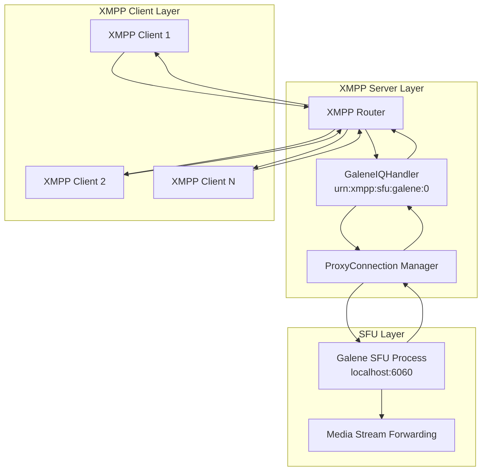
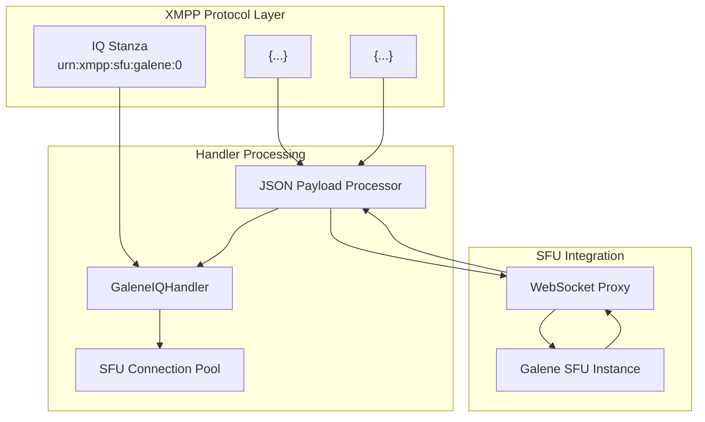

# XMPP Protocol Extensions

> **Relevant source files**
> * [docs/xep/index.html](https://github.com/igniterealtime/openfire-galene-plugin/blob/5aa54ac8/docs/xep/index.html)
> * [docs/xep/prettify.css](https://github.com/igniterealtime/openfire-galene-plugin/blob/5aa54ac8/docs/xep/prettify.css)
> * [docs/xep/prettify.js](https://github.com/igniterealtime/openfire-galene-plugin/blob/5aa54ac8/docs/xep/prettify.js)
> * [docs/xep/xep-xxx-sfu_01-01.xml](https://github.com/igniterealtime/openfire-galene-plugin/blob/5aa54ac8/docs/xep/xep-xxx-sfu_01-01.xml)
> * [docs/xep/xep.xsl](https://github.com/igniterealtime/openfire-galene-plugin/blob/5aa54ac8/docs/xep/xep.xsl)
> * [docs/xep/xmpp.css](https://github.com/igniterealtime/openfire-galene-plugin/blob/5aa54ac8/docs/xep/xmpp.css)

This document provides an overview of the custom XMPP protocol extensions that enable Selective Forwarding Unit (SFU) functionality within the XMPP ecosystem. These extensions allow XMPP clients to communicate directly with embedded SFU servers through standardized XMPP IQ stanzas, eliminating the need for separate signaling protocols or transport mechanisms.

For detailed specification of the primary protocol extension, see [XEP-XXXX: In-Band SFU Sessions](./5.1-xep-xxxx_in-band-sfu-sessions.md). For information about how these protocols are implemented in IQ handlers, see [XMPP IQ Handlers](./8.2-xmpp-iq-handlers.md).

## Protocol Extension Overview

The Openfire Galene Plugin implements a custom XMPP Extension Protocol (XEP) that defines a standardized way for XMPP clients to maintain sessions with SFU servers using the existing XMPP connection. This eliminates the complexity of managing separate WebRTC signaling connections.

### Core Namespace and Approach

The protocol uses the namespace `urn:xmpp:sfu:galene:0` to identify Galene-specific SFU communications. The approach is based on a direct access pattern where:

* XMPP servers act as proxies between clients and SFU instances
* JSON payloads containing WebRTC signaling data are embedded in XMPP stanzas
* The server maintains connections to SFU instances on behalf of clients
* No marshalling or inspection of media signaling data is required



**Sources:** [docs/xep/xep-xxx-sfu_01-01.xml L1-L143](https://github.com/igniterealtime/openfire-galene-plugin/blob/5aa54ac8/docs/xep/xep-xxx-sfu_01-01.xml#L1-L143)

## Bidirectional Communication Pattern

The protocol defines two primary message types for bidirectional communication between XMPP clients and SFU instances:

### Client-to-SFU Messages (<c2s>)

Client-to-SFU messages use the `<c2s>` element within IQ stanzas to send WebRTC signaling data to the SFU. The embedded JSON contains standard WebRTC messages like ICE candidates, SDP offers, and session management commands.

### SFU-to-Client Messages (<s2c>)

SFU-to-Client messages use the `<s2c>` element to send responses and asynchronous updates back to XMPP clients. This enables the SFU to notify clients of media stream changes, new participants, and connection status updates.

```mermaid
sequenceDiagram
  participant XMPP Client
  participant user@domain/resource
  participant GaleneIQHandler
  participant ProxyConnection
  participant Galene SFU

  note over XMPP Client,Galene SFU: WebRTC Session Establishment
  XMPP Client->>GaleneIQHandler: IQ set
  GaleneIQHandler->>ProxyConnection: <c2s><json>ICE candidate</json></c2s>
  ProxyConnection->>Galene SFU: Forward JSON payload
  Galene SFU->>ProxyConnection: WebSocket message
  ProxyConnection->>GaleneIQHandler: Response message
  GaleneIQHandler->>XMPP Client: JSON response
  note over XMPP Client,Galene SFU: Media streaming begins
```

**Sources:** [docs/xep/xep-xxx-sfu_01-01.xml L58-L106](https://github.com/igniterealtime/openfire-galene-plugin/blob/5aa54ac8/docs/xep/xep-xxx-sfu_01-01.xml#L58-L106)

## Integration with Plugin Architecture

The XMPP protocol extensions integrate with the plugin's core architecture through dedicated IQ handlers that manage the protocol translation between XMPP and SFU WebSocket communications.

### Handler Registration and Namespaces

The plugin registers IQ handlers for specific namespaces during initialization. The primary handler processes messages in the `urn:xmpp:sfu:galene:0` namespace and manages connection lifecycle for each XMPP user session.

### Connection Management

The protocol includes provisions for connection lifecycle management:

* **Session Initialization**: First message from a client automatically creates a new SFU connection
* **Session Termination**: Empty `<c2s>` elements signal connection closure
* **Connection Pooling**: The server maintains a pool of SFU connections mapped to XMPP user sessions



**Sources:** [docs/xep/xep-xxx-sfu_01-01.xml L77-L85](https://github.com/igniterealtime/openfire-galene-plugin/blob/5aa54ac8/docs/xep/xep-xxx-sfu_01-01.xml#L77-L85)

## Protocol Requirements and Dependencies

The SFU protocol extension addresses several key requirements for XMPP-based video conferencing:

### Core Requirements

| Requirement | Description | Implementation |
| --- | --- | --- |
| **In-Band Communication** | Maintain SFU sessions from existing XMPP connections | Proxy pattern through XMPP server |
| **Direct Access Protocol** | Send JSON/SDP content without XML marshalling | Embedded JSON within XMPP stanzas |
| **Third-Party Signaling** | Enable integration with Rayo and similar protocols | Generic JSON payload support |
| **SFU Federation** | Support clustering across XMPP domains | Integration with XEP-0289 (Federated MUC) |

### Protocol Dependencies

The extension builds upon established XMPP standards:

* **XEP-0335**: JSON Containers - Enables JSON embedding in XMPP stanzas
* **XEP-0327**: Rayo Protocol - Third-party call control integration
* **XEP-0167**: Jingle RTP Sessions - Media session compatibility
* **XEP-0289**: Federated MUC - Cross-domain SFU clustering support

**Sources:** [docs/xep/xep-xxx-sfu_01-01.xml L13-L51](https://github.com/igniterealtime/openfire-galene-plugin/blob/5aa54ac8/docs/xep/xep-xxx-sfu_01-01.xml#L13-L51)

## Security and Deployment Considerations

The protocol implementation includes several security and deployment considerations:

### JSON Payload Validation

* All JSON payloads must be valid UTF-8 encoded content
* Empty JSON strings are prohibited
* Implementations should validate received JSON and handle parsing errors appropriately
* The `<json>` element should only be used within `<c2s>` or `<s2c>` containers

### Connection Security

* SFU instances typically bind to localhost to avoid direct client exposure
* XMPP server acts as security boundary and access control point
* Authentication and authorization handled through existing XMPP mechanisms
* Connection pooling prevents resource exhaustion attacks

**Sources:** [docs/xep/xep-xxx-sfu_01-01.xml L121-L143](https://github.com/igniterealtime/openfire-galene-plugin/blob/5aa54ac8/docs/xep/xep-xxx-sfu_01-01.xml#L121-L143)