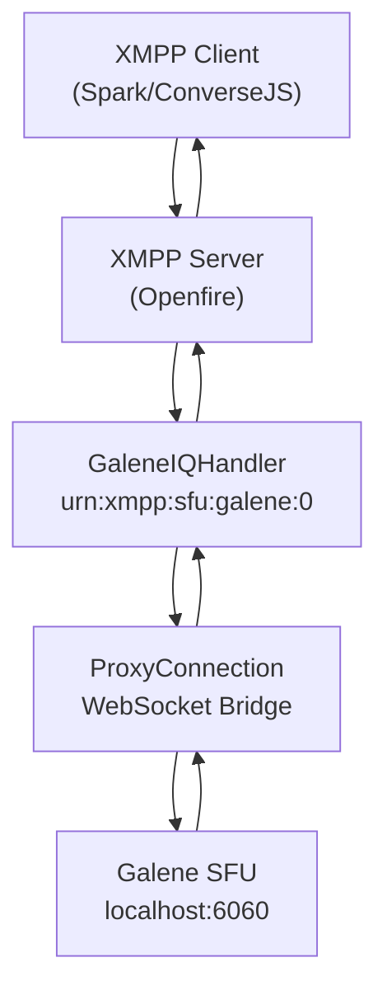
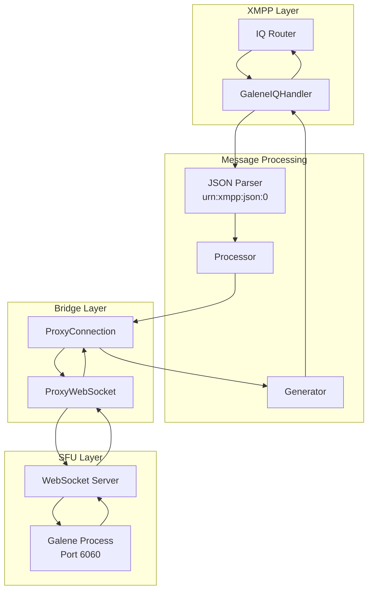
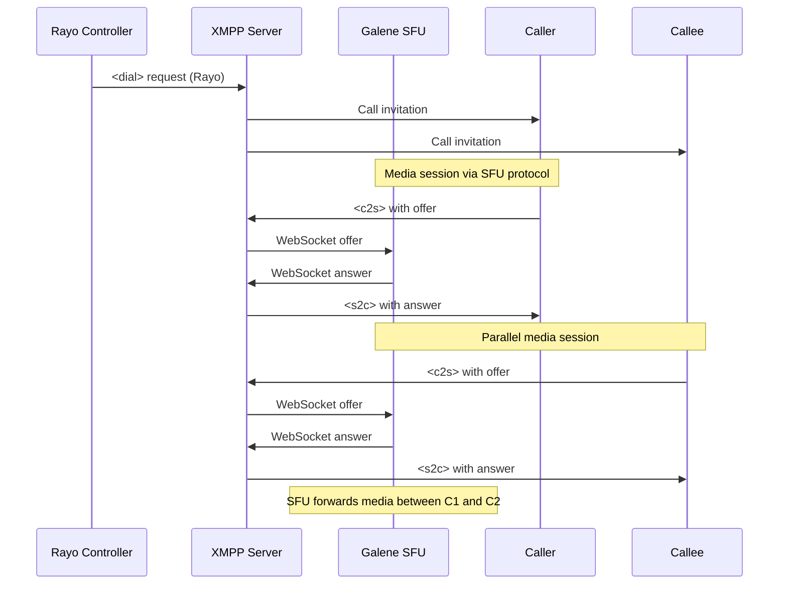

# XEP-XXXX: In-Band SFU Sessions

> **Relevant source files**
> * [docs/xep/index.html](https://github.com/igniterealtime/openfire-galene-plugin/blob/5aa54ac8/docs/xep/index.html)
> * [docs/xep/prettify.css](https://github.com/igniterealtime/openfire-galene-plugin/blob/5aa54ac8/docs/xep/prettify.css)
> * [docs/xep/prettify.js](https://github.com/igniterealtime/openfire-galene-plugin/blob/5aa54ac8/docs/xep/prettify.js)
> * [docs/xep/xep-xxx-sfu_01-01.xml](https://github.com/igniterealtime/openfire-galene-plugin/blob/5aa54ac8/docs/xep/xep-xxx-sfu_01-01.xml)
> * [docs/xep/xep.xsl](https://github.com/igniterealtime/openfire-galene-plugin/blob/5aa54ac8/docs/xep/xep.xsl)
> * [docs/xep/xmpp.css](https://github.com/igniterealtime/openfire-galene-plugin/blob/5aa54ac8/docs/xep/xmpp.css)

This document describes the custom XMPP extension protocol that enables XMPP clients to communicate directly with a Selective Forwarding Unit (SFU) through in-band XMPP messaging. This protocol allows WebRTC media session negotiation and control to occur over existing XMPP connections without requiring separate transport mechanisms.

For information about the broader plugin architecture and WebSocket proxy implementation, see [Core Plugin Architecture](/igniterealtime/openfire-galene-plugin/4.1-core-plugin-architecture) and [WebSocket Proxy System](/igniterealtime/openfire-galene-plugin/4.2-websocket-proxy-system). For XMPP IQ handler implementation details, see [XMPP IQ Handlers](/igniterealtime/openfire-galene-plugin/8.2-xmpp-iq-handlers).

## Protocol Overview

The In-Band SFU Sessions protocol uses the namespace `urn:xmpp:sfu:galene:0` to enable XMPP clients to establish and manage media sessions with the embedded Galene SFU. The XMPP server acts as a proxy, maintaining connections to the SFU while clients communicate through standard IQ stanzas containing JSON payloads.



**Sources**: [docs/xep/xep-xxx-sfu_01-01.xml L1-L144](https://github.com/igniterealtime/openfire-galene-plugin/blob/5aa54ac8/docs/xep/xep-xxx-sfu_01-01.xml#L1-L144)

## Message Format and Protocol Elements

The protocol defines two primary message directions using distinct XML elements within IQ stanzas:

### Client-to-SFU Messages (<c2s>)

Client-to-SFU messages use the `<c2s>` element containing JSON payloads for WebRTC signaling:

```xml
<iq from='user@domain/resource' to="domain" type="set" id="q1">
  <c2s xmlns="urn:xmpp:sfu:galene:0">
    <json xmlns="urn:xmpp:json:0">
      {
        "type": "ice",
        "id": "c27f64006fec100b9059f98ac17ecd9d",
        "candidate": {
          "candidate": "candidate:4258379142 1 udp 2122194687 192.168.1.250 55730 typ host generation 0 ufrag 22gS network-id 2",
          "sdpMid": "0",
          "sdpMLineIndex": 0
        }
      }
    </json>
  </c2s>
</iq>
```

### SFU-to-Client Messages (<s2c>)

SFU-to-Client messages use the `<s2c>` element for responses and server-initiated messages:

```xml
<iq from="domain" to='user@domain/resource' type="set" id="q1">
  <s2c xmlns="urn:xmpp:sfu:galene:0">
    <json xmlns="urn:xmpp:json:0">
      {
        "type": "ice",
        "id": "c27f64006fec100b9059f98ac17ecd9d",
        "candidate": {
          "candidate": "candidate:161388498 1 udp 2122260223 172.24.176.1 52755 typ host generation 0 ufrag rvu2 network-id 1",
          "sdpMid": "0",
          "sdpMLineIndex": 0
        }
      }
    </json>
  </s2c>
</iq>
```

### Connection Termination

Clients terminate their SFU connection by sending an empty `<c2s>` element:

```xml
<iq from='user@domain/resource' to="domain" type="set" id="q1">
  <c2s xmlns="urn:xmpp:sfu:galene:0">
  </c2s>
</iq>
```

**Sources**: [docs/xep/xep-xxx-sfu_01-01.xml L61-L85](https://github.com/igniterealtime/openfire-galene-plugin/blob/5aa54ac8/docs/xep/xep-xxx-sfu_01-01.xml#L61-L85)

## Implementation Architecture

The protocol implementation bridges XMPP stanza processing with SFU WebSocket communication through several key components:



**Sources**: [docs/xep/xep-xxx-sfu_01-01.xml L78-L85](https://github.com/igniterealtime/openfire-galene-plugin/blob/5aa54ac8/docs/xep/xep-xxx-sfu_01-01.xml#L78-L85)

 [docs/xep/xep-xxx-sfu_01-01.xml L55-L57](https://github.com/igniterealtime/openfire-galene-plugin/blob/5aa54ac8/docs/xep/xep-xxx-sfu_01-01.xml#L55-L57)

## JSON Payload Types

The protocol supports various JSON message types for WebRTC session management:

| Message Type | Direction | Purpose | Key Fields |
| --- | --- | --- | --- |
| `ice` | Bidirectional | ICE candidate exchange | `candidate`, `sdpMid`, `sdpMLineIndex` |
| `offer` | Client → SFU | SDP offer for media session | `sdp`, `type` |
| `answer` | SFU → Client | SDP answer for media session | `sdp`, `type` |
| `join` | Client → SFU | Join conference/group | `group`, `username`, `password` |
| `leave` | Client → SFU | Leave conference/group | `group` |
| `user` | SFU → Client | User presence updates | `kind`, `id`, `username` |

## Protocol Requirements and Constraints

The protocol implementation must adhere to several technical requirements:

### JSON Validation

* The `<json>` element MUST NOT be empty (empty string is invalid JSON)
* Data MUST be encoded as UTF-8
* Implementations SHOULD validate received JSON and handle invalid data appropriately
* The `<json>` element SHOULD always be encapsulated within `<c2s>` or `<s2c>` elements

### Connection Management

* XMPP server maintains SFU client connections automatically
* First message from a client triggers connection creation
* Empty `<c2s>` element signals connection termination
* Server handles connection cleanup and resource management

### Security Considerations

* JSON data from untrusted entities requires validation
* Only UTF-8 encoding accepted to prevent encoding mismatch attacks
* No direct client access to SFU - all communication proxied through XMPP server

**Sources**: [docs/xep/xep-xxx-sfu_01-01.xml L121-L133](https://github.com/igniterealtime/openfire-galene-plugin/blob/5aa54ac8/docs/xep/xep-xxx-sfu_01-01.xml#L121-L133)

## Integration with Rayo Protocol

The protocol supports integration with third-party signaling protocols like Rayo for advanced call control scenarios:



**Sources**: [docs/xep/xep-xxx-sfu_01-01.xml L107-L118](https://github.com/igniterealtime/openfire-galene-plugin/blob/5aa54ac8/docs/xep/xep-xxx-sfu_01-01.xml#L107-L118)

## Federation and Scalability

The protocol design supports SFU federation through standard XMPP federation mechanisms, enabling distributed SFU deployments:

* Uses XEP-0289 (Federated MUC for Constrained Environments) to align MUC rooms with SFU conferences
* Enables users to connect to nearest federated SFU for optimal network performance
* Supports large-scale real-time multi-party communication through SFU clustering
* Maintains XMPP federation trust relationships for secure SFU communication

**Sources**: [docs/xep/xep-xxx-sfu_01-01.xml L51-L52](https://github.com/igniterealtime/openfire-galene-plugin/blob/5aa54ac8/docs/xep/xep-xxx-sfu_01-01.xml#L51-L52)