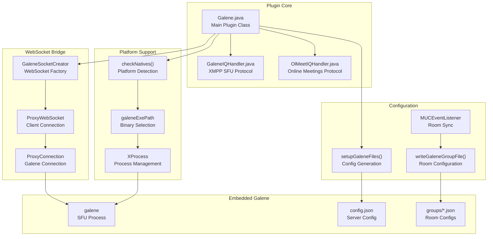
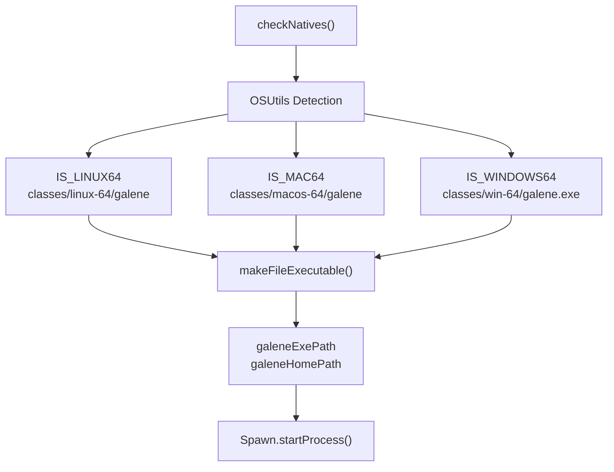
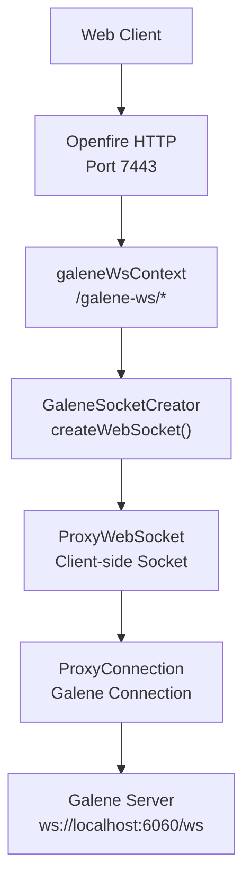
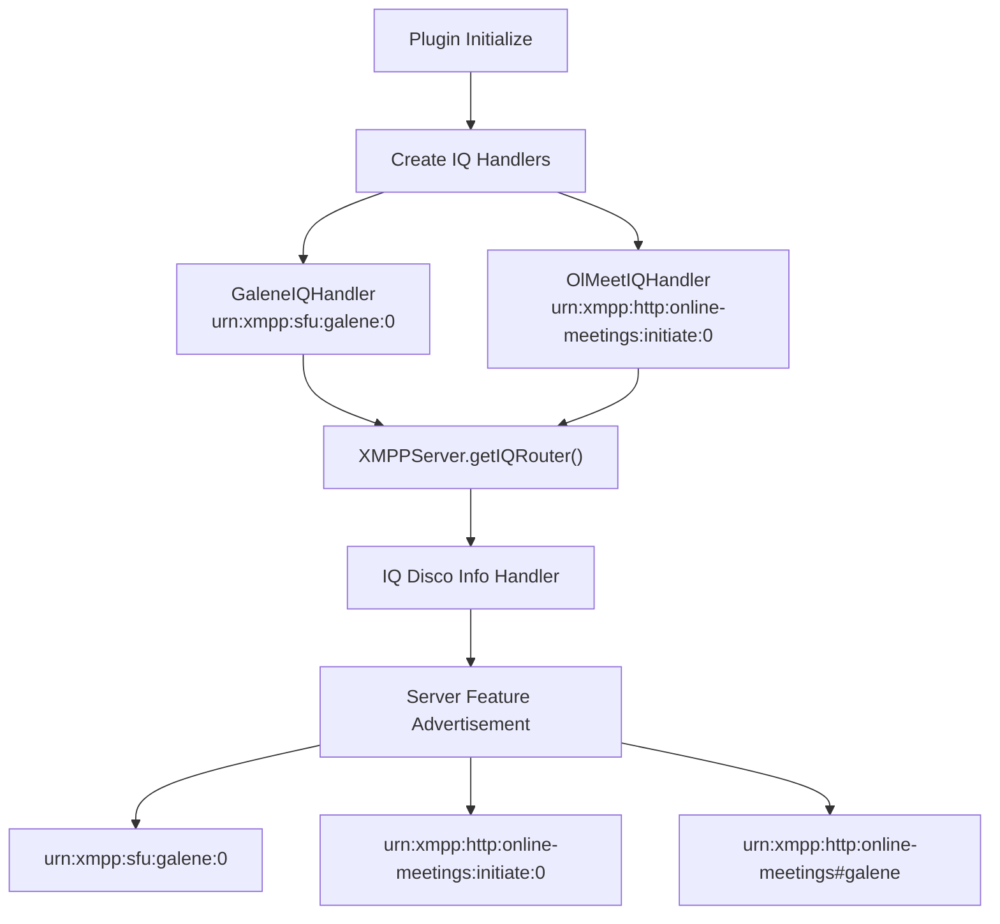
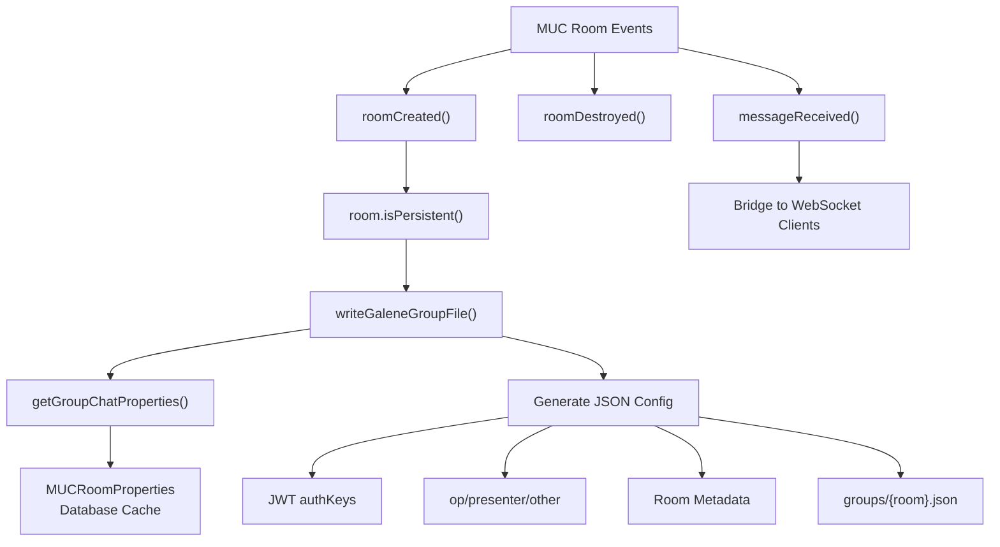
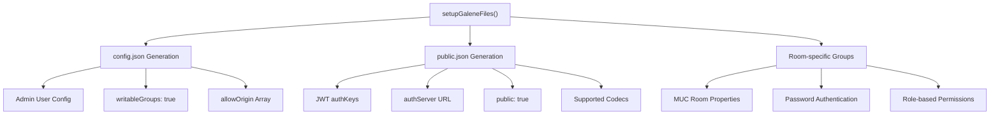
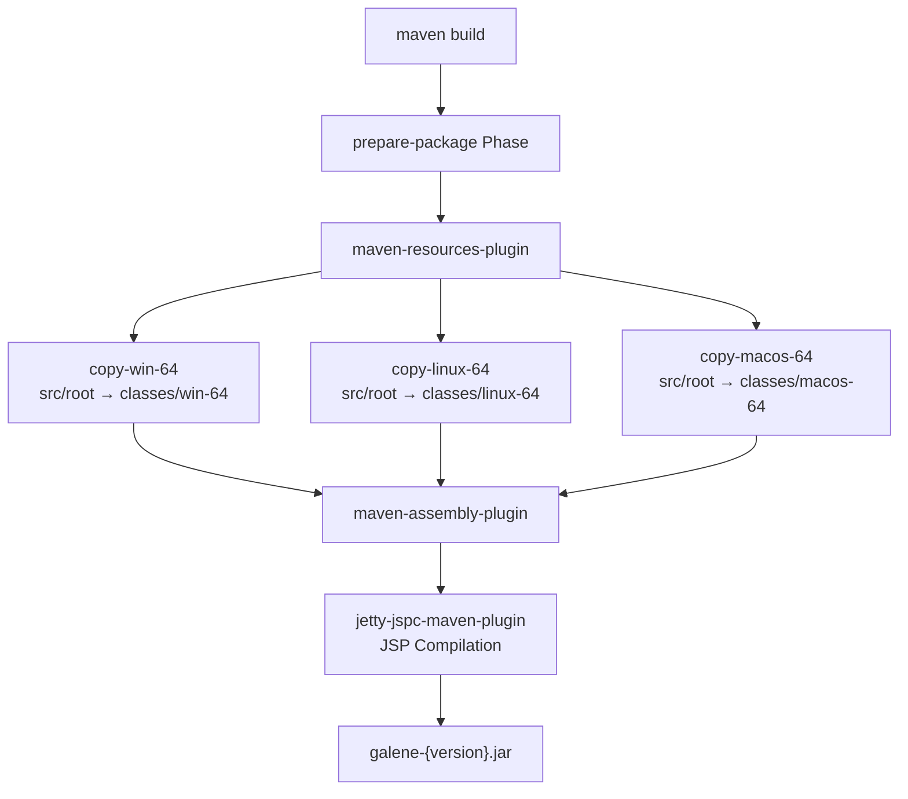
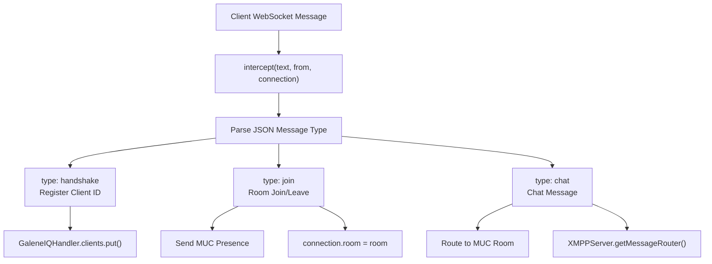

# Developer Guide

> **Relevant source files**
> * [pom.xml](https://github.com/igniterealtime/openfire-galene-plugin/blob/5aa54ac8/pom.xml)
> * [src/java/org/ifsoft/galene/openfire/Galene.java](https://github.com/igniterealtime/openfire-galene-plugin/blob/5aa54ac8/src/java/org/ifsoft/galene/openfire/Galene.java)

This document provides technical guidance for developers who want to understand, modify, or extend the Openfire Galene Plugin. It covers the plugin's architecture, key code components, development patterns, and implementation details.

For general usage information, see [Administration & Usage](/igniterealtime/openfire-galene-plugin/3-administration-and-usage). For API documentation, see [API Reference](/igniterealtime/openfire-galene-plugin/8-api-reference). For configuration details, see [Configuration Reference](/igniterealtime/openfire-galene-plugin/7-configuration-reference).

## Overview

The Openfire Galene Plugin integrates an embedded Galene SFU server into Openfire, enabling WebRTC video conferencing capabilities through both XMPP and WebSocket protocols. The plugin acts as a bridge between Openfire's XMPP infrastructure and Galene's WebRTC media handling.

**Core Plugin Architecture**



Sources: [src/java/org/ifsoft/galene/openfire/Galene.java L1-L1065](https://github.com/igniterealtime/openfire-galene-plugin/blob/5aa54ac8/src/java/org/ifsoft/galene/openfire/Galene.java#L1-L1065)

 [pom.xml L1-L191](https://github.com/igniterealtime/openfire-galene-plugin/blob/5aa54ac8/pom.xml#L1-L191)

## Plugin Initialization and Lifecycle

The `Galene` class implements the Openfire `Plugin` interface and manages the complete plugin lifecycle through several key phases:

**Plugin Initialization Flow**

```

```

The initialization process occurs in [src/java/org/ifsoft/galene/openfire/Galene.java L110-L133](https://github.com/igniterealtime/openfire-galene-plugin/blob/5aa54ac8/src/java/org/ifsoft/galene/openfire/Galene.java#L110-L133)

:

```
public void initializePlugin(final PluginManager manager, final File pluginDirectory) {
    muc_properties = CacheFactory.createLocalCache("MUC Room Properties");
    PropertyEventDispatcher.addListener(this);
    MUCEventDispatcher.addListener(this);
    
    checkNatives(pluginDirectory);
    executor = Executors.newCachedThreadPool();
    startJSP(pluginDirectory);
    startGoProcesses(pluginDirectory);
    
    galeneIQHandler = new GaleneIQHandler();
    galeneIQHandler.startHandler();
    XMPPServer.getInstance().getIQRouter().addHandler(galeneIQHandler);
    
    olMeetIQHandler = new OlMeetIQHandler();
    XMPPServer.getInstance().getIQRouter().addHandler(olMeetIQHandler);
}
```

Sources: [src/java/org/ifsoft/galene/openfire/Galene.java L110-L133](https://github.com/igniterealtime/openfire-galene-plugin/blob/5aa54ac8/src/java/org/ifsoft/galene/openfire/Galene.java#L110-L133)

## Multi-Platform Binary Management

The plugin supports multiple operating systems by embedding platform-specific Galene binaries and dynamically selecting the appropriate executable:

**Platform Detection and Binary Selection**



The platform detection logic in [src/java/org/ifsoft/galene/openfire/Galene.java L326-L371](https://github.com/igniterealtime/openfire-galene-plugin/blob/5aa54ac8/src/java/org/ifsoft/galene/openfire/Galene.java#L326-L371)

 determines the correct binary path:

* Linux: `classes/linux-64/galene`
* macOS: `classes/macos-64/galene`
* Windows: `classes/win-64/galene.exe`

The Maven build system copies platform-specific resources using the `maven-resources-plugin` configured in [pom.xml L25-L77](https://github.com/igniterealtime/openfire-galene-plugin/blob/5aa54ac8/pom.xml#L25-L77)

Sources: [src/java/org/ifsoft/galene/openfire/Galene.java L326-L371](https://github.com/igniterealtime/openfire-galene-plugin/blob/5aa54ac8/src/java/org/ifsoft/galene/openfire/Galene.java#L326-L371)

 [pom.xml L25-L77](https://github.com/igniterealtime/openfire-galene-plugin/blob/5aa54ac8/pom.xml#L25-L77)

## WebSocket Proxy Implementation

The plugin implements a WebSocket proxy system to bridge between web clients and the embedded Galene server. This allows clients to connect through Openfire's HTTP binding while maintaining direct WebSocket communication with Galene.

**WebSocket Proxy Architecture**



The WebSocket creator implementation in [src/java/org/ifsoft/galene/openfire/Galene.java L293-L324](https://github.com/igniterealtime/openfire-galene-plugin/blob/5aa54ac8/src/java/org/ifsoft/galene/openfire/Galene.java#L293-L324)

:

```python
public static class GaleneSocketCreator implements JettyWebSocketCreator {
    @Override 
    public Object createWebSocket(JettyServerUpgradeRequest req, JettyServerUpgradeResponse resp) {
        String ipaddr = JiveGlobals.getProperty("galene.ipaddr", getIpAddress());
        String port = JiveGlobals.getProperty("galene.port", getPort());
        String url = "ws://" + ipaddr + ":" + port + "/ws";
        
        ProxyConnection proxyConnection = new ProxyConnection(URI.create(url), protocols, 10000, null);
        ProxyWebSocket socket = new ProxyWebSocket();
        socket.setProxyConnection(proxyConnection);
        return socket;
    }
}
```

The WebSocket context is configured in [src/java/org/ifsoft/galene/openfire/Galene.java L245-L254](https://github.com/igniterealtime/openfire-galene-plugin/blob/5aa54ac8/src/java/org/ifsoft/galene/openfire/Galene.java#L245-L254)

 using Jetty's WebSocket container initializer.

Sources: [src/java/org/ifsoft/galene/openfire/Galene.java L293-L324](https://github.com/igniterealtime/openfire-galene-plugin/blob/5aa54ac8/src/java/org/ifsoft/galene/openfire/Galene.java#L293-L324)

 [src/java/org/ifsoft/galene/openfire/Galene.java L245-L254](https://github.com/igniterealtime/openfire-galene-plugin/blob/5aa54ac8/src/java/org/ifsoft/galene/openfire/Galene.java#L245-L254)

## XMPP Protocol Integration

The plugin registers two IQ handlers to enable XMPP clients to interact with the SFU functionality:

**XMPP Handler Registration**



The handler registration occurs in [src/java/org/ifsoft/galene/openfire/Galene.java L122-L131](https://github.com/igniterealtime/openfire-galene-plugin/blob/5aa54ac8/src/java/org/ifsoft/galene/openfire/Galene.java#L122-L131)

:

```
galeneIQHandler = new GaleneIQHandler();
galeneIQHandler.startHandler();
XMPPServer.getInstance().getIQRouter().addHandler(galeneIQHandler);
XMPPServer.getInstance().getIQDiscoInfoHandler().addServerFeature("urn:xmpp:sfu:galene:0");

olMeetIQHandler = new OlMeetIQHandler();
XMPPServer.getInstance().getIQRouter().addHandler(olMeetIQHandler);
XMPPServer.getInstance().getIQDiscoInfoHandler().addServerFeature("urn:xmpp:http:online-meetings:initiate:0");
```

For detailed information about the XMPP protocol extensions, see [XMPP Protocol Extensions](/igniterealtime/openfire-galene-plugin/5-xmpp-protocol-extensions).

Sources: [src/java/org/ifsoft/galene/openfire/Galene.java L122-L131](https://github.com/igniterealtime/openfire-galene-plugin/blob/5aa54ac8/src/java/org/ifsoft/galene/openfire/Galene.java#L122-L131)

## MUC Integration and Room Synchronization

The plugin implements `MUCEventListener` to automatically synchronize Multi-User Chat rooms with Galene group configurations:

**MUC Room Synchronization Flow**



The room creation handler in [src/java/org/ifsoft/galene/openfire/Galene.java L505-L514](https://github.com/igniterealtime/openfire-galene-plugin/blob/5aa54ac8/src/java/org/ifsoft/galene/openfire/Galene.java#L505-L514)

:

```
public void roomCreated(JID roomJID) {
    if (JiveGlobals.getBooleanProperty("galene.muc.enabled", false)) {
        MUCRoom room = XMPPServer.getInstance().getMultiUserChatManager()
            .getMultiUserChatService(roomJID).getChatRoom(roomJID.getNode());
        
        if (room != null && room.isPersistent()) {
            writeGaleneGroupFile(room.getJID(), null);
        }
    }
}
```

Sources: [src/java/org/ifsoft/galene/openfire/Galene.java L505-L514](https://github.com/igniterealtime/openfire-galene-plugin/blob/5aa54ac8/src/java/org/ifsoft/galene/openfire/Galene.java#L505-L514)

 [src/java/org/ifsoft/galene/openfire/Galene.java L612-L710](https://github.com/igniterealtime/openfire-galene-plugin/blob/5aa54ac8/src/java/org/ifsoft/galene/openfire/Galene.java#L612-L710)

## Configuration File Generation

The plugin dynamically generates Galene configuration files based on Openfire settings and MUC room properties:

**Configuration Generation Process**



The main configuration generation in [src/java/org/ifsoft/galene/openfire/Galene.java L382-L435](https://github.com/igniterealtime/openfire-galene-plugin/blob/5aa54ac8/src/java/org/ifsoft/galene/openfire/Galene.java#L382-L435)

 creates:

1. **Server Configuration** (`config.json`): Admin users, origins, global settings
2. **Public Group** (`public.json`): Default public room with JWT authentication
3. **Room-specific Groups** (`{room}.json`): MUC room configurations

Key configuration elements:

* JWT authentication keys with `JWebToken.SECRET_KEY`
* Auth server endpoint at `/galene/auth-server`
* Role-based permissions mapping MUC roles to Galene permissions
* Codec preferences: `["vp9", "av1", "opus", "h264"]`

Sources: [src/java/org/ifsoft/galene/openfire/Galene.java L382-L435](https://github.com/igniterealtime/openfire-galene-plugin/blob/5aa54ac8/src/java/org/ifsoft/galene/openfire/Galene.java#L382-L435)

 [src/java/org/ifsoft/galene/openfire/Galene.java L612-L710](https://github.com/igniterealtime/openfire-galene-plugin/blob/5aa54ac8/src/java/org/ifsoft/galene/openfire/Galene.java#L612-L710)

## Development Build System

The plugin uses Maven with specialized resource copying to handle multi-platform binaries:

**Build Process Flow**



The Maven configuration in [pom.xml L22-L87](https://github.com/igniterealtime/openfire-galene-plugin/blob/5aa54ac8/pom.xml#L22-L87)

 handles:

1. **Multi-platform Resource Copying**: Each execution copies `src/root` to platform-specific directories
2. **JSP Compilation**: Jetty JSP compiler for admin interface
3. **Plugin Assembly**: Creates final Openfire plugin JAR with embedded binaries

Key dependencies include:

* `jetty-ee8-proxy` for WebSocket proxying
* `json-lib` for JSON handling
* `jetty-ee8-websocket-jetty-client` for WebSocket client connections

Sources: [pom.xml L22-L87](https://github.com/igniterealtime/openfire-galene-plugin/blob/5aa54ac8/pom.xml#L22-L87)

 [pom.xml L89-L160](https://github.com/igniterealtime/openfire-galene-plugin/blob/5aa54ac8/pom.xml#L89-L160)

## Message Interception and Protocol Translation

The plugin intercepts WebSocket messages to provide protocol translation between XMPP and Galene's WebSocket protocol:

**Message Interception Flow**



The interception logic in [src/java/org/ifsoft/galene/openfire/Galene.java L827-L916](https://github.com/igniterealtime/openfire-galene-plugin/blob/5aa54ac8/src/java/org/ifsoft/galene/openfire/Galene.java#L827-L916)

 handles:

1. **Handshake Messages**: Register client connections with unique IDs
2. **Join/Leave Events**: Send XMPP presence to corresponding MUC rooms
3. **Chat Messages**: Bridge WebSocket chat to XMPP group chat messages

This enables seamless integration between WebRTC clients and XMPP-based chat systems.

Sources: [src/java/org/ifsoft/galene/openfire/Galene.java L827-L916](https://github.com/igniterealtime/openfire-galene-plugin/blob/5aa54ac8/src/java/org/ifsoft/galene/openfire/Galene.java#L827-L916)

 [src/java/org/ifsoft/galene/openfire/Galene.java L541-L562](https://github.com/igniterealtime/openfire-galene-plugin/blob/5aa54ac8/src/java/org/ifsoft/galene/openfire/Galene.java#L541-L562)

## Development Workflow

For developers working on the plugin:

1. **Environment Setup**: Ensure Maven 3.6+, Java 11+, and Openfire development environment
2. **Platform Binaries**: Place Galene binaries in `src/root/` directory
3. **Build Process**: Run `mvn clean package` to generate multi-platform plugin JAR
4. **Testing**: Deploy to Openfire plugins directory and verify initialization
5. **Debugging**: Enable debug logging for `org.ifsoft.galene.openfire.Galene` class

Key integration points for extensions:

* **Custom IQ Handlers**: Extend the existing handlers or create new ones
* **WebSocket Processing**: Modify message interception in `intercept()` method
* **Configuration**: Add new properties via `JiveGlobals` and reflect in config generation
* **Platform Support**: Add new platform detection in `checkNatives()` method

Sources: [src/java/org/ifsoft/galene/openfire/Galene.java L1-L1065](https://github.com/igniterealtime/openfire-galene-plugin/blob/5aa54ac8/src/java/org/ifsoft/galene/openfire/Galene.java#L1-L1065)

 [pom.xml L1-L191](https://github.com/igniterealtime/openfire-galene-plugin/blob/5aa54ac8/pom.xml#L1-L191)