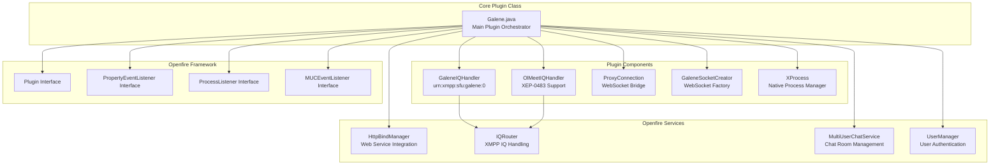
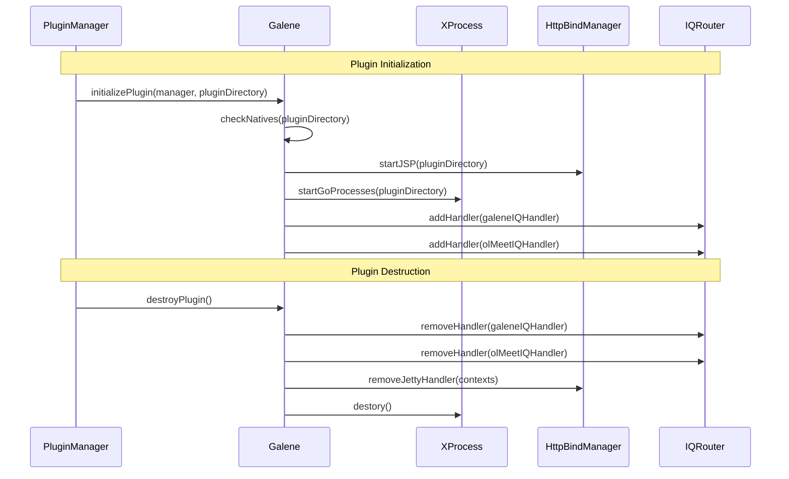
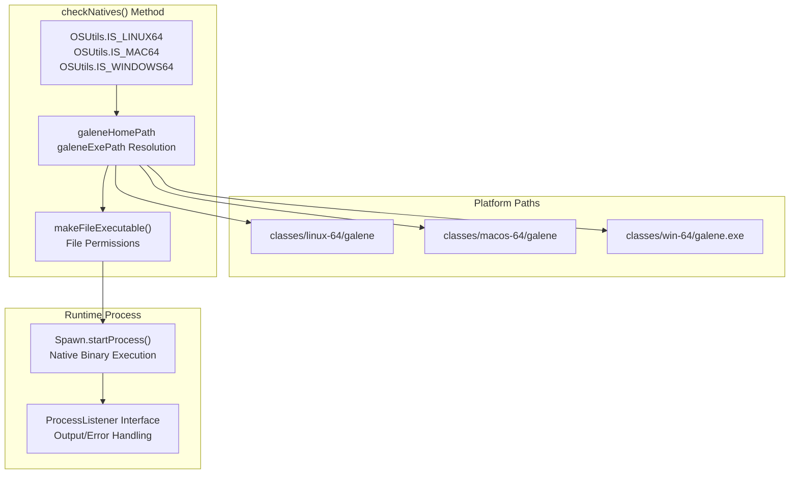
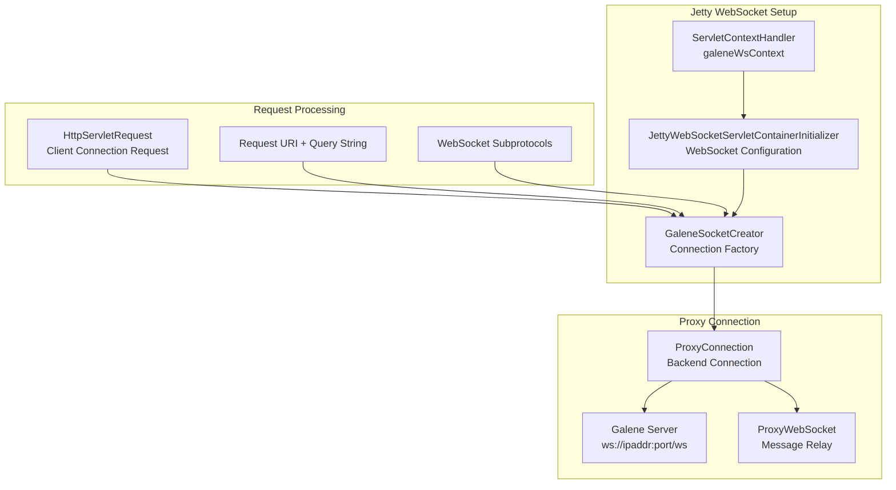
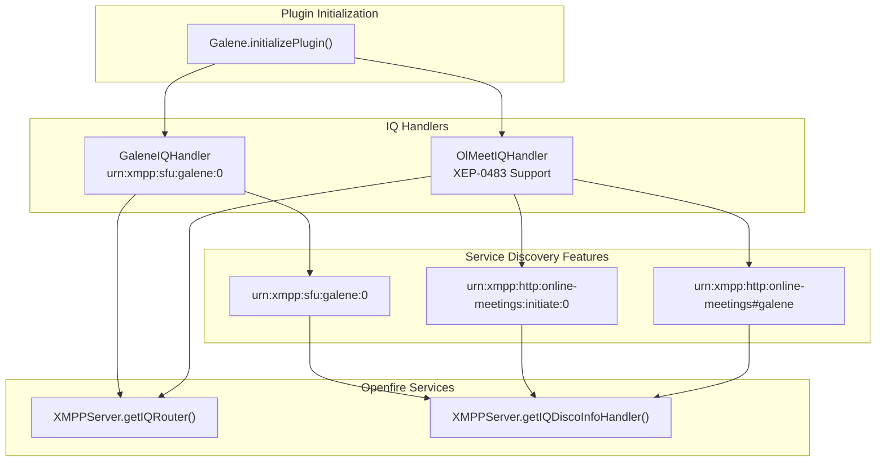
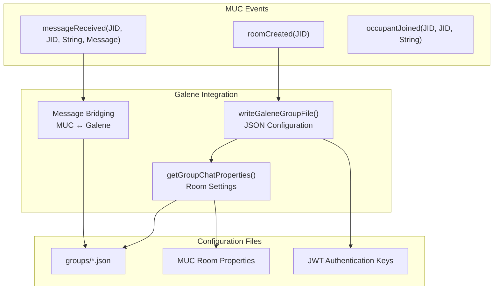
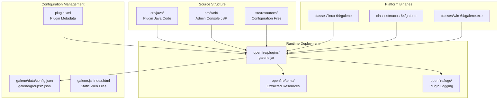

# Plugin Development Overview

> **Relevant source files**
> * [plugin.xml](https://github.com/igniterealtime/openfire-galene-plugin/blob/5aa54ac8/plugin.xml)
> * [src/java/de/mxro/process/internal/Engine.java](https://github.com/igniterealtime/openfire-galene-plugin/blob/5aa54ac8/src/java/de/mxro/process/internal/Engine.java)
> * [src/java/org/ifsoft/galene/openfire/Galene.java](https://github.com/igniterealtime/openfire-galene-plugin/blob/5aa54ac8/src/java/org/ifsoft/galene/openfire/Galene.java)

This document provides a comprehensive overview of the Openfire Galene Plugin's architecture, main classes, and development workflow. It is intended for developers who want to understand the plugin's internal structure, modify existing functionality, or extend the plugin with new features.

This page focuses on the core plugin architecture and development patterns. For detailed information about WebSocket implementation specifics, see [WebSocket Implementation Details](/igniterealtime/openfire-galene-plugin/6.2-websocket-implementation-details). For client-side development guidance, see [Client-Side Development](/igniterealtime/openfire-galene-plugin/6.3-client-side-development). For configuration options that affect development, see [Plugin Configuration Options](/igniterealtime/openfire-galene-plugin/7.1-plugin-configuration-options).

## Core Plugin Architecture

The plugin follows the standard Openfire plugin architecture with additional complexity due to its hybrid nature - it embeds a native Galene SFU server while providing XMPP integration and WebSocket proxying capabilities.

### Main Plugin Class Structure

Sources: [src/java/org/ifsoft/galene/openfire/Galene.java L60-L77](https://github.com/igniterealtime/openfire-galene-plugin/blob/5aa54ac8/src/java/org/ifsoft/galene/openfire/Galene.java#L60-L77)

 [plugin.xml L1-L27](https://github.com/igniterealtime/openfire-galene-plugin/blob/5aa54ac8/plugin.xml#L1-L27)

### Plugin Lifecycle Management

The plugin implements the standard Openfire plugin lifecycle with additional process management for the embedded Galene server:

Sources: [src/java/org/ifsoft/galene/openfire/Galene.java L110-L133](https://github.com/igniterealtime/openfire-galene-plugin/blob/5aa54ac8/src/java/org/ifsoft/galene/openfire/Galene.java#L110-L133)

 [src/java/org/ifsoft/galene/openfire/Galene.java L79-L108](https://github.com/igniterealtime/openfire-galene-plugin/blob/5aa54ac8/src/java/org/ifsoft/galene/openfire/Galene.java#L79-L108)

## Multi-Platform Binary Management

The plugin manages platform-specific Galene binaries through a sophisticated detection and path resolution system:

Sources: [src/java/org/ifsoft/galene/openfire/Galene.java L326-L371](https://github.com/igniterealtime/openfire-galene-plugin/blob/5aa54ac8/src/java/org/ifsoft/galene/openfire/Galene.java#L326-L371)

 [src/java/org/ifsoft/galene/openfire/Galene.java L373-L380](https://github.com/igniterealtime/openfire-galene-plugin/blob/5aa54ac8/src/java/org/ifsoft/galene/openfire/Galene.java#L373-L380)

 [src/java/de/mxro/process/internal/Engine.java L19-L187](https://github.com/igniterealtime/openfire-galene-plugin/blob/5aa54ac8/src/java/de/mxro/process/internal/Engine.java#L19-L187)

## WebSocket Proxy Architecture

The plugin implements a sophisticated WebSocket proxy system that bridges web clients to the embedded Galene server:

### WebSocket Creation Flow

| Component | Responsibility | Implementation |
| --- | --- | --- |
| `GaleneSocketCreator` | WebSocket factory for incoming connections | [src/java/org/ifsoft/galene/openfire/Galene.java L293-L324](https://github.com/igniterealtime/openfire-galene-plugin/blob/5aa54ac8/src/java/org/ifsoft/galene/openfire/Galene.java#L293-L324) |
| `ProxyConnection` | Manages connection to Galene server | Referenced in [src/java/org/ifsoft/galene/openfire/Galene.java L318](https://github.com/igniterealtime/openfire-galene-plugin/blob/5aa54ac8/src/java/org/ifsoft/galene/openfire/Galene.java#L318-L318) |
| `ProxyWebSocket` | Bidirectional message relay | Referenced in [src/java/org/ifsoft/galene/openfire/Galene.java L320](https://github.com/igniterealtime/openfire-galene-plugin/blob/5aa54ac8/src/java/org/ifsoft/galene/openfire/Galene.java#L320-L320) |
| `JettyWebSocketServletContainerInitializer` | Jetty WebSocket configuration | [src/java/org/ifsoft/galene/openfire/Galene.java L248-L252](https://github.com/igniterealtime/openfire-galene-plugin/blob/5aa54ac8/src/java/org/ifsoft/galene/openfire/Galene.java#L248-L252) |

### WebSocket Context Configuration

Sources: [src/java/org/ifsoft/galene/openfire/Galene.java L245-L255](https://github.com/igniterealtime/openfire-galene-plugin/blob/5aa54ac8/src/java/org/ifsoft/galene/openfire/Galene.java#L245-L255)

 [src/java/org/ifsoft/galene/openfire/Galene.java L293-L324](https://github.com/igniterealtime/openfire-galene-plugin/blob/5aa54ac8/src/java/org/ifsoft/galene/openfire/Galene.java#L293-L324)

## XMPP Protocol Integration

The plugin extends XMPP functionality through two main IQ handlers that implement custom protocol extensions:

### IQ Handler Registration

Sources: [src/java/org/ifsoft/galene/openfire/Galene.java L122-L131](https://github.com/igniterealtime/openfire-galene-plugin/blob/5aa54ac8/src/java/org/ifsoft/galene/openfire/Galene.java#L122-L131)

 [src/java/org/ifsoft/galene/openfire/Galene.java L96-L101](https://github.com/igniterealtime/openfire-galene-plugin/blob/5aa54ac8/src/java/org/ifsoft/galene/openfire/Galene.java#L96-L101)

## MUC Integration Architecture

The plugin deeply integrates with Openfire's Multi-User Chat (MUC) system, automatically creating Galene group configurations for chat rooms:

### MUC Event Handling

Sources: [src/java/org/ifsoft/galene/openfire/Galene.java L505-L514](https://github.com/igniterealtime/openfire-galene-plugin/blob/5aa54ac8/src/java/org/ifsoft/galene/openfire/Galene.java#L505-L514)

 [src/java/org/ifsoft/galene/openfire/Galene.java L541-L562](https://github.com/igniterealtime/openfire-galene-plugin/blob/5aa54ac8/src/java/org/ifsoft/galene/openfire/Galene.java#L541-L562)

 [src/java/org/ifsoft/galene/openfire/Galene.java L612-L710](https://github.com/igniterealtime/openfire-galene-plugin/blob/5aa54ac8/src/java/org/ifsoft/galene/openfire/Galene.java#L612-L710)

## Development Workflow

### Plugin Build and Resource Structure

The plugin follows Maven conventions with additional resource management for platform-specific binaries:

Sources: [plugin.xml L1-L27](https://github.com/igniterealtime/openfire-galene-plugin/blob/5aa54ac8/plugin.xml#L1-L27)

 [src/java/org/ifsoft/galene/openfire/Galene.java L337-L365](https://github.com/igniterealtime/openfire-galene-plugin/blob/5aa54ac8/src/java/org/ifsoft/galene/openfire/Galene.java#L337-L365)

 [src/java/org/ifsoft/galene/openfire/Galene.java L227-L235](https://github.com/igniterealtime/openfire-galene-plugin/blob/5aa54ac8/src/java/org/ifsoft/galene/openfire/Galene.java#L227-L235)

### Configuration File Generation

The plugin dynamically generates Galene configuration files based on Openfire settings and MUC room properties:

| Configuration Type | File Location | Purpose | Key Properties |
| --- | --- | --- | --- |
| Server Config | `data/config.json` | Global Galene settings | Admin users, allowed origins |
| Group Config | `groups/{room}.json` | Per-room settings | Authentication, permissions, codecs |
| Public Group | `groups/public.json` | Default public room | JWT auth server, recording settings |

Sources: [src/java/org/ifsoft/galene/openfire/Galene.java L382-L435](https://github.com/igniterealtime/openfire-galene-plugin/blob/5aa54ac8/src/java/org/ifsoft/galene/openfire/Galene.java#L382-L435)

 [src/java/org/ifsoft/galene/openfire/Galene.java L436-L475](https://github.com/igniterealtime/openfire-galene-plugin/blob/5aa54ac8/src/java/org/ifsoft/galene/openfire/Galene.java#L436-L475)

 [src/java/org/ifsoft/galene/openfire/Galene.java L612-L710](https://github.com/igniterealtime/openfire-galene-plugin/blob/5aa54ac8/src/java/org/ifsoft/galene/openfire/Galene.java#L612-L710)

## Key Extension Points

For developers extending the plugin, these are the primary extension points:

### Custom IQ Handlers

* Implement additional XMPP protocol extensions by creating new IQ handlers
* Register handlers in `initializePlugin()` method
* Add corresponding service discovery features

### WebSocket Message Interception

* The `intercept()` method in the main class allows processing WebSocket messages
* Useful for adding custom protocol features or logging

### MUC Event Processing

* Override additional `MUCEventListener` methods for custom room behaviors
* Extend `writeGaleneGroupFile()` for custom group configurations

### Administrative Interface

* Add new JSP pages to `src/web/` directory
* Register admin console entries in `plugin.xml`
* Use existing property management patterns

Sources: [src/java/org/ifsoft/galene/openfire/Galene.java L122-L131](https://github.com/igniterealtime/openfire-galene-plugin/blob/5aa54ac8/src/java/org/ifsoft/galene/openfire/Galene.java#L122-L131)

 [src/java/org/ifsoft/galene/openfire/Galene.java L827-L916](https://github.com/igniterealtime/openfire-galene-plugin/blob/5aa54ac8/src/java/org/ifsoft/galene/openfire/Galene.java#L827-L916)

 [plugin.xml L12-L26](https://github.com/igniterealtime/openfire-galene-plugin/blob/5aa54ac8/plugin.xml#L12-L26)