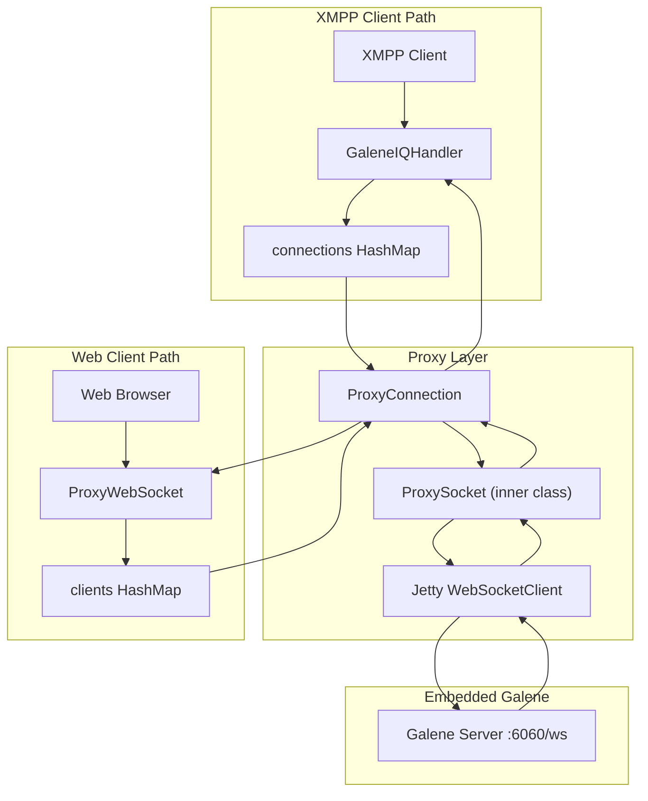
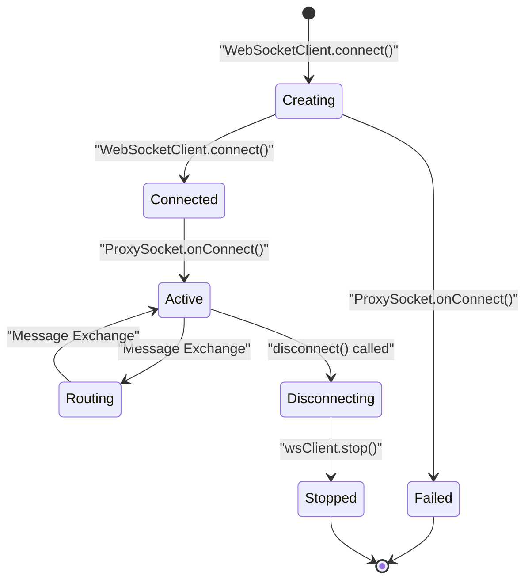
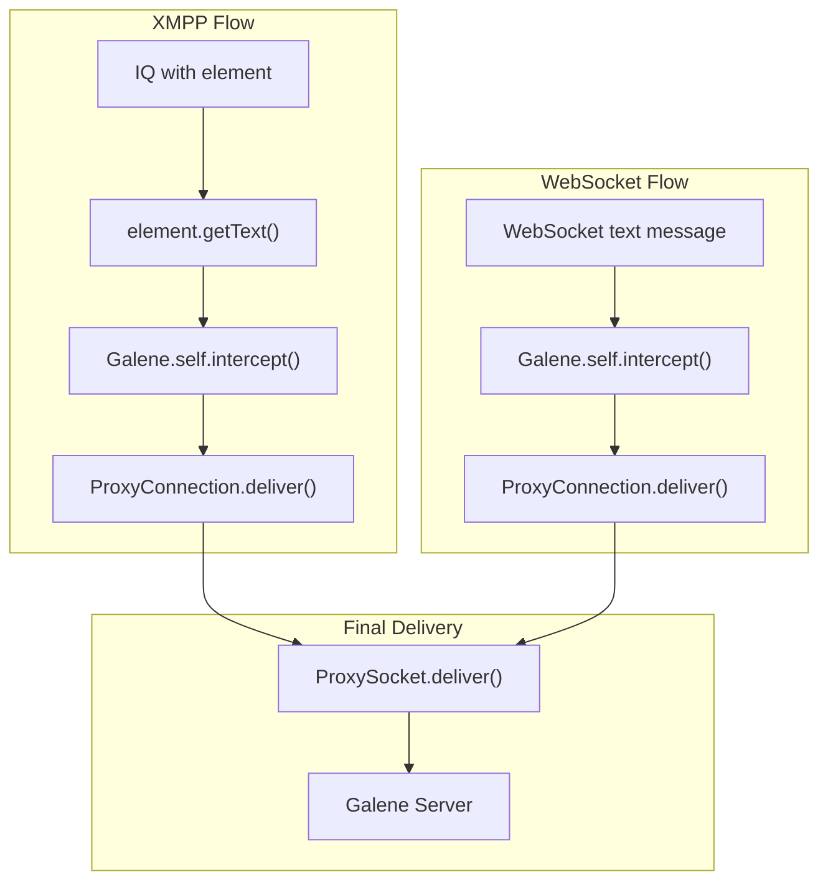
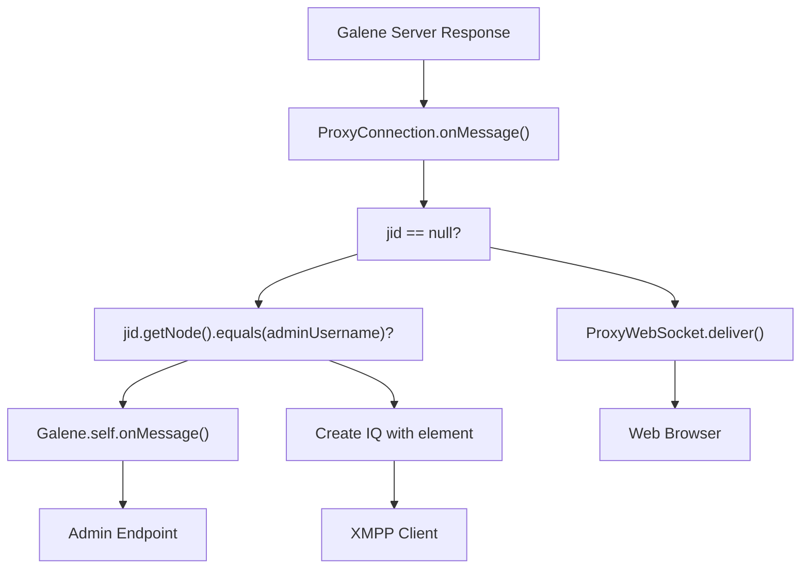

# WebSocket Implementation Details

> **Relevant source files**
> * [src/java/org/ifsoft/galene/openfire/GaleneIQHandler.java](https://github.com/igniterealtime/openfire-galene-plugin/blob/5aa54ac8/src/java/org/ifsoft/galene/openfire/GaleneIQHandler.java)
> * [src/java/org/ifsoft/websockets/ProxyConnection.java](https://github.com/igniterealtime/openfire-galene-plugin/blob/5aa54ac8/src/java/org/ifsoft/websockets/ProxyConnection.java)
> * [src/java/org/ifsoft/websockets/ProxyWebSocket.java](https://github.com/igniterealtime/openfire-galene-plugin/blob/5aa54ac8/src/java/org/ifsoft/websockets/ProxyWebSocket.java)
> * [src/root/data/ice-servers.json](https://github.com/igniterealtime/openfire-galene-plugin/blob/5aa54ac8/src/root/data/ice-servers.json)

This document covers the technical implementation of the WebSocket proxy system that bridges XMPP clients and web browsers to the embedded Galene SFU server. The proxy architecture enables both XMPP-based clients and direct WebSocket clients to participate in the same video conferences.

For broader architectural context, see [System Architecture](/igniterealtime/openfire-galene-plugin/4-system-architecture). For client-side WebSocket integration, see [Client-Side Development](/igniterealtime/openfire-galene-plugin/6.3-client-side-development).

## Proxy Architecture Overview

The WebSocket implementation uses a dual-path proxy system that bridges different client types to the embedded Galene server running on `localhost:6060`.

### WebSocket Proxy Components



**Sources:** [src/java/org/ifsoft/galene/openfire/GaleneIQHandler.java L37-L38](https://github.com/igniterealtime/openfire-galene-plugin/blob/5aa54ac8/src/java/org/ifsoft/galene/openfire/GaleneIQHandler.java#L37-L38)

 [src/java/org/ifsoft/websockets/ProxyWebSocket.java L29-L38](https://github.com/igniterealtime/openfire-galene-plugin/blob/5aa54ac8/src/java/org/ifsoft/websockets/ProxyWebSocket.java#L29-L38)

 [src/java/org/ifsoft/websockets/ProxyConnection.java L39-L55](https://github.com/igniterealtime/openfire-galene-plugin/blob/5aa54ac8/src/java/org/ifsoft/websockets/ProxyConnection.java#L39-L55)

## Connection Management

The system maintains separate connection pools for XMPP and WebSocket clients using concurrent hash maps.

### Connection Lifecycle

| Phase | XMPP Path | WebSocket Path |
| --- | --- | --- |
| **Connection Creation** | `GaleneIQHandler.handleIQ()` creates `ProxyConnection` | `ProxyWebSocket.onConnect()` associates with existing `ProxyConnection` |
| **Registration** | Stored in `connections` HashMap by `bareJID` | Stored in `clients` HashMap by `connection.id` |
| **Active Communication** | IQ stanzas contain JSON payload | Direct WebSocket text messages |
| **Cleanup** | `sessionDestroyed()` removes from both maps | `onClose()` triggers `ProxyConnection.disconnect()` |

**Sources:** [src/java/org/ifsoft/galene/openfire/GaleneIQHandler.java L69-L79](https://github.com/igniterealtime/openfire-galene-plugin/blob/5aa54ac8/src/java/org/ifsoft/galene/openfire/GaleneIQHandler.java#L69-L79)

 [src/java/org/ifsoft/galene/openfire/GaleneIQHandler.java L152-L163](https://github.com/igniterealtime/openfire-galene-plugin/blob/5aa54ac8/src/java/org/ifsoft/galene/openfire/GaleneIQHandler.java#L152-L163)

 [src/java/org/ifsoft/websockets/ProxyWebSocket.java L45-L50](https://github.com/igniterealtime/openfire-galene-plugin/blob/5aa54ac8/src/java/org/ifsoft/websockets/ProxyWebSocket.java#L45-L50)

### ProxyConnection Lifecycle



**Sources:** [src/java/org/ifsoft/websockets/ProxyConnection.java L56-L96](https://github.com/igniterealtime/openfire-galene-plugin/blob/5aa54ac8/src/java/org/ifsoft/websockets/ProxyConnection.java#L56-L96)

 [src/java/org/ifsoft/websockets/ProxyConnection.java L132-L137](https://github.com/igniterealtime/openfire-galene-plugin/blob/5aa54ac8/src/java/org/ifsoft/websockets/ProxyConnection.java#L132-L137)

## Message Routing Implementation

The proxy system handles message routing differently based on client type and message direction.

### Inbound Message Routing (Client → Galene)



**Sources:** [src/java/org/ifsoft/galene/openfire/GaleneIQHandler.java L81-L84](https://github.com/igniterealtime/openfire-galene-plugin/blob/5aa54ac8/src/java/org/ifsoft/galene/openfire/GaleneIQHandler.java#L81-L84)

 [src/java/org/ifsoft/websockets/ProxyWebSocket.java L75-L76](https://github.com/igniterealtime/openfire-galene-plugin/blob/5aa54ac8/src/java/org/ifsoft/websockets/ProxyWebSocket.java#L75-L76)

 [src/java/org/ifsoft/websockets/ProxyConnection.java L265-L276](https://github.com/igniterealtime/openfire-galene-plugin/blob/5aa54ac8/src/java/org/ifsoft/websockets/ProxyConnection.java#L265-L276)

### Outbound Message Routing (Galene → Client)

The `ProxyConnection.onMessage()` method routes responses back to clients based on the connection type:



**Sources:** [src/java/org/ifsoft/websockets/ProxyConnection.java L148-L176](https://github.com/igniterealtime/openfire-galene-plugin/blob/5aa54ac8/src/java/org/ifsoft/websockets/ProxyConnection.java#L148-L176)

 [src/java/org/ifsoft/websockets/ProxyWebSocket.java L89-L101](https://github.com/igniterealtime/openfire-galene-plugin/blob/5aa54ac8/src/java/org/ifsoft/websockets/ProxyWebSocket.java#L89-L101)

## WebSocket Client Implementation

The system uses Jetty's WebSocket client implementation for connections to Galene.

### ProxyConnection Configuration

| Parameter | Source | Default | Purpose |
| --- | --- | --- | --- |
| `galenePort` | `JiveGlobals.getProperty("galene.port")` | `Galene.self.getPort()` | Galene server port |
| `connectTimeout` | Constructor parameter | 10000ms | Connection timeout |
| `idleTimeout` | `wsClient.setIdleTimeout()` | 5 minutes | Keep-alive timeout |
| `maxTextMessageSize` | `@WebSocket` annotation | 64KB | Maximum message size |

**Sources:** [src/java/org/ifsoft/galene/openfire/GaleneIQHandler.java L70](https://github.com/igniterealtime/openfire-galene-plugin/blob/5aa54ac8/src/java/org/ifsoft/galene/openfire/GaleneIQHandler.java#L70-L70)

 [src/java/org/ifsoft/websockets/ProxyConnection.java L79](https://github.com/igniterealtime/openfire-galene-plugin/blob/5aa54ac8/src/java/org/ifsoft/websockets/ProxyConnection.java#L79-L79)

 [src/java/org/ifsoft/websockets/ProxyConnection.java L228](https://github.com/igniterealtime/openfire-galene-plugin/blob/5aa54ac8/src/java/org/ifsoft/websockets/ProxyConnection.java#L228-L228)

### SSL/TLS Support

The `ProxyConnection` constructor detects SSL requirements from the URI scheme and configures trust managers:

```
// From ProxyConnection.java:62-68
if("wss".equals(uri.getScheme()))
{
    getSSLContext();
    isSecure = true;
}
```

The `getSSLContext()` method implements a permissive trust manager that accepts all certificates, suitable for localhost connections to the embedded Galene server.

**Sources:** [src/java/org/ifsoft/websockets/ProxyConnection.java L62-L68](https://github.com/igniterealtime/openfire-galene-plugin/blob/5aa54ac8/src/java/org/ifsoft/websockets/ProxyConnection.java#L62-L68)

 [src/java/org/ifsoft/websockets/ProxyConnection.java L186-L226](https://github.com/igniterealtime/openfire-galene-plugin/blob/5aa54ac8/src/java/org/ifsoft/websockets/ProxyConnection.java#L186-L226)

## Thread Pool Management

The WebSocket implementation uses Jetty's `QueuedThreadPool` for connection management:

```
// From ProxyConnection.java:70-73  
httpClient = new HttpClient();
final QueuedThreadPool queuedThreadPool = QueuedThreadPoolProvider.getQueuedThreadPool("ProxyConnection-HttpClient");
httpClient.setExecutor(queuedThreadPool);
```

This provides dedicated thread pools for each `ProxyConnection` instance to handle concurrent WebSocket operations.

**Sources:** [src/java/org/ifsoft/websockets/ProxyConnection.java L70-L73](https://github.com/igniterealtime/openfire-galene-plugin/blob/5aa54ac8/src/java/org/ifsoft/websockets/ProxyConnection.java#L70-L73)

## Error Handling and Reconnection

The proxy system implements several error handling mechanisms:

### Connection Failures

* **Initial connection failure**: Sets `connected = false` and logs error
* **Runtime disconnection**: Triggers cleanup in both `ProxySocket.onClose()` and `ProxyWebSocket.onClose()`
* **Message delivery failure**: Logged but doesn't terminate connection

### Session Management Integration

The `GaleneIQHandler` implements `SessionEventListener` to automatically clean up connections when XMPP sessions end:

```python
// From GaleneIQHandler.java:152-163
public void sessionDestroyed(Session session)
{
    final String from = session.getAddress().toBareJID();
    ProxyConnection connection = (ProxyConnection) connections.remove(from);
    
    if (connection != null) {
        clients.remove(connection.id);
        connection.disconnect();
    }
}
```

**Sources:** [src/java/org/ifsoft/galene/openfire/GaleneIQHandler.java L152-L163](https://github.com/igniterealtime/openfire-galene-plugin/blob/5aa54ac8/src/java/org/ifsoft/galene/openfire/GaleneIQHandler.java#L152-L163)

 [src/java/org/ifsoft/websockets/ProxyConnection.java L91-L95](https://github.com/igniterealtime/openfire-galene-plugin/blob/5aa54ac8/src/java/org/ifsoft/websockets/ProxyConnection.java#L91-L95)

 [src/java/org/ifsoft/websockets/ProxyWebSocket.java L52-L62](https://github.com/igniterealtime/openfire-galene-plugin/blob/5aa54ac8/src/java/org/ifsoft/websockets/ProxyWebSocket.java#L52-L62)