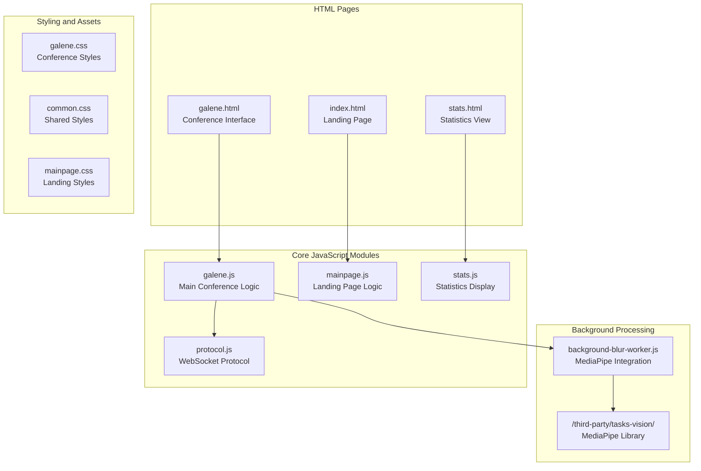
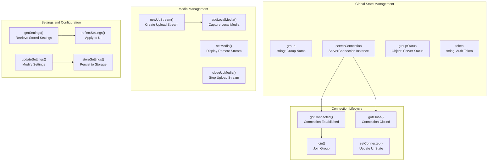
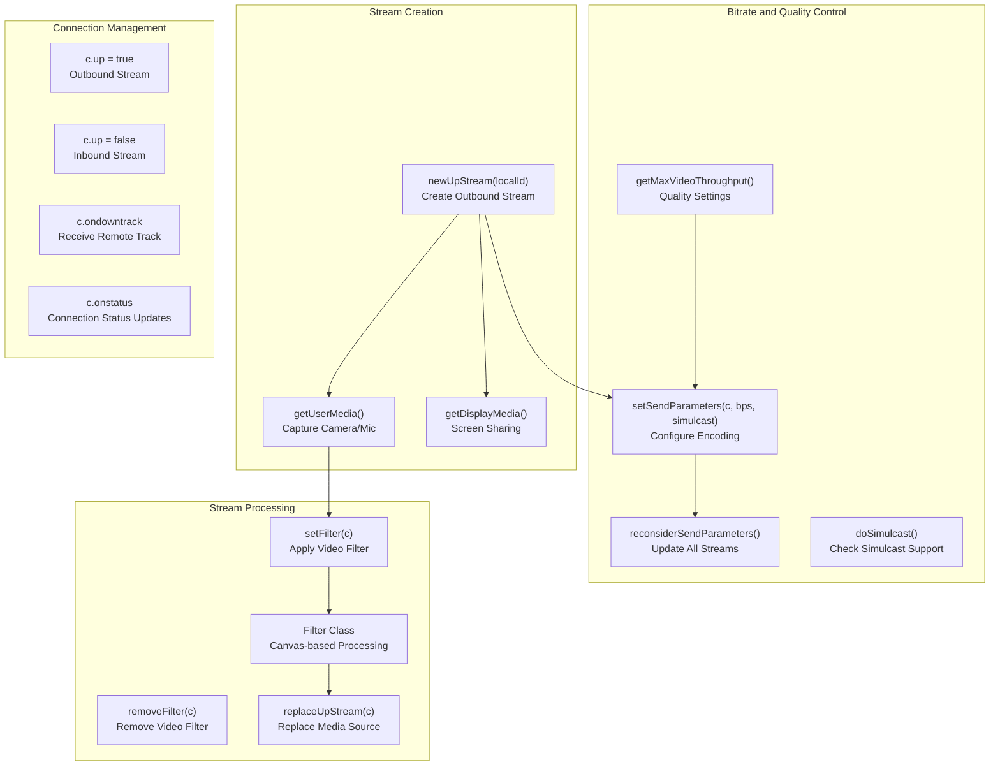
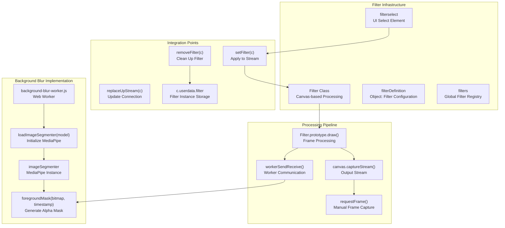
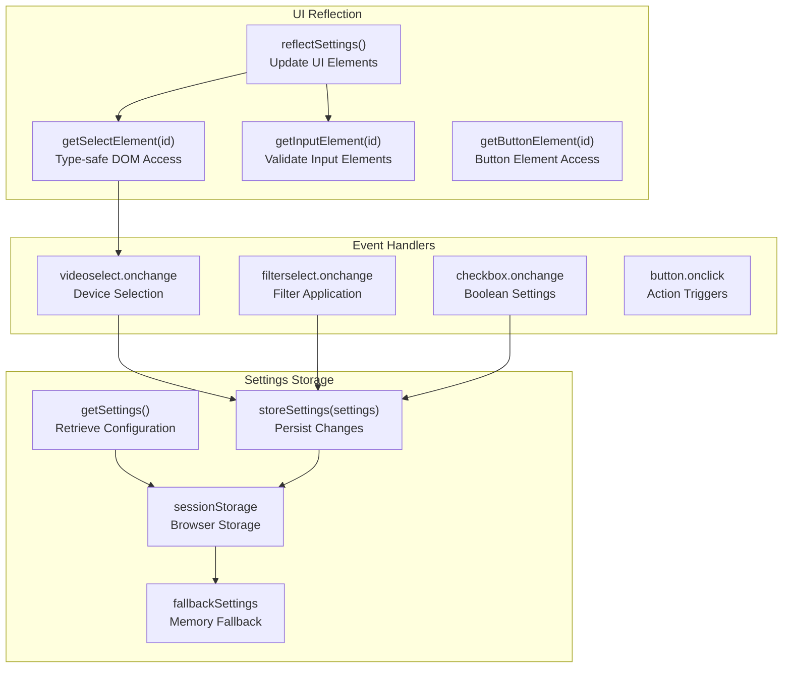
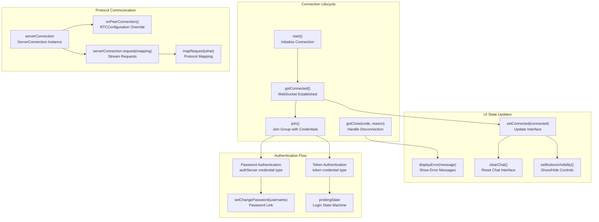

# Client-Side Development

> **Relevant source files**
> * [src/root/static/background-blur-worker.js](https://github.com/igniterealtime/openfire-galene-plugin/blob/5aa54ac8/src/root/static/background-blur-worker.js)
> * [src/root/static/galene.js](https://github.com/igniterealtime/openfire-galene-plugin/blob/5aa54ac8/src/root/static/galene.js)
> * [src/root/static/index.html](https://github.com/igniterealtime/openfire-galene-plugin/blob/5aa54ac8/src/root/static/index.html)
> * [src/root/static/mainpage.css](https://github.com/igniterealtime/openfire-galene-plugin/blob/5aa54ac8/src/root/static/mainpage.css)
> * [src/root/static/mainpage.js](https://github.com/igniterealtime/openfire-galene-plugin/blob/5aa54ac8/src/root/static/mainpage.js)
> * [src/root/static/stats.html](https://github.com/igniterealtime/openfire-galene-plugin/blob/5aa54ac8/src/root/static/stats.html)
> * [src/root/static/stats.js](https://github.com/igniterealtime/openfire-galene-plugin/blob/5aa54ac8/src/root/static/stats.js)
> * [src/root/static/tsconfig.json](https://github.com/igniterealtime/openfire-galene-plugin/blob/5aa54ac8/src/root/static/tsconfig.json)

This document covers the web client architecture, JavaScript components, and client-side features of the Galene video conferencing interface. It focuses on the browser-based user interface that connects to the embedded Galene SFU through WebSocket proxying.

For server-side plugin development, see [Plugin Development Overview](/igniterealtime/openfire-galene-plugin/6.1-plugin-development-overview). For WebSocket proxy implementation details, see [WebSocket Implementation Details](/igniterealtime/openfire-galene-plugin/6.2-websocket-implementation-details). For administration interfaces, see [Admin Console Interface](/igniterealtime/openfire-galene-plugin/3.1-admin-console-interface).

## Web Client Architecture Overview

The Galene web client is a single-page application built around WebRTC peer connections and a custom signaling protocol. The main entry points are the landing page and the group interface, with the core functionality implemented in JavaScript modules.

The web client operates as a WebRTC application that communicates with the Galene SFU through WebSocket connections proxied by the Openfire plugin. The main conference interface is built around the `ServerConnection` class and media stream management.

**Sources:** [src/root/static/galene.js L1-L40](https://github.com/igniterealtime/openfire-galene-plugin/blob/5aa54ac8/src/root/static/galene.js#L1-L40)

 [src/root/static/index.html L1-L40](https://github.com/igniterealtime/openfire-galene-plugin/blob/5aa54ac8/src/root/static/index.html#L1-L40)

 [src/root/static/background-blur-worker.js L1-L25](https://github.com/igniterealtime/openfire-galene-plugin/blob/5aa54ac8/src/root/static/background-blur-worker.js#L1-L25)

## Core JavaScript Components

The main client logic is organized around several key JavaScript classes and global objects that manage different aspects of the video conferencing experience.

The architecture follows a pattern where global state variables track the connection status and group information, while functions handle specific operations like media management and settings persistence.

**Sources:** [src/root/static/galene.js L23-L66](https://github.com/igniterealtime/openfire-galene-plugin/blob/5aa54ac8/src/root/static/galene.js#L23-L66)

 [src/root/static/galene.js L100-L164](https://github.com/igniterealtime/openfire-galene-plugin/blob/5aa54ac8/src/root/static/galene.js#L100-L164)

 [src/root/static/galene.js L360-L468](https://github.com/igniterealtime/openfire-galene-plugin/blob/5aa54ac8/src/root/static/galene.js#L360-L468)

## WebRTC Stream Management

The client implements a comprehensive WebRTC stream management system that handles both incoming and outgoing media streams, with support for simulcast, bitrate control, and multiple video sources.

The stream management system supports advanced features like background blur through the `Filter` class, which uses canvas-based video processing to apply real-time effects to outgoing video streams.

**Sources:** [src/root/static/galene.js L1032-L1076](https://github.com/igniterealtime/openfire-galene-plugin/blob/5aa54ac8/src/root/static/galene.js#L1032-L1076)

 [src/root/static/galene.js L1112-L1276](https://github.com/igniterealtime/openfire-galene-plugin/blob/5aa54ac8/src/root/static/galene.js#L1112-L1276)

 [src/root/static/galene.js L720-L753](https://github.com/igniterealtime/openfire-galene-plugin/blob/5aa54ac8/src/root/static/galene.js#L720-L753)

## Video Filtering and Background Blur

The client implements a sophisticated video filtering system centered around the `Filter` class and a Web Worker for background blur processing using MediaPipe.

The background blur feature uses MediaPipe's image segmentation running in a Web Worker to generate foreground masks that are applied in real-time to the video stream through canvas compositing.

**Sources:** [src/root/static/galene.js L1122-L1276](https://github.com/igniterealtime/openfire-galene-plugin/blob/5aa54ac8/src/root/static/galene.js#L1122-L1276)

 [src/root/static/background-blur-worker.js L25-L93](https://github.com/igniterealtime/openfire-galene-plugin/blob/5aa54ac8/src/root/static/background-blur-worker.js#L25-L93)

 [src/root/static/galene.js L704-L717](https://github.com/igniterealtime/openfire-galene-plugin/blob/5aa54ac8/src/root/static/galene.js#L704-L717)

## UI Components and Settings Management

The client provides a comprehensive settings system that persists user preferences and reflects them in the user interface through HTML form controls and programmatic updates.

| Setting Category | UI Elements | Storage Functions | Settings Keys |
| --- | --- | --- | --- |
| Media Devices | `videoselect`, `audioselect` | `updateSettings()` | `video`, `audio` |
| Video Quality | `sendselect`, `simulcastselect` | `updateSetting()` | `send`, `simulcast` |
| Display Options | `mirrorbox`, `blackboardbox` | `reflectSettings()` | `mirrorView`, `blackboardMode` |
| Audio Processing | `hqaudiobox`, `preprocessingbox` | `getSettings()` | `hqaudio`, `preprocessing` |
| Activity Detection | `activitybox`, `displayallbox` | `storeSettings()` | `activityDetection`, `displayAll` |
| Video Filters | `filterselect` | `delSetting()` | `filter` |

The settings system provides type-safe DOM element access through helper functions and automatic persistence of user preferences, with fallback handling for environments where session storage is not available.

**Sources:** [src/root/static/galene.js L100-L164](https://github.com/igniterealtime/openfire-galene-plugin/blob/5aa54ac8/src/root/static/galene.js#L100-L164)

 [src/root/static/galene.js L166-L200](https://github.com/igniterealtime/openfire-galene-plugin/blob/5aa54ac8/src/root/static/galene.js#L166-L200)

 [src/root/static/galene.js L204-L302](https://github.com/igniterealtime/openfire-galene-plugin/blob/5aa54ac8/src/root/static/galene.js#L204-L302)

 [src/root/static/galene.js L639-L686](https://github.com/igniterealtime/openfire-galene-plugin/blob/5aa54ac8/src/root/static/galene.js#L639-L686)

## Connection and Protocol Handling

The client manages WebSocket connections to the Galene SFU through a protocol layer that handles authentication, group joining, and real-time communication with the server.

The connection system supports multiple authentication methods including JWT tokens and password-based authentication through an auth server, with automatic UI state management based on connection status and user permissions.

**Sources:** [src/root/static/galene.js L384-L468](https://github.com/igniterealtime/openfire-galene-plugin/blob/5aa54ac8/src/root/static/galene.js#L384-L468)

 [src/root/static/galene.js L470-L530](https://github.com/igniterealtime/openfire-galene-plugin/blob/5aa54ac8/src/root/static/galene.js#L470-L530)

 [src/root/static/galene.js L584-L614](https://github.com/igniterealtime/openfire-galene-plugin/blob/5aa54ac8/src/root/static/galene.js#L584-L614)

 [src/root/static/galene.js L796-L803](https://github.com/igniterealtime/openfire-galene-plugin/blob/5aa54ac8/src/root/static/galene.js#L796-L803)