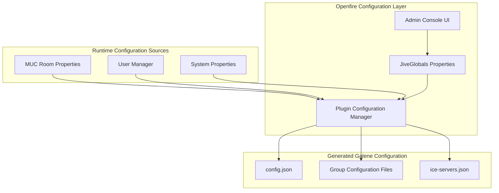
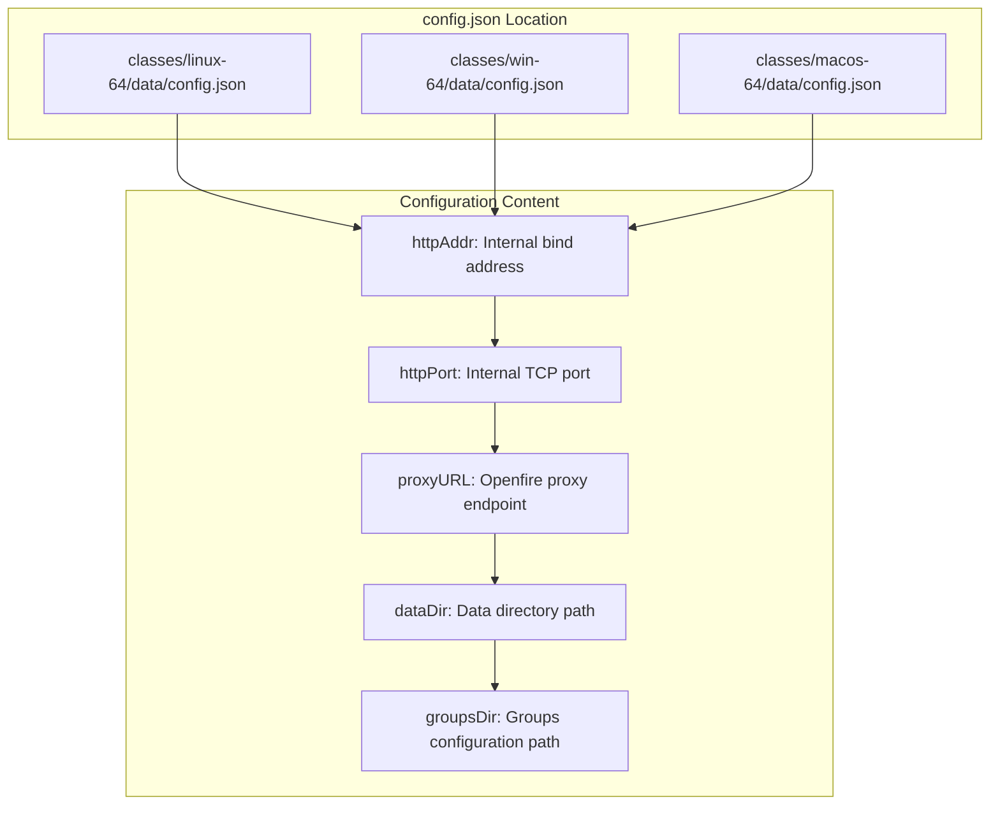
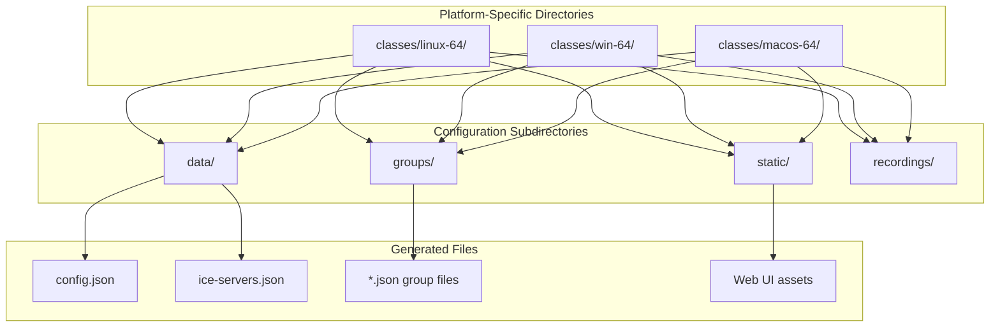
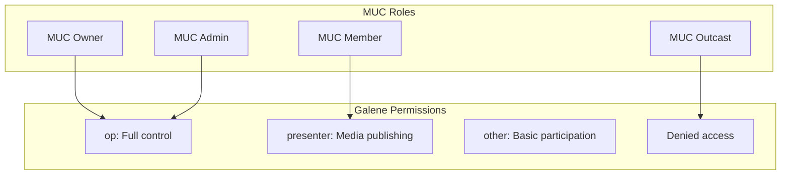

# Configuration Reference

> **Relevant source files**
> * [README.md](https://github.com/igniterealtime/openfire-galene-plugin/blob/5aa54ac8/README.md)
> * [classes/macos-64/data/config.json](https://github.com/igniterealtime/openfire-galene-plugin/blob/5aa54ac8/classes/macos-64/data/config.json)
> * [classes/macos-64/data/ice-servers.json](https://github.com/igniterealtime/openfire-galene-plugin/blob/5aa54ac8/classes/macos-64/data/ice-servers.json)
> * [classes/macos-64/groups/public.json](https://github.com/igniterealtime/openfire-galene-plugin/blob/5aa54ac8/classes/macos-64/groups/public.json)
> * [classes/macos-64/recordings/public/dummy.txt](https://github.com/igniterealtime/openfire-galene-plugin/blob/5aa54ac8/classes/macos-64/recordings/public/dummy.txt)
> * [classes/macos-64/static/404.css](https://github.com/igniterealtime/openfire-galene-plugin/blob/5aa54ac8/classes/macos-64/static/404.css)
> * [classes/macos-64/static/404.html](https://github.com/igniterealtime/openfire-galene-plugin/blob/5aa54ac8/classes/macos-64/static/404.html)
> * [classes/macos-64/static/change-password.css](https://github.com/igniterealtime/openfire-galene-plugin/blob/5aa54ac8/classes/macos-64/static/change-password.css)
> * [readme.html](https://github.com/igniterealtime/openfire-galene-plugin/blob/5aa54ac8/readme.html)
> * [src/root/groups/public.json](https://github.com/igniterealtime/openfire-galene-plugin/blob/5aa54ac8/src/root/groups/public.json)

This document provides a comprehensive reference for all configuration options available in the Openfire Galene Plugin. It covers both plugin-specific settings stored in Openfire's configuration system and the embedded Galene SFU configuration files.

For installation and basic setup instructions, see [Plugin Installation & Basic Setup](./2.2-plugin-installation-and-basic-setup.md). For advanced configuration scenarios and network setup, see [Advanced Configuration](./2.3-advanced-configuration.md). For understanding how these configurations integrate with the system architecture, see [Core Plugin Architecture](./4.1-core-plugin-architecture.md).

## Configuration Overview

The Openfire Galene Plugin uses a two-tier configuration system:

1. **Plugin Configuration**: Stored in Openfire's `JiveGlobals` properties system, controlling plugin behavior and integration settings
2. **Galene Configuration**: Native Galene configuration files (`config.json`, group files) automatically generated and managed by the plugin



**Configuration Flow Diagram**
Sources: [README.md L19-L65](https://github.com/igniterealtime/openfire-galene-plugin/blob/5aa54ac8/README.md#L19-L65)

 [readme.html L44-L72](https://github.com/igniterealtime/openfire-galene-plugin/blob/5aa54ac8/readme.html#L44-L72)

## Plugin Configuration Properties

All plugin configuration is stored using Openfire's `JiveGlobals` properties system with the prefix `plugin.galene.`. These properties can be configured through the Openfire Admin Console or set programmatically.

### Core Plugin Settings

| Property | Type | Default | Description |
| --- | --- | --- | --- |
| `plugin.galene.enabled` | Boolean | `true` | Enables or disables the entire plugin functionality |
| `plugin.galene.muc.enabled` | Boolean | `true` | Enables MUC integration for room-based conferences |
| `plugin.galene.port.single` | Boolean | `false` | Use single muxed UDP port instead of port range |

### Network Configuration

| Property | Type | Default | Description |
| --- | --- | --- | --- |
| `plugin.galene.ipaddr` | String | Auto-detected | Internal IP address for Galene to bind to |
| `plugin.galene.port` | Integer | `6060` | Internal TCP port for Galene HTTP server |
| `plugin.galene.udp.port.min` | Integer | `49152` | Minimum UDP port for ICE connections |
| `plugin.galene.udp.port.max` | Integer | `65535` | Maximum UDP port for ICE connections |
| `plugin.galene.udp.port.mux` | Integer | `8443` | Single muxed UDP port when enabled |

### TURN Server Configuration

| Property | Type | Default | Description |
| --- | --- | --- | --- |
| `plugin.galene.turn.enabled` | Boolean | `false` | Enables internal TURN server |
| `plugin.galene.turn.ipaddr` | String | Auto-detected | Public IP address for TURN server |
| `plugin.galene.turn.port` | Integer | `3478` | TURN server port (TCP and UDP) |

### Authentication Settings

| Property | Type | Default | Description |
| --- | --- | --- | --- |
| `plugin.galene.admin.username` | String | `sfu-admin` | Username for Galene admin user |
| `plugin.galene.admin.password` | String | Auto-generated | Password for Galene admin user |
| `plugin.galene.external.url` | String | Auto-generated | Base external URL for client access |

Sources: [README.md L22-L65](https://github.com/igniterealtime/openfire-galene-plugin/blob/5aa54ac8/README.md#L22-L65)

 [readme.html L46-L72](https://github.com/igniterealtime/openfire-galene-plugin/blob/5aa54ac8/readme.html#L46-L72)

## Galene Configuration Files

The plugin automatically generates and manages Galene's native configuration files based on the plugin properties and Openfire's state.

### Main Configuration File Structure



**Galene Configuration File Structure**
Sources: [classes/macos-64/data/config.json L1-L3](https://github.com/igniterealtime/openfire-galene-plugin/blob/5aa54ac8/classes/macos-64/data/config.json#L1-L3)

### ICE Servers Configuration

The plugin manages ICE server configuration for WebRTC connectivity:

```json
[
    {
        "urls": [
            "stun:stun1.l.google.com:19305",
            "stun:stun1.l.google.com:19302",
            "stun:stun4.l.google.com:19302",
            "stun:stun.frozenmountain.com:3478",
            "stun:stun.freeswitch.org:3478"
        ]
    }
]
```

Sources: [classes/macos-64/data/ice-servers.json L1-L11](https://github.com/igniterealtime/openfire-galene-plugin/blob/5aa54ac8/classes/macos-64/data/ice-servers.json#L1-L11)

## Group Configuration Files

Group files define the permissions and settings for individual conference rooms. The plugin creates these automatically based on MUC room configurations.

### Default Public Group Configuration

```json
{
  "public": true,
  "description": "A public place to hangout",
  "allow-recording": true,
  "allow-anonymous": true,
  "allow-subgroups": true,
  "op": [{}],
  "presenter": [{}],
  "other": [{}],  
  "codecs": ["vp9", "opus", "av1", "h264"],   
  "max-clients": 100
}
```

### Group Configuration Properties

| Property | Type | Description |
| --- | --- | --- |
| `public` | Boolean | Whether the group is publicly accessible |
| `description` | String | Human-readable group description |
| `allow-recording` | Boolean | Permits recording functionality |
| `allow-anonymous` | Boolean | Allows anonymous user access |
| `allow-subgroups` | Boolean | Enables subgroup creation |
| `op` | Array | Operator permissions configuration |
| `presenter` | Array | Presenter permissions configuration |
| `other` | Array | Default user permissions configuration |
| `codecs` | Array | Supported media codecs list |
| `max-clients` | Integer | Maximum concurrent clients |

Sources: [classes/macos-64/groups/public.json L1-L12](https://github.com/igniterealtime/openfire-galene-plugin/blob/5aa54ac8/classes/macos-64/groups/public.json#L1-L12)

 [src/root/groups/public.json L1-L12](https://github.com/igniterealtime/openfire-galene-plugin/blob/5aa54ac8/src/root/groups/public.json#L1-L12)

## Configuration File Locations



**Platform-Specific Configuration Layout**
Sources: [classes/macos-64/data/config.json L1-L3](https://github.com/igniterealtime/openfire-galene-plugin/blob/5aa54ac8/classes/macos-64/data/config.json#L1-L3)

 [classes/macos-64/groups/public.json L1-L12](https://github.com/igniterealtime/openfire-galene-plugin/blob/5aa54ac8/classes/macos-64/groups/public.json#L1-L12)

 [classes/macos-64/static/404.html L1-L31](https://github.com/igniterealtime/openfire-galene-plugin/blob/5aa54ac8/classes/macos-64/static/404.html#L1-L31)

 [classes/macos-64/recordings/public/dummy.txt L1](https://github.com/igniterealtime/openfire-galene-plugin/blob/5aa54ac8/classes/macos-64/recordings/public/dummy.txt#L1-L1)

## MUC Integration Configuration

When MUC support is enabled, the plugin dynamically creates group configuration files based on Openfire MUC room properties.

### MUC Room to Group Mapping

| MUC Room Property | Galene Group Property | Effect |
| --- | --- | --- |
| `members-only` | `allow-anonymous` | Inverts the value (members-only disables anonymous) |
| `password-protected` | Authentication requirement | Uses room password for group access |
| `persistent` | Group persistence | Determines if group configuration is saved |
| `public-room` | `public` | Controls group visibility |
| `moderated` | Permission levels | Affects `op`, `presenter`, `other` arrays |

### Permission Level Mapping



**MUC Role to Galene Permission Mapping**
Sources: [README.md L25-L39](https://github.com/igniterealtime/openfire-galene-plugin/blob/5aa54ac8/README.md#L25-L39)

 [readme.html L48-L56](https://github.com/igniterealtime/openfire-galene-plugin/blob/5aa54ac8/readme.html#L48-L56)

## Configuration Validation and Dependencies

### Required Configuration Relationships

| Setting | Dependencies | Validation Rules |
| --- | --- | --- |
| `plugin.galene.turn.enabled` | `plugin.galene.turn.ipaddr`, `plugin.galene.turn.port` | Must specify public IP when enabled |
| `plugin.galene.port.single` | `plugin.galene.udp.port.mux` | Mux port required when single port mode enabled |
| `plugin.galene.muc.enabled` | MUC service availability | MUC service must be running |
| `plugin.galene.admin.username` | User manager write access | User must exist or be creatable |

### Port Configuration Validation

The plugin validates that configured ports don't conflict with Openfire's existing services:

* Internal Galene port (`plugin.galene.port`) must not conflict with Openfire HTTP ports
* UDP port range (`min`/`max`) must be valid and available
* TURN port must be accessible from external networks when TURN is enabled
* Mux port must be unique when single port mode is used

Sources: [README.md L42-L65](https://github.com/igniterealtime/openfire-galene-plugin/blob/5aa54ac8/README.md#L42-L65)

 [readme.html L57-L72](https://github.com/igniterealtime/openfire-galene-plugin/blob/5aa54ac8/readme.html#L57-L72)