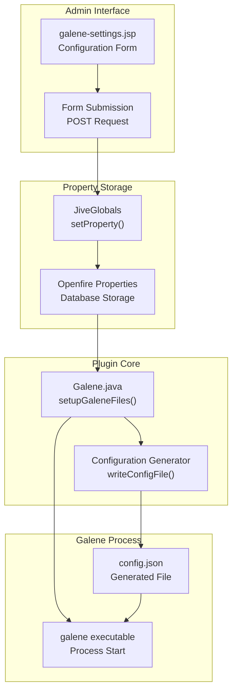
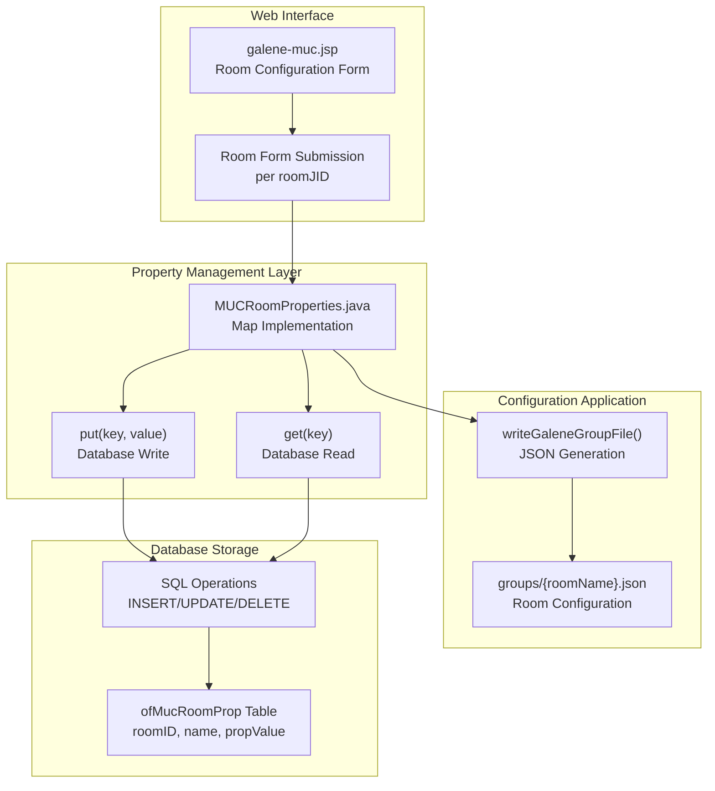
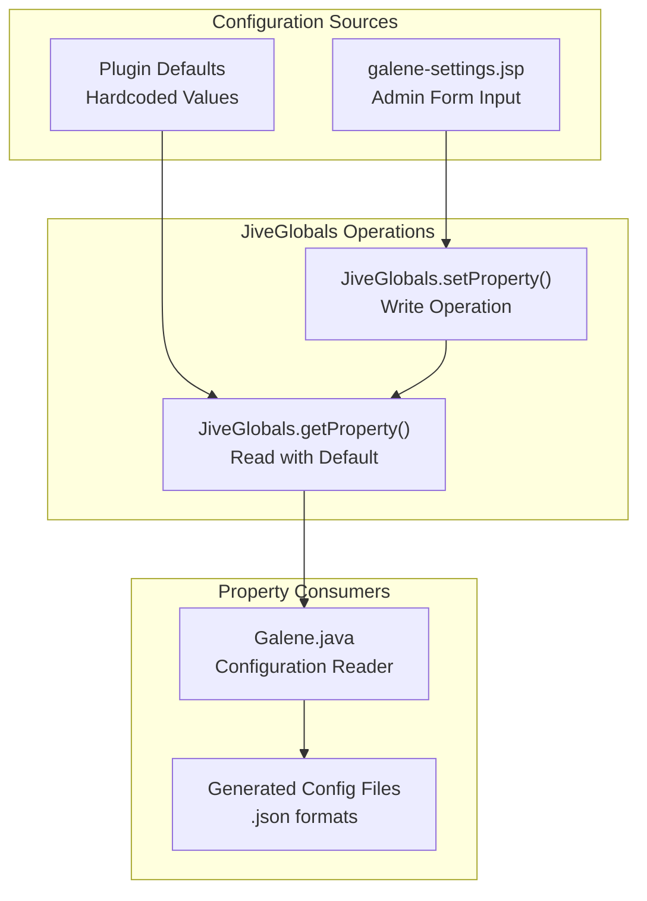
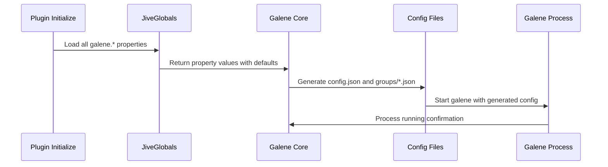
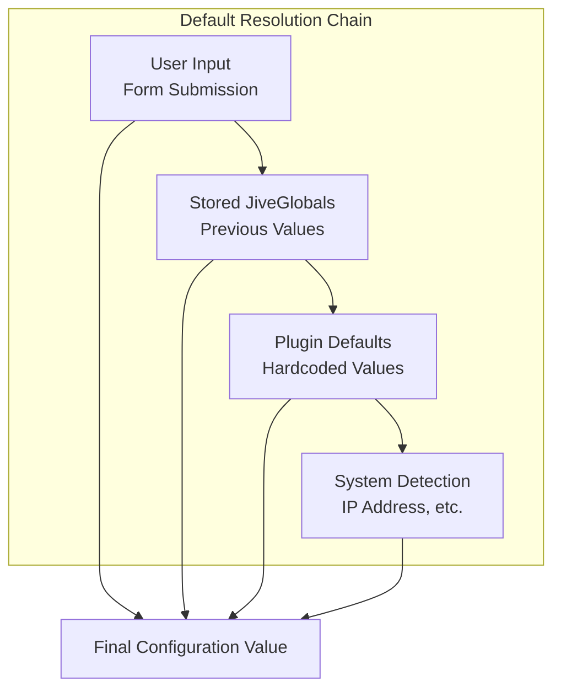

# Plugin Configuration Options

> **Relevant source files**
> * [README.md](https://github.com/igniterealtime/openfire-galene-plugin/blob/5aa54ac8/README.md)
> * [readme.html](https://github.com/igniterealtime/openfire-galene-plugin/blob/5aa54ac8/readme.html)
> * [src/i18n/galene_i18n.properties](https://github.com/igniterealtime/openfire-galene-plugin/blob/5aa54ac8/src/i18n/galene_i18n.properties)
> * [src/java/org/ifsoft/galene/openfire/MUCRoomProperties.java](https://github.com/igniterealtime/openfire-galene-plugin/blob/5aa54ac8/src/java/org/ifsoft/galene/openfire/MUCRoomProperties.java)
> * [src/web/galene-muc.jsp](https://github.com/igniterealtime/openfire-galene-plugin/blob/5aa54ac8/src/web/galene-muc.jsp)
> * [src/web/galene-settings.jsp](https://github.com/igniterealtime/openfire-galene-plugin/blob/5aa54ac8/src/web/galene-settings.jsp)
> * [src/web/galene-summary.jsp](https://github.com/igniterealtime/openfire-galene-plugin/blob/5aa54ac8/src/web/galene-summary.jsp)

This document provides a comprehensive reference for all configuration options available in the Openfire Galene plugin. It covers both global plugin settings that affect the entire SFU deployment and room-specific settings that control individual MUC room behavior. For information about the structure and format of Galene's native configuration files, see [Galene Configuration Files](./7.2-galene-configuration-files.md).

The plugin uses two primary configuration storage mechanisms: Openfire's JiveGlobals properties for system-wide settings and database-stored MUC room properties for per-room customization.

## Global Configuration Properties

Global configuration options are stored as JiveGlobals properties and control the overall behavior of the embedded Galene SFU server. These settings are managed through the admin console interface and require plugin restart when modified.

### Core Plugin Settings

| Property | Default Value | Description |
| --- | --- | --- |
| `galene.enabled` | `"true"` | Master switch to enable or disable the entire SFU functionality |
| `galene.muc.enabled` | `"false"` | Integrates Galene with Openfire MUC rooms when enabled |

### Network Configuration

| Property | Default Value | Description |
| --- | --- | --- |
| `galene.ipaddr` | Auto-detected | Internal IP address for Galene server binding |
| `galene.port` | `"6060"` | Internal TCP port for Galene HTTP server |
| `galene.url` | Auto-generated | External base URL for client access |

### UDP Port Management

| Property | Default Value | Description |
| --- | --- | --- |
| `galene.mux.enabled` | `"false"` | Use single muxed UDP port instead of port range |
| `galene.port.range.min` | `"49152"` | Minimum UDP port for ICE connections |
| `galene.port.range.max` | `"65535"` | Maximum UDP port for ICE connections |
| `galene.port.mux` | `"6061"` | Single muxed UDP port when mux mode enabled |

### TURN Server Configuration

| Property | Default Value | Description |
| --- | --- | --- |
| `galene.turn.enabled` | `"false"` | Enable embedded TURN server for NAT traversal |
| `galene.turn.ipaddr` | Same as `galene.ipaddr` | Public IP address for TURN server |
| `galene.turn.port` | `"3478"` | TURN server port (TCP and UDP) |

### Authentication Settings

| Property | Default Value | Description |
| --- | --- | --- |
| `galene.username` | `"sfu-admin"` | Admin username for Galene management |
| `galene.password` | Random generated | Admin password for Galene management |

Sources: [src/web/galene-settings.jsp L18-L58](https://github.com/igniterealtime/openfire-galene-plugin/blob/5aa54ac8/src/web/galene-settings.jsp#L18-L58)

 [src/i18n/galene_i18n.properties L17-L20](https://github.com/igniterealtime/openfire-galene-plugin/blob/5aa54ac8/src/i18n/galene_i18n.properties#L17-L20)

## Configuration Flow Architecture

Sources: [src/web/galene-settings.jsp L16-L61](https://github.com/igniterealtime/openfire-galene-plugin/blob/5aa54ac8/src/web/galene-settings.jsp#L16-L61)

 [src/java/org/ifsoft/galene/openfire/Galene.java](https://github.com/igniterealtime/openfire-galene-plugin/blob/5aa54ac8/src/java/org/ifsoft/galene/openfire/Galene.java)

## MUC Room Properties

Room-specific configuration options are stored in the `ofMucRoomProp` database table and allow per-room customization of SFU behavior. These properties inherit from global settings but can be overridden at the room level.

### Room-Level Configuration Options

| Property | Default Value | Description |
| --- | --- | --- |
| `galene.enabled` | Inherited from global | Enable/disable SFU for specific room |
| `galene.federation.enabled` | `"false"` | Allow federated connections to this room |

### MUC Property Management System

Sources: [src/web/galene-muc.jsp L23-L31](https://github.com/igniterealtime/openfire-galene-plugin/blob/5aa54ac8/src/web/galene-muc.jsp#L23-L31)

 [src/java/org/ifsoft/galene/openfire/MUCRoomProperties.java L172-L196](https://github.com/igniterealtime/openfire-galene-plugin/blob/5aa54ac8/src/java/org/ifsoft/galene/openfire/MUCRoomProperties.java#L172-L196)

## Configuration Storage Implementation

The plugin uses a two-tier property storage system that separates global and room-specific settings.

### JiveGlobals Property Operations

### Database Property Schema

The MUC room properties utilize the standard Openfire database schema with the following table structure:

| Column | Type | Purpose |
| --- | --- | --- |
| `roomID` | BIGINT | References MUC room primary key |
| `name` | VARCHAR | Property name (e.g., `"galene.enabled"`) |
| `propValue` | TEXT | Property value as string |

Sources: [src/java/org/ifsoft/galene/openfire/MUCRoomProperties.java L29-L32](https://github.com/igniterealtime/openfire-galene-plugin/blob/5aa54ac8/src/java/org/ifsoft/galene/openfire/MUCRoomProperties.java#L29-L32)

 [src/web/galene-settings.jsp L18-L58](https://github.com/igniterealtime/openfire-galene-plugin/blob/5aa54ac8/src/web/galene-settings.jsp#L18-L58)

## Configuration Lifecycle and Persistence

### Plugin Startup Configuration Flow

### Runtime Configuration Updates

Configuration changes require specific handling depending on the property type:

1. **Global Properties**: Modified through `galene-settings.jsp`, require plugin restart
2. **Room Properties**: Modified through `galene-muc.jsp`, applied immediately via `setupGaleneFiles()`
3. **Dynamic Properties**: Some properties trigger immediate Galene configuration regeneration

Sources: [src/web/galene-settings.jsp L60](https://github.com/igniterealtime/openfire-galene-plugin/blob/5aa54ac8/src/web/galene-settings.jsp#L60-L60)

 [src/web/galene-muc.jsp L30](https://github.com/igniterealtime/openfire-galene-plugin/blob/5aa54ac8/src/web/galene-muc.jsp#L30-L30)

 [src/web/galene-summary.jsp L17](https://github.com/igniterealtime/openfire-galene-plugin/blob/5aa54ac8/src/web/galene-summary.jsp#L17-L17)

## Configuration Validation and Defaults

### Default Value Resolution

The plugin implements a cascading default value system:

### Required vs Optional Properties

| Category | Required Properties | Optional Properties |
| --- | --- | --- |
| **Network** | `galene.ipaddr`, `galene.port` | `galene.url` |
| **Authentication** | `galene.username`, `galene.password` | None |
| **UDP Ports** | `galene.port.range.min`, `galene.port.range.max` | `galene.port.mux` |
| **TURN** | `galene.turn.ipaddr`, `galene.turn.port` | None |

Sources: [src/web/galene-settings.jsp L117-L191](https://github.com/igniterealtime/openfire-galene-plugin/blob/5aa54ac8/src/web/galene-settings.jsp#L117-L191)

 [src/i18n/galene_i18n.properties L7-L16](https://github.com/igniterealtime/openfire-galene-plugin/blob/5aa54ac8/src/i18n/galene_i18n.properties#L7-L16)