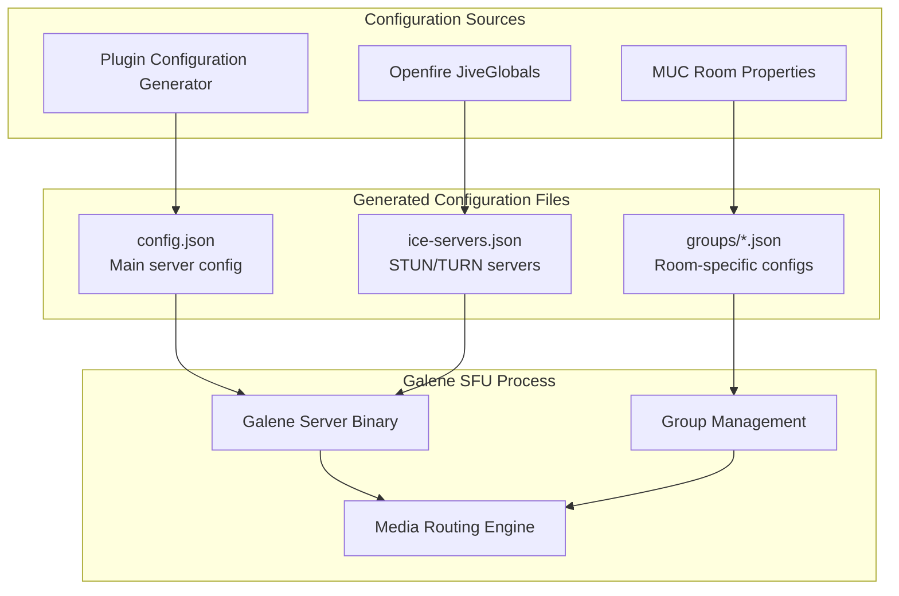
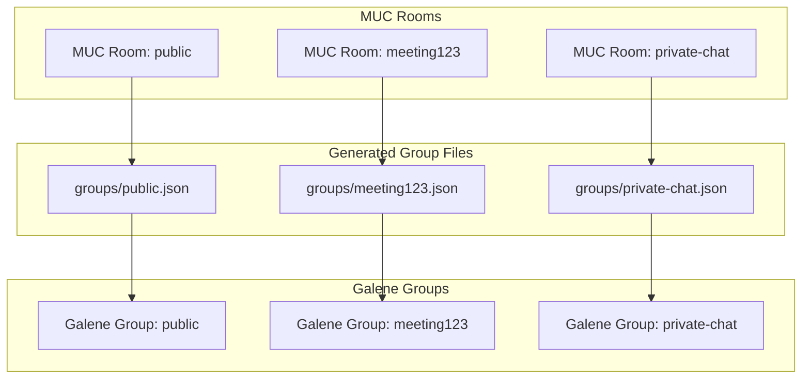
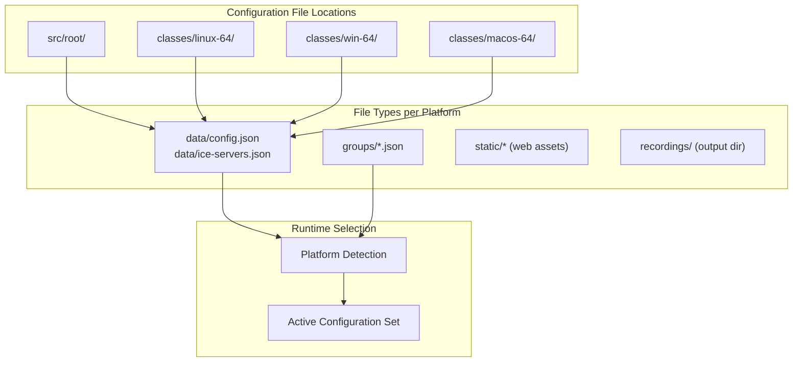
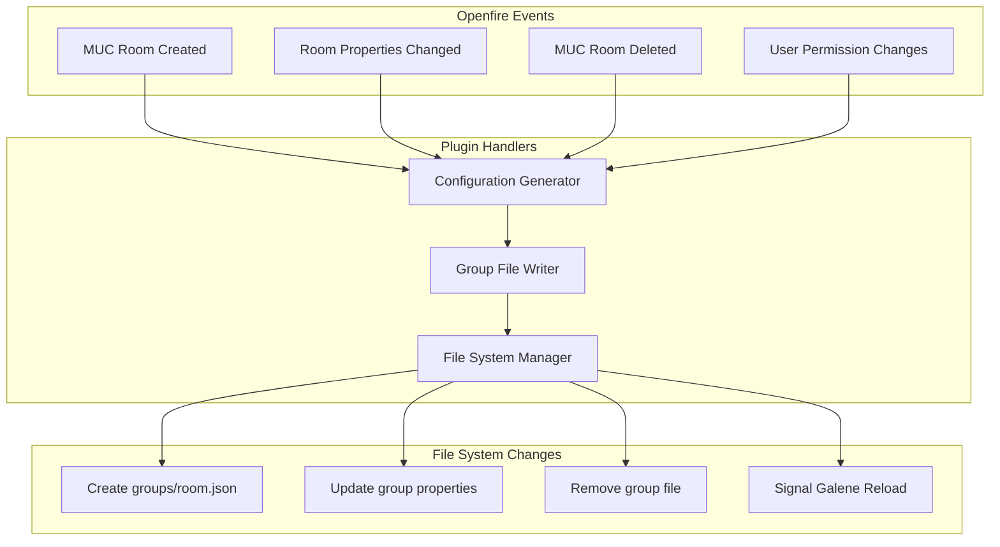

# Galene Configuration Files

> **Relevant source files**
> * [classes/macos-64/data/config.json](https://github.com/igniterealtime/openfire-galene-plugin/blob/5aa54ac8/classes/macos-64/data/config.json)
> * [classes/macos-64/data/ice-servers.json](https://github.com/igniterealtime/openfire-galene-plugin/blob/5aa54ac8/classes/macos-64/data/ice-servers.json)
> * [classes/macos-64/groups/public.json](https://github.com/igniterealtime/openfire-galene-plugin/blob/5aa54ac8/classes/macos-64/groups/public.json)
> * [classes/macos-64/recordings/public/dummy.txt](https://github.com/igniterealtime/openfire-galene-plugin/blob/5aa54ac8/classes/macos-64/recordings/public/dummy.txt)
> * [classes/macos-64/static/404.css](https://github.com/igniterealtime/openfire-galene-plugin/blob/5aa54ac8/classes/macos-64/static/404.css)
> * [classes/macos-64/static/404.html](https://github.com/igniterealtime/openfire-galene-plugin/blob/5aa54ac8/classes/macos-64/static/404.html)
> * [classes/macos-64/static/change-password.css](https://github.com/igniterealtime/openfire-galene-plugin/blob/5aa54ac8/classes/macos-64/static/change-password.css)
> * [src/root/groups/public.json](https://github.com/igniterealtime/openfire-galene-plugin/blob/5aa54ac8/src/root/groups/public.json)

This document covers the JSON configuration files used by the embedded Galene SFU server. These files define server behavior, group permissions, and network settings that control how the SFU operates within the Openfire environment.

For plugin-level configuration options that control the Openfire Galene Plugin behavior, see [Plugin Configuration Options](./7.1-plugin-configuration-options.md).

## Configuration File Overview

The Galene SFU server relies on multiple JSON configuration files that are dynamically generated and managed by the plugin. These files define everything from basic server settings to detailed group permissions and media codec preferences.



Sources: [classes/macos-64/data/config.json L1-L3](https://github.com/igniterealtime/openfire-galene-plugin/blob/5aa54ac8/classes/macos-64/data/config.json#L1-L3)

 [classes/macos-64/data/ice-servers.json L1-L11](https://github.com/igniterealtime/openfire-galene-plugin/blob/5aa54ac8/classes/macos-64/data/ice-servers.json#L1-L11)

 [classes/macos-64/groups/public.json L1-L12](https://github.com/igniterealtime/openfire-galene-plugin/blob/5aa54ac8/classes/macos-64/groups/public.json#L1-L12)

## Main Configuration File (config.json)

The primary Galene configuration file contains server-wide settings that apply to all groups and connections.

### Basic Structure

```json
{
    "proxyURL": "http://localhost:7070/"
}
```

### Configuration Properties

| Property | Type | Description | Example |
| --- | --- | --- | --- |
| `proxyURL` | string | Base URL for HTTP proxy connections back to Openfire | `"http://localhost:7070/"` |

The `config.json` file is minimal by design, with most group-specific configuration handled in individual group files. The `proxyURL` setting establishes the connection back to the Openfire server for authentication and session management.

Sources: [classes/macos-64/data/config.json L1-L3](https://github.com/igniterealtime/openfire-galene-plugin/blob/5aa54ac8/classes/macos-64/data/config.json#L1-L3)

## Group Configuration Files

Group files define per-room settings including permissions, media options, and access controls. Each MUC room in Openfire typically maps to a corresponding group file.

### File Location and Naming

Group configuration files are stored in the `groups/` directory with the filename pattern `{groupname}.json`. The plugin automatically generates these files based on MUC room properties.



Sources: [src/root/groups/public.json L1-L12](https://github.com/igniterealtime/openfire-galene-plugin/blob/5aa54ac8/src/root/groups/public.json#L1-L12)

 [classes/macos-64/groups/public.json L1-L12](https://github.com/igniterealtime/openfire-galene-plugin/blob/5aa54ac8/classes/macos-64/groups/public.json#L1-L12)

### Group File Structure

The group configuration defines access permissions, media capabilities, and behavioral settings for each conference room.

#### Basic Properties

| Property | Type | Description | Example |
| --- | --- | --- | --- |
| `public` | boolean | Whether the group is publicly accessible | `true` |
| `description` | string | Human-readable group description | `"A public place to hangout"` |
| `allow-recording` | boolean | Enable recording functionality | `true` |
| `allow-anonymous` | boolean | Allow anonymous users to join | `true` |
| `allow-subgroups` | boolean | Enable subgroup creation | `true` |
| `max-clients` | number | Maximum concurrent participants | `100` |

#### Permission Levels

Group files define three permission levels, each with specific capabilities:

| Permission Level | Description | Typical Capabilities |
| --- | --- | --- |
| `op` | Operators/Moderators | Full room control, recording management |
| `presenter` | Presenters | Media sharing, screen sharing |
| `other` | Regular participants | Basic audio/video participation |

```json
{
  "op": [{}],
  "presenter": [{}], 
  "other": [{}]
}
```

#### Media Configuration

The `codecs` array specifies supported audio and video codecs in order of preference:

```json
{
  "codecs": ["vp9", "opus", "av1", "h264"]
}
```

Supported codec types:

* **Video**: `vp9`, `vp8`, `h264`, `av1`
* **Audio**: `opus`, `g722`, `pcmu`, `pcma`

Sources: [src/root/groups/public.json L1-L12](https://github.com/igniterealtime/openfire-galene-plugin/blob/5aa54ac8/src/root/groups/public.json#L1-L12)

 [classes/macos-64/groups/public.json L1-L12](https://github.com/igniterealtime/openfire-galene-plugin/blob/5aa54ac8/classes/macos-64/groups/public.json#L1-L12)

## ICE Server Configuration

The `ice-servers.json` file defines STUN and TURN servers used for NAT traversal and media connectivity.

### File Structure

```json
[
    {
        "urls": [
            "stun:stun1.l.google.com:19305",
            "stun:stun1.l.google.com:19302",
            "stun:stun4.l.google.com:19302",
            "stun:stun.frozenmountain.com:3478",
            "stun:stun.freeswitch.org:3478"
        ]
    }
]
```

### ICE Server Properties

| Property | Type | Description | Example |
| --- | --- | --- | --- |
| `urls` | string[] | Array of STUN/TURN server URLs | `["stun:stun1.l.google.com:19302"]` |
| `username` | string | Authentication username (for TURN) | `"turnuser"` |
| `credential` | string | Authentication credential (for TURN) | `"turnpass"` |

The configuration supports multiple fallback servers to ensure reliable connectivity across different network conditions.

Sources: [classes/macos-64/data/ice-servers.json L1-L11](https://github.com/igniterealtime/openfire-galene-plugin/blob/5aa54ac8/classes/macos-64/data/ice-servers.json#L1-L11)

## Configuration File Hierarchy

The plugin manages configuration files across multiple platform-specific directories, with each containing identical configuration structures.



### Directory Structure

Each platform directory contains:

* `data/config.json` - Main server configuration
* `data/ice-servers.json` - ICE server definitions
* `groups/*.json` - Group-specific configurations
* `static/` - Web client assets
* `recordings/` - Recording output directory

Sources: [classes/macos-64/data/config.json L1-L3](https://github.com/igniterealtime/openfire-galene-plugin/blob/5aa54ac8/classes/macos-64/data/config.json#L1-L3)

 [classes/macos-64/data/ice-servers.json L1-L11](https://github.com/igniterealtime/openfire-galene-plugin/blob/5aa54ac8/classes/macos-64/data/ice-servers.json#L1-L11)

 [classes/macos-64/groups/public.json L1-L12](https://github.com/igniterealtime/openfire-galene-plugin/blob/5aa54ac8/classes/macos-64/groups/public.json#L1-L12)

## Dynamic Configuration Management

The plugin automatically generates and updates these configuration files based on Openfire settings and MUC room changes. This ensures that Galene group configurations stay synchronized with MUC room properties and user permissions.

### Configuration Synchronization



This automatic synchronization ensures that changes in Openfire MUC rooms are immediately reflected in the Galene SFU configuration without requiring manual intervention or server restarts.

Sources: [src/root/groups/public.json L1-L12](https://github.com/igniterealtime/openfire-galene-plugin/blob/5aa54ac8/src/root/groups/public.json#L1-L12)

 [classes/macos-64/groups/public.json L1-L12](https://github.com/igniterealtime/openfire-galene-plugin/blob/5aa54ac8/classes/macos-64/groups/public.json#L1-L12)