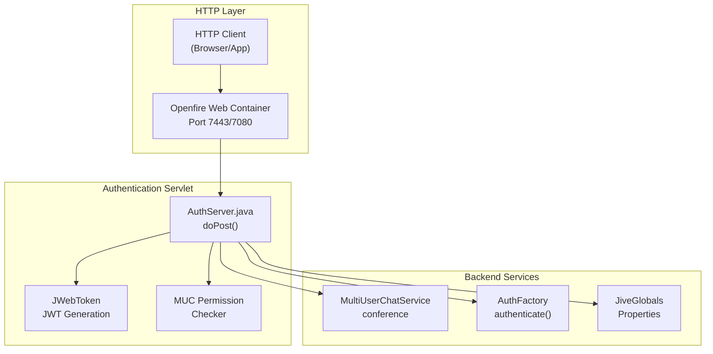
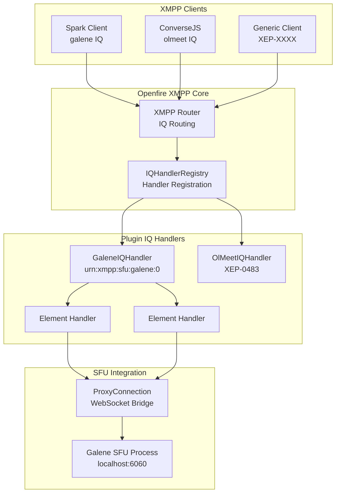
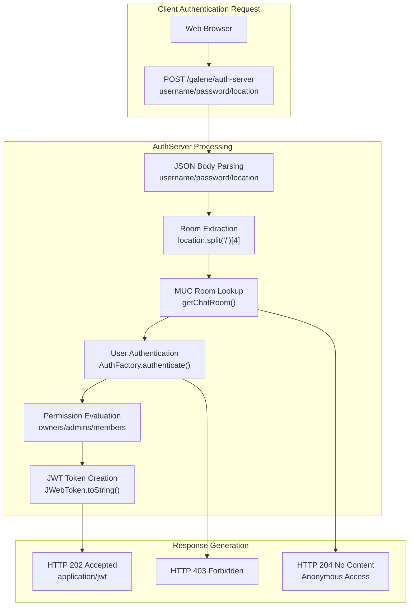

# API Reference

> **Relevant source files**
> * [docs/xep/index.html](https://github.com/igniterealtime/openfire-galene-plugin/blob/5aa54ac8/docs/xep/index.html)
> * [docs/xep/xep-xxx-sfu_01-01.xml](https://github.com/igniterealtime/openfire-galene-plugin/blob/5aa54ac8/docs/xep/xep-xxx-sfu_01-01.xml)
> * [src/java/org/ifsoft/galene/openfire/AuthServer.java](https://github.com/igniterealtime/openfire-galene-plugin/blob/5aa54ac8/src/java/org/ifsoft/galene/openfire/AuthServer.java)

This document provides a comprehensive technical reference for all programmatic interfaces exposed by the Openfire Galene Plugin. This includes HTTP REST endpoints, XMPP IQ handlers, WebSocket proxy mechanisms, and custom protocol extensions.

For detailed HTTP endpoint specifications, see [HTTP APIs & Endpoints](/igniterealtime/openfire-galene-plugin/8.1-http-apis-and-endpoints). For XMPP message format details, see [XMPP IQ Handlers](/igniterealtime/openfire-galene-plugin/8.2-xmpp-iq-handlers). For configuration of these APIs, see [Plugin Configuration Options](/igniterealtime/openfire-galene-plugin/7.1-plugin-configuration-options).

## API Overview

The plugin exposes three primary API surfaces for different integration scenarios:

| API Type | Purpose | Target Clients |
| --- | --- | --- |
| HTTP REST APIs | JWT authentication, admin operations | Web browsers, HTTP clients |
| XMPP IQ Protocol | SFU session management, media signaling | XMPP clients (Spark, ConverseJS) |
| WebSocket Proxy | Direct SFU communication tunneling | Web clients connecting to embedded Galene |

## HTTP API Architecture

The HTTP APIs are implemented as Java servlets integrated into Openfire's web container, providing authentication and administrative functionality.

#### HTTP API Component Diagram



Sources: [src/java/org/ifsoft/galene/openfire/AuthServer.java L1-L239](https://github.com/igniterealtime/openfire-galene-plugin/blob/5aa54ac8/src/java/org/ifsoft/galene/openfire/AuthServer.java#L1-L239)

## XMPP Protocol Architecture

The XMPP APIs implement custom protocol extensions for SFU communication using IQ stanzas with JSON payloads, following the XEP-XXXX specification.

#### XMPP Protocol Handler Diagram



Sources: [docs/xep/xep-xxx-sfu_01-01.xml L1-L144](https://github.com/igniterealtime/openfire-galene-plugin/blob/5aa54ac8/docs/xep/xep-xxx-sfu_01-01.xml#L1-L144)

## Authentication Flow

The authentication system coordinates between HTTP JWT generation and XMPP session validation to provide secure access to SFU resources.

#### Complete Authentication Flow Diagram



Sources: [src/java/org/ifsoft/galene/openfire/AuthServer.java L59-L235](https://github.com/igniterealtime/openfire-galene-plugin/blob/5aa54ac8/src/java/org/ifsoft/galene/openfire/AuthServer.java#L59-L235)

## Protocol Message Formats

### XMPP IQ Stanza Structure

The plugin uses structured IQ stanzas with embedded JSON for SFU communication:

#### Client-to-SFU Messages (<c2s>)

```xml
<iq from='user@domain/resource' to='server.domain' type='set' id='unique-id'>
  <c2s xmlns='urn:xmpp:sfu:galene:0'>
    <json xmlns='urn:xmpp:json:0'>
      { "type": "ice", "id": "connection-id", "candidate": {...} }
    </json>
  </c2s>
</iq>
```

#### SFU-to-Client Messages (<s2c>)

```xml
<iq from='server.domain' to='user@domain/resource' type='set' id='unique-id'>
  <s2c xmlns='urn:xmpp:sfu:galene:0'>
    <json xmlns='urn:xmpp:json:0'>
      { "type": "offer", "id": "connection-id", "sdp": "..." }
    </json>
  </s2c>
</iq>
```

Sources: [docs/xep/xep-xxx-sfu_01-01.xml L61-L105](https://github.com/igniterealtime/openfire-galene-plugin/blob/5aa54ac8/docs/xep/xep-xxx-sfu_01-01.xml#L61-L105)

### JWT Token Payload

The `AuthServer` generates JWT tokens with the following payload structure:

| Field | Type | Description |
| --- | --- | --- |
| `sub` | String | Username/subject |
| `aud` | String | Target location/room |
| `permissions` | Array | Galene permissions array |
| `iat` | Number | Issued at timestamp |
| `exp` | Number | Expiration timestamp |
| `iss` | String | Issuer URL |

#### Permission Levels

| MUC Role | Galene Permissions |
| --- | --- |
| Owner | `["record", "op", "present", "token"]` |
| Admin | `["op", "present", "token"]` |
| Member | `["present", "token"]` |
| Visitor | `["token"]` (if invites allowed) |

Sources: [src/java/org/ifsoft/galene/openfire/AuthServer.java L33-L56](https://github.com/igniterealtime/openfire-galene-plugin/blob/5aa54ac8/src/java/org/ifsoft/galene/openfire/AuthServer.java#L33-L56)

 [src/java/org/ifsoft/galene/openfire/AuthServer.java L175-L198](https://github.com/igniterealtime/openfire-galene-plugin/blob/5aa54ac8/src/java/org/ifsoft/galene/openfire/AuthServer.java#L175-L198)

## Namespace Registration

The plugin registers the following XML namespaces:

| Namespace | Purpose | Handler |
| --- | --- | --- |
| `urn:xmpp:sfu:galene:0` | SFU direct access protocol | `GaleneIQHandler` |
| `urn:xmpp:json:0` | JSON payload encapsulation | Standard XEP-0335 |

Sources: [docs/xep/xep-xxx-sfu_01-01.xml L140-L141](https://github.com/igniterealtime/openfire-galene-plugin/blob/5aa54ac8/docs/xep/xep-xxx-sfu_01-01.xml#L140-L141)

## Error Handling

### HTTP Response Codes

| Code | Meaning | Condition |
| --- | --- | --- |
| 202 | Accepted | Valid credentials, JWT token issued |
| 204 | No Content | Anonymous access allowed |
| 403 | Forbidden | Invalid credentials or no permissions |

### XMPP Error Responses

Invalid JSON or malformed IQ stanzas result in standard XMPP error responses following RFC 6120 specifications.

Sources: [src/java/org/ifsoft/galene/openfire/AuthServer.java L51](https://github.com/igniterealtime/openfire-galene-plugin/blob/5aa54ac8/src/java/org/ifsoft/galene/openfire/AuthServer.java#L51-L51)

 [src/java/org/ifsoft/galene/openfire/AuthServer.java L78](https://github.com/igniterealtime/openfire-galene-plugin/blob/5aa54ac8/src/java/org/ifsoft/galene/openfire/AuthServer.java#L78-L78)

 [src/java/org/ifsoft/galene/openfire/AuthServer.java L216](https://github.com/igniterealtime/openfire-galene-plugin/blob/5aa54ac8/src/java/org/ifsoft/galene/openfire/AuthServer.java#L216-L216)

 [docs/xep/xep-xxx-sfu_01-01.xml L125-L128](https://github.com/igniterealtime/openfire-galene-plugin/blob/5aa54ac8/docs/xep/xep-xxx-sfu_01-01.xml#L125-L128)