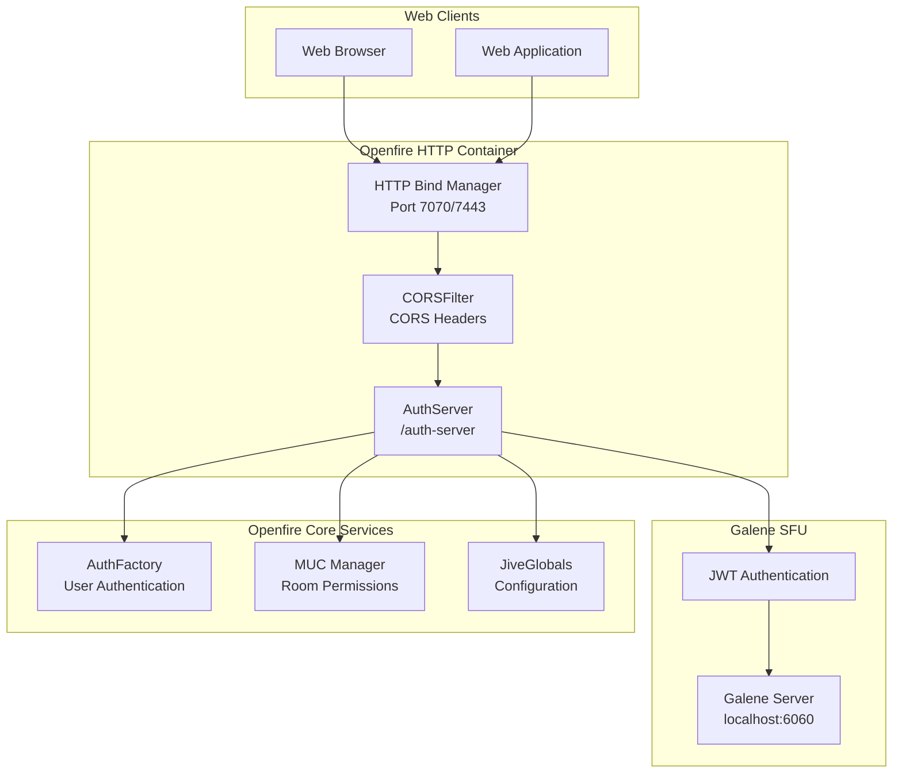
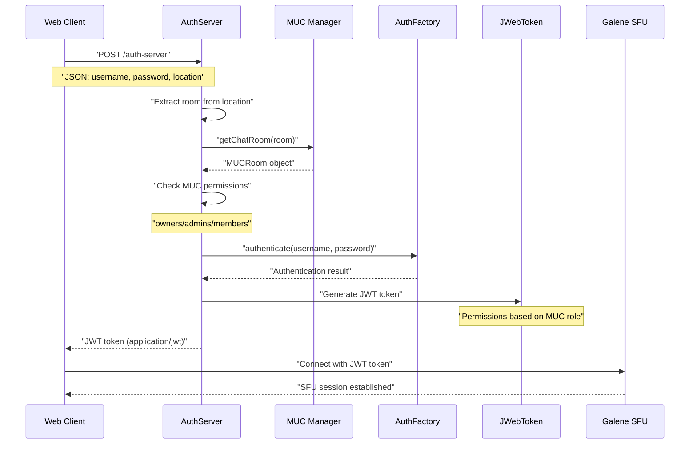
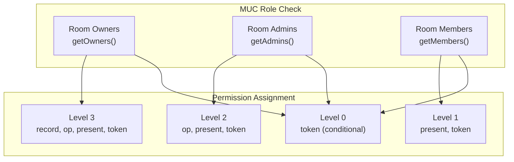
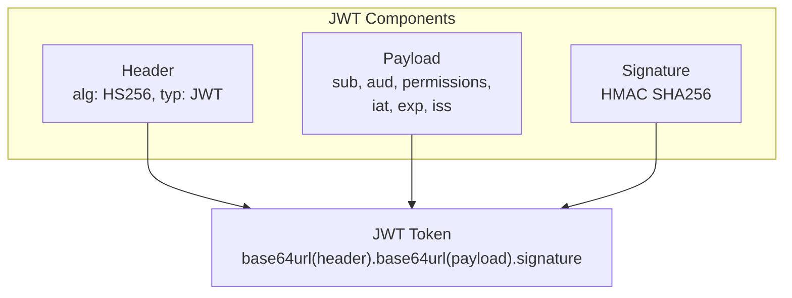
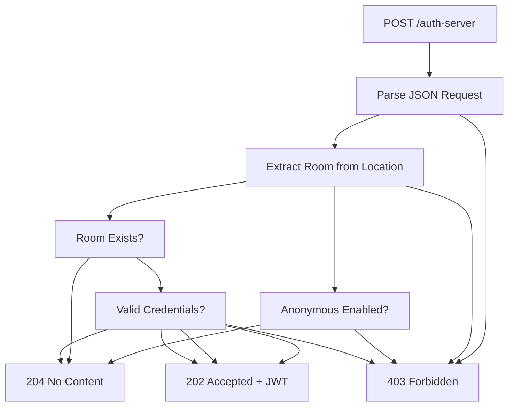

# HTTP APIs & Endpoints

> **Relevant source files**
> * [classes/jsp/WEB-INF/web.xml](https://github.com/igniterealtime/openfire-galene-plugin/blob/5aa54ac8/classes/jsp/WEB-INF/web.xml)
> * [src/java/org/ifsoft/galene/openfire/AuthServer.java](https://github.com/igniterealtime/openfire-galene-plugin/blob/5aa54ac8/src/java/org/ifsoft/galene/openfire/AuthServer.java)
> * [src/java/org/ifsoft/galene/openfire/CORSFilter.java](https://github.com/igniterealtime/openfire-galene-plugin/blob/5aa54ac8/src/java/org/ifsoft/galene/openfire/CORSFilter.java)
> * [src/java/org/ifsoft/galene/openfire/JWebToken.java](https://github.com/igniterealtime/openfire-galene-plugin/blob/5aa54ac8/src/java/org/ifsoft/galene/openfire/JWebToken.java)
> * [src/root/data/config.json](https://github.com/igniterealtime/openfire-galene-plugin/blob/5aa54ac8/src/root/data/config.json)

This document covers the HTTP-based APIs and endpoints provided by the Galene plugin for authentication, CORS handling, and client access. These REST endpoints enable web clients to authenticate with the embedded Galene SFU server and obtain the necessary JWT tokens for media session participation.

For information about XMPP-based communication protocols, see [XMPP IQ Handlers](/igniterealtime/openfire-galene-plugin/8.2-xmpp-iq-handlers). For configuration of these HTTP endpoints, see [Plugin Configuration Options](/igniterealtime/openfire-galene-plugin/7.1-plugin-configuration-options).

## HTTP API Architecture

The plugin provides a lightweight HTTP API layer that bridges web clients with the Openfire authentication system and embedded Galene SFU. The API consists of servlets deployed within Openfire's web container, accessible through the configured HTTP binding ports.



Sources: [classes/jsp/WEB-INF/web.xml L1-L26](https://github.com/igniterealtime/openfire-galene-plugin/blob/5aa54ac8/classes/jsp/WEB-INF/web.xml#L1-L26)

 [src/java/org/ifsoft/galene/openfire/AuthServer.java L1-L239](https://github.com/igniterealtime/openfire-galene-plugin/blob/5aa54ac8/src/java/org/ifsoft/galene/openfire/AuthServer.java#L1-L239)

 [src/java/org/ifsoft/galene/openfire/CORSFilter.java L1-L50](https://github.com/igniterealtime/openfire-galene-plugin/blob/5aa54ac8/src/java/org/ifsoft/galene/openfire/CORSFilter.java#L1-L50)

## Authentication Server API

The primary HTTP endpoint is the authentication server, implemented as a servlet that validates user credentials and issues JWT tokens for Galene access. It handles POST requests containing user credentials and room information.

### Endpoint Configuration

| Property | Value | Description |
| --- | --- | --- |
| **URL Pattern** | `/auth-server` | Servlet mapping for authentication requests |
| **HTTP Method** | POST | Only POST requests are accepted |
| **Content Type** | `application/json` | Request body format |
| **Response Type** | `application/jwt` or HTTP status codes | JWT token or error status |

### Request Format

```json
{
  "username": "user@domain.com",
  "password": "userpassword",
  "location": "https://server:7443/galene/group/roomname/"
}
```

### Authentication Flow



Sources: [src/java/org/ifsoft/galene/openfire/AuthServer.java L59-L235](https://github.com/igniterealtime/openfire-galene-plugin/blob/5aa54ac8/src/java/org/ifsoft/galene/openfire/AuthServer.java#L59-L235)

### Permission Mapping

The authentication server maps MUC room roles to Galene permissions:

| MUC Role | Permission Level | Galene Permissions |
| --- | --- | --- |
| **Owner** | 3 | `record`, `op`, `present`, `token` |
| **Admin** | 2 | `op`, `present`, `token` |
| **Member** | 1 | `present`, `token` |
| **Visitor** | 0 | `token` (if room allows invites) |



Sources: [src/java/org/ifsoft/galene/openfire/AuthServer.java L125-L198](https://github.com/igniterealtime/openfire-galene-plugin/blob/5aa54ac8/src/java/org/ifsoft/galene/openfire/AuthServer.java#L125-L198)

### Special Authentication Cases

The server handles several special authentication scenarios:

#### SFU Admin Authentication

```
String adminUsername = JiveGlobals.getProperty("galene.username", "sfu-admin");
String adminPassword = JiveGlobals.getProperty("galene.password", "sfu-admin");
```

#### Room Password Authentication

Room passwords bypass user authentication when the provided password matches the MUC room password.

#### Anonymous Access

When `AnonymousSaslServer.ENABLED.getValue()` is true and rooms are not members-only, anonymous access is permitted.

#### Public Room Access

Special handling for the `public` room location, which allows access based on anonymous settings.

Sources: [src/java/org/ifsoft/galene/openfire/AuthServer.java L74-L82](https://github.com/igniterealtime/openfire-galene-plugin/blob/5aa54ac8/src/java/org/ifsoft/galene/openfire/AuthServer.java#L74-L82)

 [src/java/org/ifsoft/galene/openfire/AuthServer.java L102-L115](https://github.com/igniterealtime/openfire-galene-plugin/blob/5aa54ac8/src/java/org/ifsoft/galene/openfire/AuthServer.java#L102-L115)

 [src/java/org/ifsoft/galene/openfire/AuthServer.java L200-L219](https://github.com/igniterealtime/openfire-galene-plugin/blob/5aa54ac8/src/java/org/ifsoft/galene/openfire/AuthServer.java#L200-L219)

 [src/java/org/ifsoft/galene/openfire/AuthServer.java L223-L227](https://github.com/igniterealtime/openfire-galene-plugin/blob/5aa54ac8/src/java/org/ifsoft/galene/openfire/AuthServer.java#L223-L227)

## JWT Token System

The authentication server uses JWT tokens to authorize clients with the Galene SFU. Tokens are generated using the `JWebToken` class with HMAC SHA256 signing.

### JWT Structure



### JWT Payload Structure

| Field | Description | Example |
| --- | --- | --- |
| `sub` | Subject (username) | `user@domain.com` |
| `aud` | Audience (room location) | `https://server:7443/galene/group/room/` |
| `permissions` | Array of Galene permissions | `["op", "present", "token"]` |
| `iat` | Issued at (epoch seconds) | Current time - 1 day |
| `exp` | Expiration (epoch seconds) | Current time + 1 day |
| `iss` | Issuer (auth server URL) | `https://server:7443/galene/auth-server` |

Sources: [src/java/org/ifsoft/galene/openfire/AuthServer.java L33-L56](https://github.com/igniterealtime/openfire-galene-plugin/blob/5aa54ac8/src/java/org/ifsoft/galene/openfire/AuthServer.java#L33-L56)

 [src/java/org/ifsoft/galene/openfire/JWebToken.java L1-L77](https://github.com/igniterealtime/openfire-galene-plugin/blob/5aa54ac8/src/java/org/ifsoft/galene/openfire/JWebToken.java#L1-L77)

### Token Security

The JWT implementation uses a hardcoded secret key and HMAC SHA256 algorithm:

```java
public static final String SECRET_KEY = "H7pCkktUl5KyPCZ7CKw09y1j460tfIv4dRcS1XstUKY";
private static final String JWT_HEADER = "{\"alg\":\"HS256\",\"typ\":\"JWT\"}";
```

Sources: [src/java/org/ifsoft/galene/openfire/JWebToken.java L25-L26](https://github.com/igniterealtime/openfire-galene-plugin/blob/5aa54ac8/src/java/org/ifsoft/galene/openfire/JWebToken.java#L25-L26)

## CORS Support

The plugin implements Cross-Origin Resource Sharing (CORS) support through a servlet filter that applies to all HTTP endpoints. This enables web applications from different origins to access the authentication API.

### CORS Headers

| Header | Value | Purpose |
| --- | --- | --- |
| `Access-Control-Allow-Origin` | `*` | Allow all origins |
| `Access-Control-Allow-Headers` | `*` | Allow all headers |
| `Access-Control-Allow-Methods` | `GET, OPTIONS, HEAD, PUT, POST` | Permitted methods |
| `Access-Control-Allow-Private-Network` | `true` | Enable private network access |
| `Access-Control-Request-Headers` | `*` | Pre-flight header support |

### OPTIONS Pre-flight Handling

The CORS filter automatically handles OPTIONS requests for pre-flight checks:

```
if (request.getMethod().equals("OPTIONS")) {
    resp.setStatus(HttpServletResponse.SC_ACCEPTED);
    return;
}
```

Sources: [src/java/org/ifsoft/galene/openfire/CORSFilter.java L28-L44](https://github.com/igniterealtime/openfire-galene-plugin/blob/5aa54ac8/src/java/org/ifsoft/galene/openfire/CORSFilter.java#L28-L44)

 [classes/jsp/WEB-INF/web.xml L17-L25](https://github.com/igniterealtime/openfire-galene-plugin/blob/5aa54ac8/classes/jsp/WEB-INF/web.xml#L17-L25)

## HTTP Response Codes

The authentication server returns specific HTTP status codes to indicate different authentication outcomes:

| Status Code | Constant | Meaning | Scenario |
| --- | --- | --- | --- |
| **202** | `SC_ACCEPTED` | Authentication successful | Valid credentials, JWT token returned |
| **202** | `SC_ACCEPTED` | OPTIONS request | CORS pre-flight handled |
| **204** | `SC_NO_CONTENT` | Anonymous access allowed | Public room or anonymous enabled |
| **403** | `SC_FORBIDDEN` | Access denied | Invalid credentials or unauthorized |

### Error Response Scenarios



Sources: [src/java/org/ifsoft/galene/openfire/AuthServer.java L78-L81](https://github.com/igniterealtime/openfire-galene-plugin/blob/5aa54ac8/src/java/org/ifsoft/galene/openfire/AuthServer.java#L78-L81)

 [src/java/org/ifsoft/galene/openfire/AuthServer.java L88](https://github.com/igniterealtime/openfire-galene-plugin/blob/5aa54ac8/src/java/org/ifsoft/galene/openfire/AuthServer.java#L88-L88)

 [src/java/org/ifsoft/galene/openfire/AuthServer.java L112](https://github.com/igniterealtime/openfire-galene-plugin/blob/5aa54ac8/src/java/org/ifsoft/galene/openfire/AuthServer.java#L112-L112)

 [src/java/org/ifsoft/galene/openfire/AuthServer.java L203](https://github.com/igniterealtime/openfire-galene-plugin/blob/5aa54ac8/src/java/org/ifsoft/galene/openfire/AuthServer.java#L203-L203)

 [src/java/org/ifsoft/galene/openfire/AuthServer.java L211](https://github.com/igniterealtime/openfire-galene-plugin/blob/5aa54ac8/src/java/org/ifsoft/galene/openfire/AuthServer.java#L211-L211)

 [src/java/org/ifsoft/galene/openfire/AuthServer.java L225](https://github.com/igniterealtime/openfire-galene-plugin/blob/5aa54ac8/src/java/org/ifsoft/galene/openfire/AuthServer.java#L225-L225)

 [src/java/org/ifsoft/galene/openfire/AuthServer.java L234](https://github.com/igniterealtime/openfire-galene-plugin/blob/5aa54ac8/src/java/org/ifsoft/galene/openfire/AuthServer.java#L234-L234)

## Configuration and Proxy Settings

The HTTP APIs interact with configuration settings that control proxy behavior and authentication parameters. The Galene configuration includes a proxy URL that routes requests through Openfire's HTTP binding system.

### Proxy Configuration

The embedded Galene server is configured to proxy authentication requests back to Openfire:

```json
{
    "proxyURL": "http://localhost:7070/"
}
```

This creates a bidirectional communication path where:

1. Web clients connect to Openfire's HTTP binding ports (7070/7443)
2. Authentication requests are processed by the AuthServer servlet
3. Galene SFU proxies auth requests back to Openfire for validation

Sources: [src/root/data/config.json L1-L3](https://github.com/igniterealtime/openfire-galene-plugin/blob/5aa54ac8/src/root/data/config.json#L1-L3)