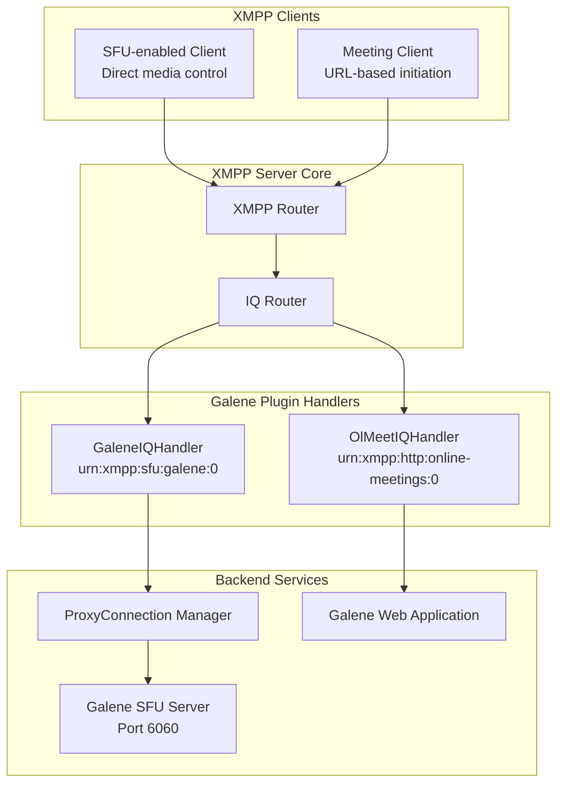
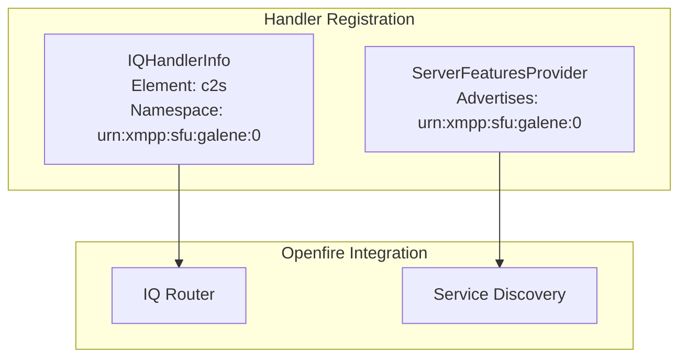
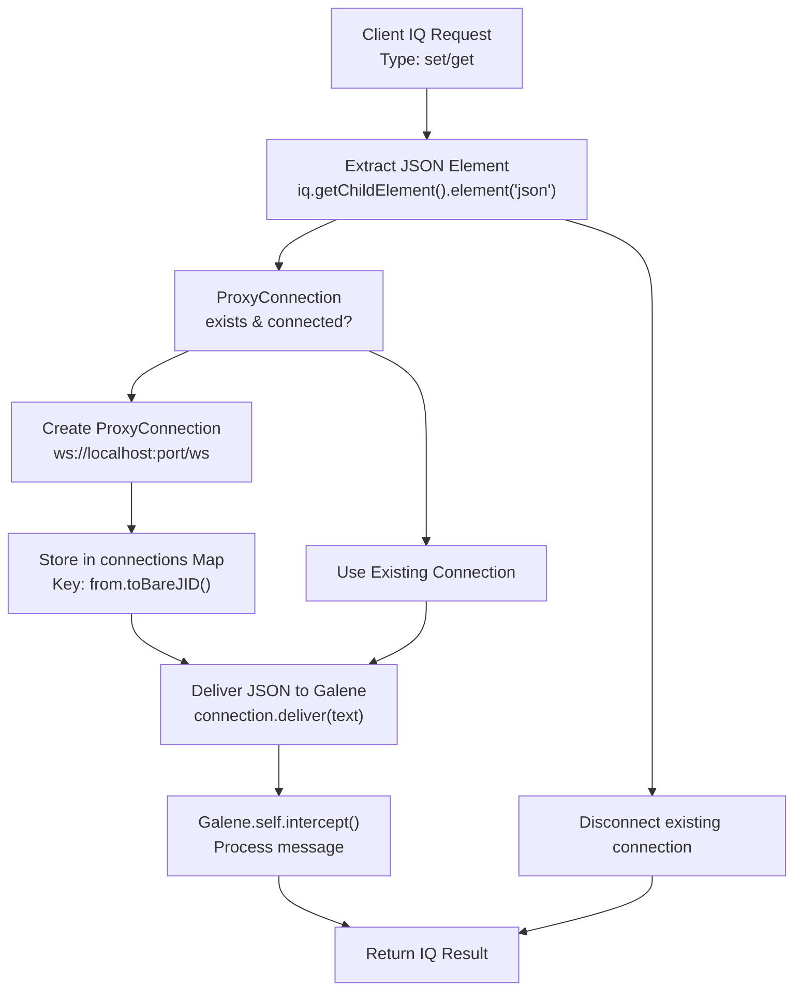
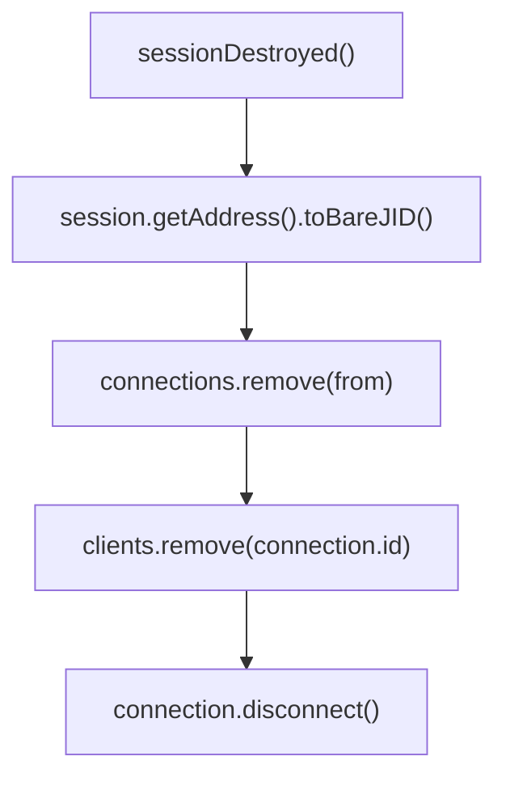
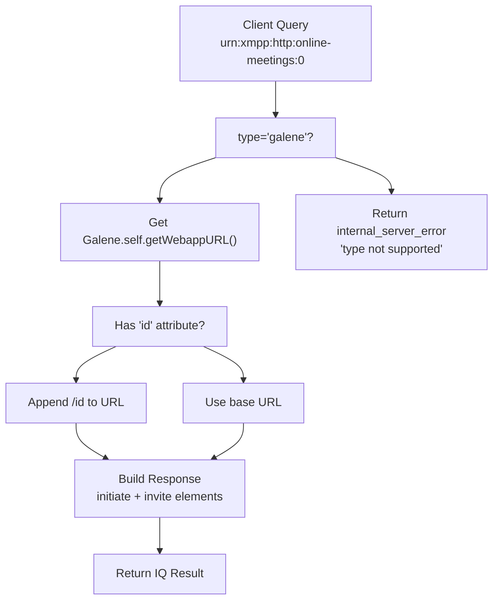

# XMPP IQ Handlers

> **Relevant source files**
> * [src/java/org/ifsoft/galene/openfire/GaleneIQHandler.java](https://github.com/igniterealtime/openfire-galene-plugin/blob/5aa54ac8/src/java/org/ifsoft/galene/openfire/GaleneIQHandler.java)
> * [src/java/org/ifsoft/galene/openfire/OlMeetIQHandler.java](https://github.com/igniterealtime/openfire-galene-plugin/blob/5aa54ac8/src/java/org/ifsoft/galene/openfire/OlMeetIQHandler.java)
> * [src/root/data/ice-servers.json](https://github.com/igniterealtime/openfire-galene-plugin/blob/5aa54ac8/src/root/data/ice-servers.json)

This document provides technical documentation for the XMPP IQ (Info/Query) handlers implemented by the Galene plugin. These handlers enable XMPP clients to communicate with the embedded Galene SFU server through standardized XMPP protocol extensions.

The plugin implements two primary IQ handlers that serve different purposes: `GaleneIQHandler` for direct SFU communication and `OlMeetIQHandler` for meeting initiation. For information about the XMPP protocol specifications these handlers implement, see [XEP-XXXX: In-Band SFU Sessions](/igniterealtime/openfire-galene-plugin/5.1-xep-xxxx:-in-band-sfu-sessions).

## Handler Architecture Overview

The plugin registers two IQ handlers with the Openfire XMPP server to process client requests and manage SFU sessions:



Sources: [src/java/org/ifsoft/galene/openfire/GaleneIQHandler.java L34-L107](https://github.com/igniterealtime/openfire-galene-plugin/blob/5aa54ac8/src/java/org/ifsoft/galene/openfire/GaleneIQHandler.java#L34-L107)

 [src/java/org/ifsoft/galene/openfire/OlMeetIQHandler.java L28-L82](https://github.com/igniterealtime/openfire-galene-plugin/blob/5aa54ac8/src/java/org/ifsoft/galene/openfire/OlMeetIQHandler.java#L28-L82)

## GaleneIQHandler

The `GaleneIQHandler` class is the primary IQ handler that enables direct SFU communication between XMPP clients and the embedded Galene server. It handles the `urn:xmpp:sfu:galene:0` namespace and manages WebSocket proxy connections.

### Handler Registration and Features



The handler registers itself using the element name `c2s` and namespace `urn:xmpp:sfu:galene:0`, as defined in the `getInfo()` method. It also advertises this feature through service discovery.

Sources: [src/java/org/ifsoft/galene/openfire/GaleneIQHandler.java L104-L107](https://github.com/igniterealtime/openfire-galene-plugin/blob/5aa54ac8/src/java/org/ifsoft/galene/openfire/GaleneIQHandler.java#L104-L107)

 [src/java/org/ifsoft/galene/openfire/GaleneIQHandler.java L110-L115](https://github.com/igniterealtime/openfire-galene-plugin/blob/5aa54ac8/src/java/org/ifsoft/galene/openfire/GaleneIQHandler.java#L110-L115)

### Message Processing Flow

The `handleIQ()` method processes incoming IQ stanzas and manages the WebSocket communication bridge:



Sources: [src/java/org/ifsoft/galene/openfire/GaleneIQHandler.java L56-L100](https://github.com/igniterealtime/openfire-galene-plugin/blob/5aa54ac8/src/java/org/ifsoft/galene/openfire/GaleneIQHandler.java#L56-L100)

### Connection Management

The handler maintains two static `ConcurrentHashMap` collections for connection tracking:

| Collection | Key Type | Value Type | Purpose |
| --- | --- | --- | --- |
| `connections` | `String` (bare JID) | `ProxyConnection` | Maps user JIDs to their WebSocket connections |
| `clients` | `String` (connection ID) | `ProxyConnection` | Maps connection IDs to connections for cleanup |

Sources: [src/java/org/ifsoft/galene/openfire/GaleneIQHandler.java L37-L38](https://github.com/igniterealtime/openfire-galene-plugin/blob/5aa54ac8/src/java/org/ifsoft/galene/openfire/GaleneIQHandler.java#L37-L38)

### Session Management

The handler implements `SessionEventListener` to clean up connections when XMPP sessions end:



This ensures that WebSocket connections are properly closed when XMPP clients disconnect, preventing resource leaks.

Sources: [src/java/org/ifsoft/galene/openfire/GaleneIQHandler.java L152-L163](https://github.com/igniterealtime/openfire-galene-plugin/blob/5aa54ac8/src/java/org/ifsoft/galene/openfire/GaleneIQHandler.java#L152-L163)

 [src/java/org/ifsoft/galene/openfire/GaleneIQHandler.java L42-L48](https://github.com/igniterealtime/openfire-galene-plugin/blob/5aa54ac8/src/java/org/ifsoft/galene/openfire/GaleneIQHandler.java#L42-L48)

## OlMeetIQHandler

The `OlMeetIQHandler` implements support for XEP-0483 (HTTP Online Meetings) by providing web URLs for Galene meetings. It handles the `urn:xmpp:http:online-meetings:0` namespace.

### Message Processing



Sources: [src/java/org/ifsoft/galene/openfire/OlMeetIQHandler.java L38-L76](https://github.com/igniterealtime/openfire-galene-plugin/blob/5aa54ac8/src/java/org/ifsoft/galene/openfire/OlMeetIQHandler.java#L38-L76)

### Response Format

The handler builds a structured XML response containing both initiation and invitation elements:

```xml
<query xmlns="urn:xmpp:http:online-meetings:0">
  <initiate type="galene">
    <url>https://server:7443/galene/group</url>
  </initiate>
  <invite xmlns="urn:xmpp:call-invites:0">
    <external uri="https://server:7443/galene/group"/>
  </invite>
</query>
```

Sources: [src/java/org/ifsoft/galene/openfire/OlMeetIQHandler.java L56-L65](https://github.com/igniterealtime/openfire-galene-plugin/blob/5aa54ac8/src/java/org/ifsoft/galene/openfire/OlMeetIQHandler.java#L56-L65)

## Message Format Specifications

### GaleneIQHandler Message Format

Client requests to `GaleneIQHandler` must contain a JSON element with Galene protocol messages:

```xml
<iq type="set" to="domain" id="unique-id">
  <c2s xmlns="urn:xmpp:sfu:galene:0">
    <json>{"type":"handshake","id":"client-id"}</json>
  </c2s>
</iq>
```

The JSON content is extracted and forwarded directly to the Galene WebSocket interface.

### OlMeetIQHandler Query Format

Meeting initiation requests use a query element with type attribute:

```xml
<iq type="get" to="domain" id="unique-id">
  <query xmlns="urn:xmpp:http:online-meetings:0" type="galene" id="optional-group-id"/>
</iq>
```

Sources: [src/java/org/ifsoft/galene/openfire/GaleneIQHandler.java L63-L84](https://github.com/igniterealtime/openfire-galene-plugin/blob/5aa54ac8/src/java/org/ifsoft/galene/openfire/GaleneIQHandler.java#L63-L84)

 [src/java/org/ifsoft/galene/openfire/OlMeetIQHandler.java L46-L54](https://github.com/igniterealtime/openfire-galene-plugin/blob/5aa54ac8/src/java/org/ifsoft/galene/openfire/OlMeetIQHandler.java#L46-L54)

## Feature Advertisement

Both handlers implement `ServerFeaturesProvider` to advertise their capabilities through XMPP service discovery:

| Handler | Advertised Features |
| --- | --- |
| `GaleneIQHandler` | `urn:xmpp:sfu:galene:0` |
| `OlMeetIQHandler` | `urn:xmpp:http:online-meetings:initiate:0``urn:xmpp:http:online-meetings#galene` |

This enables clients to discover SFU capabilities automatically through standard XMPP service discovery protocols.

Sources: [src/java/org/ifsoft/galene/openfire/GaleneIQHandler.java L110-L115](https://github.com/igniterealtime/openfire-galene-plugin/blob/5aa54ac8/src/java/org/ifsoft/galene/openfire/GaleneIQHandler.java#L110-L115)

 [src/java/org/ifsoft/galene/openfire/OlMeetIQHandler.java L84-L91](https://github.com/igniterealtime/openfire-galene-plugin/blob/5aa54ac8/src/java/org/ifsoft/galene/openfire/OlMeetIQHandler.java#L84-L91)